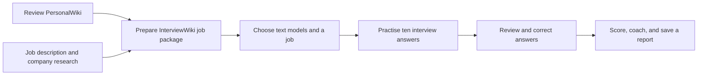
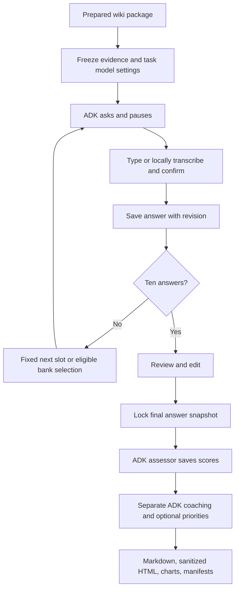

# InterviewSimulator

## 1. What this project does

InterviewSimulator helps you practise for a specific job using your real, reviewed career background. Choose a prepared opportunity, answer ten interview questions, and receive a report with scores, feedback, and practical answer examples. You can type or speak one answer at a time. English, Japanese, and Traditional Chinese are supported; Traditional Chinese uses Mandarin speech.

**PersonalWiki** holds your confirmed experience. **InterviewWiki** prepares the job description, company research, compatibility analysis, questions, and tailored resume. You prepare these manually before practising. The simulator reads the approved package and saves a separate report for every practice run under that job.

The conversation uses **Google ADK 2.x**, Google's Agent Development Kit, to manage the interview steps. Text tasks can run locally with **llama.cpp**, a program that runs downloaded models, or through Ollama, Google, OpenAI, or Anthropic. Microphone recordings, speech recognition, and spoken questions always stay on your computer. Cloud providers receive the selected text needed for the tasks you enable; you agree to this before starting.

Your score describes the evidence in this practice interview. It does not predict a hiring decision. Answer examples use confirmed profile statements and mark missing details for you to verify.



## 2. Quick start: from installation to your first report

### Choose hardware and an installation profile

| Device | Practical starting point |
|---|---|
| Reference hardware | **2018 Mac mini**, 3 GHz six-core Intel Core i5, **32 GB RAM**, macOS Sequoia 15.7.9. Local model and synthetic speech checks were performed on this machine. |
| Newer Mac | Apple Silicon with 16 GB or more is a reasonable starting point; use 32 GB for more room when running several applications. Configure and test its own voices. |
| Windows/Linux PC | A conservative local 9B setup uses 32 GB RAM. Text adapters and installation logic have automated tests; physical voice/device qualification remains open. |
| Cloud text | No local Qwen download or llama server is needed when **every enabled text task** uses a cloud model. Local voice still needs its own software and model. |
| Storage | Allow at least 10 GB for 9B, whisper small, environments, and download headroom; leave more space for your private source files and practice history. |

The quality-first local model is **Qwen3.5-9B Q4_K_M**. The speed alternative is **Qwen3.5-4B Q4_K_M**. “9B” and “4B” describe the model size; Q4_K_M is a compact four-bit format. The Intel Mac can take minutes to assess and coach an answer. Questions appear without waiting for scoring because report work happens afterward. See [current validation and timings](doc/DURABILITY_IMPLEMENTATION_AND_VALIDATION.md) for measured conditions and limitations.

| Profile | Python applications | Qwen / llama server | Local recording and transcription | Local question playback |
|---|---|---|---|---|
| `cloud-text` | Required | Not needed | Optional | Optional |
| `cloud-local-voice` | Required | Not needed | whisper.cpp, multilingual small model, FFmpeg | Installed OS voice, or configured Piper/Open JTalk |
| `local-text` | Required | Required | Optional | Optional |
| `local-voice` | Required | Required | whisper.cpp, multilingual small model, FFmpeg | Installed OS voice, or configured Piper/Open JTalk |

### Step 1 — Install the project

Install [Git](https://git-scm.com/downloads) and [uv](https://docs.astral.sh/uv/getting-started/installation/), the Python environment manager. On macOS, install [Homebrew](https://brew.sh/) if you want the setup script to install native tools. Use the vendors' instructions for these initial system installations.

```sh
git clone https://github.com/NinjaRoboticsEducation/InterviewSimulator.git
cd InterviewSimulator
```

A clone includes the wiki applications, but not your private resumes, job packages, API keys, reports, or model files. You can also copy the whole project folder. Open your terminal in the copy you intend to use.

**Intel Mac prerequisite:** the locked `cryptography` Python package has no Intel Mac wheel (prebuilt package), and the clean installation here compiled it successfully. Install Apple's development tools, Rust, and OpenSSL first—even for cloud text:

```sh
xcode-select --install
brew install openssl@3 rust pkgconf
```

If Apple's tools are already installed, keep the existing installation. Rust and OpenSSL support this Python dependency build; they are separate from voice and Qwen requirements. See the [official cryptography build guide](https://cryptography.io/en/latest/installation/#building-cryptography-on-macos). Do not downgrade the locked dependency to avoid a compiler error.

**macOS / Linux:** with an existing Python 3 interpreter, preview the installation, then install your chosen profile:

```sh
sh scripts/setup.sh --profile local-voice --model 9b --dry-run
sh scripts/setup.sh --profile local-voice --model 9b --install-native
```

For cloud text only:

```sh
sh scripts/setup.sh --profile cloud-text
```

**Windows PowerShell:** the dry-run preview needs an existing Python 3 interpreter and does not install one.

```powershell
powershell -ExecutionPolicy Bypass -File scripts/setup.ps1 -Profile local-voice -Model 9b -DryRun
powershell -ExecutionPolicy Bypass -File scripts/setup.ps1 -Profile local-voice -Model 9b -InstallNative
```

The execution policy option applies to that one setup process. Windows also needs Git, CMake, a C++ build environment, and FFmpeg on `PATH` when building native tools. See the [platform installation and voice guide](doc/installation/LOCAL_VOICE_SETUP.md).

The script installs Python 3.13 and the three locked Python environments, downloads only the selected models, verifies their **SHA-256 checksum** (a file fingerprint), and creates `.env` only if it is absent. Existing private settings are preserved. Copied Python environments are detected, retained under `.simulator/environment-backups/`, and recreated so commands point to the current project. Interrupted downloads can resume. A mismatched existing model is rejected rather than overwritten. `--skip-models` is available if you manage model files yourself. Native installation requires `--install-native`; administrator/package-manager access may be needed. Exit code 2 means Python setup completed but required native tools are still missing.

On the reference Mac, Homebrew installs missing `llama.cpp`, `whisper.cpp`, and `ffmpeg`. Linux automation covers Debian/Ubuntu package tooling and pinned source builds; other distributions need the manual route. This is a guided installer, not a claim that every operating system can install all speech assets unattended.

For a manual Python-only installation:

```sh
uv python install 3.13
uv sync --locked
cd InterviewWiki
uv sync --locked
cd PersonalWiki
uv sync --locked
```

### Step 2 — Build and review PersonalWiki

From `InterviewWiki/PersonalWiki`:

```sh
uv run llmwiki init
uv run llmwiki doctor
```

Place your resume in `raw/articles/`. Career notes belong in `raw/notes/`, certificates in `raw/papers/`, and portfolio images in `raw/media/`. Register each source; replace the sample filename below with your own:

```sh
uv run llmwiki source add raw/articles/MyResume.pdf
uv run llmwiki source list
```

Registration does not create a complete wiki. Follow the ingestion and review workflow in [PersonalWiki/AGENTS.md](InterviewWiki/PersonalWiki/AGENTS.md). With a coding assistant, you can request:

> Read PersonalWiki/AGENTS.md and its ingestion and review skills. Build source-linked wiki pages from my files, preserve the originals, check every career claim against its source, and show uncertainties for my review.

Review the resulting pages, resolve unsupported claims, and run:

```sh
uv run llmwiki lint --strict
```

Only confirmed, non-sensitive facts are eligible for simulation. Do this once, then repeat it whenever your background changes. A machine-generated review must not be described as human verification.

### Step 3 — Register and prepare a job

Return to `InterviewWiki`. Create a company/opportunity folder and place the job description here:

```text
JobDescriptions/example-company/python-engineer/sources/JobDescription.md
```

The folder names become the reference `example-company/python-engineer`. Run:

```sh
uv run interviewwiki init
uv run interviewwiki candidate migrate
uv run interviewwiki opportunity register example-company/python-engineer
uv run interviewwiki task prepare example-company/python-engineer --kind full-package
```

Complete the company-research and full-package workflows described in [InterviewWiki/AGENTS.md](InterviewWiki/AGENTS.md) and [its guide](InterviewWiki/README.md). The package must contain sourced company research, candidate compatibility analysis, interview questions and answer plans, and a tailored resume. `task prepare` creates the workspace; it does not write the whole package automatically.

When ready:

```sh
uv run interviewwiki task validate example-company/python-engineer --kind full-package --strict
uv run interviewwiki task finalize example-company/python-engineer --kind full-package
```

Fix every strict validation error before finalizing. Repeat this step for each job. Back at the project root, `uv run interview-simulator jobs` lists opportunities and explains missing preparation.

### Step 4 — Configure local models and voices

Skip Qwen setup if all enabled text tasks will use cloud models. The installer creates `.env` with the selected local model paths. For a manual setup, copy `.env.example` to `.env`, then fill in the paths. Keep `.env` private.

```dotenv
INTERVIEW_SIMULATOR_GGUF=models/primary/Qwen3.5-9B-Q4_K_M.gguf
INTERVIEW_SIMULATOR_WHISPER_MODEL=models/whisper/ggml-small.bin
INTERVIEW_SIMULATOR_TTS_BACKEND=auto
```

The Qwen model handles text; it cannot transcribe your microphone. `ggml-small.bin` must be the **multilingual whisper.cpp small** model, not an English-only `.en` model or a tiny test fixture. Pinned downloads, hashes, and licenses are recorded in [the download manifest](config/download-manifest.json).

On macOS, install English, Japanese, and Mandarin voices through System Settings → Accessibility → Spoken Content. Check the available names with `say -v '?'`. The app prefers Samantha, Kyoko, and Meijia when installed, then searches by language. You can override names in `.env`. Missing voices are reported before you record.

Windows uses installed **System.Speech** voices, which may differ from voices visible elsewhere in Windows. Linux can use Piper for English/Mandarin and Open JTalk for Japanese. Piper's engine and each voice have separate licenses; the project does not assume a qualified Japanese Piper voice exists. Follow the complete [local voice setup guide](doc/installation/LOCAL_VOICE_SETUP.md), including actual playback and transcription checks.

Start your configured local Qwen model in one terminal:

```sh
uv run interview-simulator local-server
```

By default this starts a CPU server on `127.0.0.1:8081`, with six threads, a 4,096-token context, and alias `interview-local`. Custom loopback host, port, alias, and local authentication settings come from this copy’s `.env`. Leave it running. For unusually long answers, you can explicitly restart it with `--context-tokens 8192` (up to 16384); larger contexts need more memory and may be slower. GPU acceleration is opt-in with `--gpu-layers`, after checking that your native build supports your device. If you change the port, update `INTERVIEW_SIMULATOR_MODEL_URL` in `.env` to the matching numeric loopback URL ending in `/v1`.

To use 4B, install with `--model 4b` and explicitly change the existing `.env` to:

```dotenv
INTERVIEW_SIMULATOR_GGUF=models/fallback/Qwen3.5-4B-Q4_K_M.gguf
```

Stop and restart the model server. Begin a new run when changing a scoring model; existing scores retain their original model identity. The app does not silently switch models or providers.

In a second terminal at the project root:

```sh
uv run interview-simulator doctor
uv run interview-simulator jobs
uv run interview-simulator voice-test /private/tmp/interview-en.wav --locale en
```

On Windows, use a new output path such as `C:\Temp\interview-en.wav`. Play the WAV to verify that you hear the expected voice. Repeat with `--locale ja` and `--locale zh-Hant`. Record a short answer in the built-in browser and check the recognized text. Physical microphone quality is a separate check from software readiness.

### Step 5 — Practise in the built-in browser

From the root:

```sh
uv run interview-simulator serve
```

Open [http://127.0.0.1:8765](http://127.0.0.1:8765) in Safari, Chrome, or Edge. The six steps guide you through connection, models, job readiness, interview, answer review, and report.

1. **Connection:** Local is selected by default. For Google, OpenAI, or Anthropic, enter the key directly into the password field. The app discovers models available to that account. By default the key stays only in the running server's memory. Select “Remember on this device” only if you want the operating system's credential vault to store it. Never put cloud keys into chat, a report, or a Git commit.
2. **Models:** Choose one text model, or open advanced settings to assign different models to question preparation, assessment, coaching, and summary. Optional generated variants and summary are off by default. Unknown models need a synthetic structured-output check; a successful check confirms the response format, not interview quality. Test requests may incur API charges.
3. **Job:** Choose a ready opportunity and a language. Review voice readiness and the provider disclosure. Cloud text requires explicit consent. Missing voice setup still allows typed answers.
4. **Interview:** Play the greeting or question; record one answer or type it. Correct the transcript before confirming. Progress shows the question number and saved answers. Previous question and Review answers let you revisit confirmed answers. Pause interview saves the run and keeps you in the interview workspace; Resume practice continues it. Connection, Models, and Job settings stay locked until you cancel or finish the interview. Cancel preserves the history; Restart prepares a new run.
5. **Review:** Correct earlier answers before generating the report. Edits preserve original versions and the already selected question sequence. Saving from another tab with an outdated revision is rejected so it cannot overwrite newer work.
6. **Report:** Generating the report locks the final answers. The browser shows formatted feedback, topic and rubric score bars, strengths, and practice priorities. You can download Markdown or standalone HTML, or print. Stop report work saves completed scores; resuming finishes missing work without recalculating them.

Fixed practice begins with self-introduction, then moves through experience, professional judgment, portfolio, role, and company. Adaptive practice selects from questions previously asked for **the same job and current evidence**, within the required topic slots. It uses a bounded matching policy, including Japanese/Chinese character pairs; it is not model fine-tuning. Sparse banks fall back to the fixed route. Optional question preparation uses an ADK model to choose evidence and focus; trusted language templates assemble the question so it cannot invent a career premise.

The OS vault protects stored keys, but it does not isolate them from all programs running under your own account. Use a trusted computer and Python environment.

Cloud provider model lists are dynamic. The dated [research plan](doc/REFINEMENT_RESEARCH_AND_IMPLEMENTATION_PLAN.md) explains candidate models and costs. Not every account has every model. Provider availability, retention policies, billing and quality remain the provider's responsibility; selecting a cloud model does not make the entire interview local.

### Step 6 — Practise in Google ADK Web

Use one interview interface at a time. Stop the built-in server with **Ctrl+C**, then run:

```sh
uv run interview-simulator serve-adk
```

Open [the local address](http://127.0.0.1:8765), select `interview_practice`, and type `jobs`. Start with:

```text
start example-company/python-engineer en
```

Use `ja` or `zh-Hant` for another interview language; append `adaptive` for bank selection. Type your answers. Commands:

| Command | What it does |
|---|---|
| `jobs` / `help` | List prepared jobs and explain how to start |
| `resume RUN_ID` | Explicitly open an unfinished saved interview; `resume` continues a chat already bound to that run |
| `history RUN_ID` | Open saved answers without adopting another interview |
| `retry-preparation` / `baseline` | Retry failed preparation, or use native fixed questions with reduced personalization |
| `allowance` | Grant 12 more attempts to an interrupted report; cloud requests may be billed |
| `revise-report cloud-ok` | Create a separate scoring revision from saved answers and current model settings |
| `skip` | Record an explicit skipped answer |
| `review` | Read the saved questions and answers without advancing |
| `edit 1 revised answer` | Change answer 1 before scoring starts |
| `restart` | Start a new run for the same job; cloud text may require `restart cloud-ok` |
| `pause` / `cancel` | Pause or abandon the current run, keeping history |
| `report` / `status` | Generate feedback and check saved progress |
| `stop-report` | Interrupt report work; completed scores stay saved |

ADK Web shares the saved model configuration. Configure it first through the built-in browser, then stop that server. For a cloud configuration:

```sh
uv run interview-simulator serve-adk --allow-cloud-text
```

The flag confirms that configured cloud text tasks may receive selected facts and confirmed answers. If no remembered key exists, the terminal prompts privately for a session-only key; keys are not passed in command-line arguments. For a direct `adk web agents` launch, append `cloud-ok` to a start command to confirm cloud text consent. Use the `serve-adk` wrapper for the exclusive server lease and credential bootstrap.

ADK Web is a **typed development chat interface**. The guided microphone and local speech controls are in the built-in browser. ADK Web displays the report's local file path. Its development chat history is temporary; shared interview answers and reports remain durable. Keep either interface bound to this computer, not exposed to a network.

### Step 7 — Review, repeat, and move your data

**Interface language** changes buttons and messages. Choose it on the Connection landing page; it is hidden and fixed while an interview is open. **Interview language** selects questions, speech, coaching, and the report; it stays fixed for that run. Changing the interface language never translates saved answers.

Reloading or restarting opens the connection screen. Under **Job & readiness → Saved interviews**, explicitly choose **Resume** for unfinished practice. Cancelled interviews are history only. Failed preparation offers **Retry preparation** or **Use native fixed questions**; the latter omits untranslated profile excerpts and explains its reduced personalization.

If a provider reaches a quota or rate limit, report work pauses. The partial report keeps completed scores. Wait for the displayed delay, check the provider account, and choose **Resume unfinished report**. **Allow 12 more attempts** adds a bounded recovery allowance after review. **New assessment with current model settings** creates a separate scoring revision with the same locked answers; earlier report files and scores remain available. Review cloud consent when changing providers. Cloud requests can be billed even after a timeout.

### Use Ollama

1. Install Ollama from its [official website](https://ollama.com/download) for inference on your computer. Direct official-cloud access does not require a local daemon (the model server).
2. On **Connection**, choose **Ollama**. Select **Own computer**, normally `http://127.0.0.1:11434`, or **Official cloud**, fixed to `https://ollama.com`. Arbitrary remote and private-network servers are outside this version.
3. Install your preferred Qwen3.5 model through Ollama and verify its quantization (compressed model format). Qwen3.5-9B Q4_K_M remains the quality preference; 4B Q4_K_M is the explicit speed alternative. The app records the discovered model digest (identity) and quantization; a model name alone does not guarantee either.
4. A local key is optional. Official-cloud access needs a key. Keys stay in server memory unless you select the operating system's credential vault. For cloud models accessed through a local daemon, run `ollama signin` in your terminal first (entering a key in the app does not sign in the local daemon); text still leaves your computer and requires consent.
5. Connect, choose a discovered model, and select **Test model**. For Ollama this runs nine fictional checks covering multilingual tasks and rejection of an invented achievement; cloud checks may incur charges. Local output uses an enforced JSON schema (defined data format); cloud output is validated by the application. A cloud model that fails qualification stays blocked. The app checks locality again before generating text. Leave reasoning at **Provider default** unless the model explicitly supports the selected level. The check displays progress out of nine and has a **Stop model test** button. Leaving the page cancels the check; a lost connection stops it after 45 seconds without a status check, and every check has a ten-minute limit.
6. Save models and continue to the job screen. **Question localization** is available in advanced settings and initially follows your question model. Local Ollama uses a conservative context check because it lacks this app's llama.cpp tokenizer endpoint. If a whole task does not fit, create a connection with a larger explicit context setting or select a suitable model. Answers are never silently shortened.

Automated tests cover the Ollama API and security boundaries. Live model qualification requires your installed model or account; connection success is not a certification of interview quality. Copying this project does not copy Ollama or your credential vault. Reconnect and rediscover models on the new device.

Reports are saved here:

```text
InterviewWiki/Output/<company>/<opportunity>/Simulations/<run-id>/report.md
```

Later report revisions preserve earlier versions. Every answer includes feedback and, where available, a finished example supported by your profile. Missing results appear in separate coaching notes; the example does not fill them with invented achievements. Verify the example against your real experience before using it. A partially completed report is marked incomplete; retry missing work. Select Practice again or start the same job in a new ADK run to practise further.

```sh
uv run interview-simulator verify-run <run-id>
```

This checks the saved report manifest and fingerprints. To move devices, copy the source, private wiki/job data, models if desired, and simulation state. Recreate `.venv` and native programs on the destination; compiled tools and Python environments are not portable. Prefer relative paths in `.env`. Reconnect cloud accounts: project copying does not transfer credential-vault access.

Stop the server before backing up or restoring:

```sh
uv run interview-simulator backup /path/to/private-backup.zip
uv run interview-simulator restore /path/to/private-backup.zip
```

The backup is a **private, unencrypted ZIP** containing databases and practice folders. It excludes keys and provider credential metadata. Copy the wiki preparation files separately. Restore requires empty simulator state and no existing simulation folders; it will not overwrite runs. Before deliberately deleting a run with `delete-run <run-id>`, keep a backup if you might need its answers again.

## 3. Key features and how it works

```text
InterviewSimulator/
├── agents/interview_practice/       ADK Web chat adapter
├── src/interview_simulator/
│   ├── engine.py                    Shared interview and report workflow
│   ├── adk_runtime.py               ADK interview pauses and model agents
│   ├── providers/                   Cloud/Ollama requests, discovery, key handling
│   ├── localization.py              Complete translations and private caches
│   ├── storage.py                   Answers, versions, scoring locks, call ledger
│   ├── wiki.py                      Read-only bridge to prepared job packages
│   ├── speech.py / local_voices.py  Local transcription and playback
│   ├── report.py / report_view.py   Markdown, safe HTML, validated score charts
│   └── static/                      Guided browser, theme, translations
├── InterviewWiki/
│   ├── PersonalWiki/raw/            Original private resume and portfolio files
│   ├── PersonalWiki/wiki/           Reviewed source-linked career information
│   ├── JobDescriptions/             Registered opportunities
│   └── Output/.../Simulations/      Separate snapshots and reports for each run
├── .simulator/                      Private databases and non-secret model settings
├── models/                          Downloaded text and speech models
├── config/download-manifest.json    Pinned model downloads, checksums, licenses
├── scripts/                         Setup and synthetic model benchmarks
├── tests/                           Workflow, security, provider, browser checks
│   └── fixtures/                    Fictional multilingual reference questions
└── doc/                             Research, audits, setup, validation evidence
```

| Component | Purpose |
|---|---|
| ADK interview flow | Durable question/answer pauses: the workflow waits for a person, rather than letting a model impersonate them. |
| Question designer | Optional evidence/focus selection; fixed preparation works without a generation request. |
| Assessor | Scores five dimensions against a fixed rubric (the scoring rules). The quote must occur exactly in the final confirmed answer. |
| Career coach | Keeps the saved score intact and writes a finished example from approved facts. Missing results stay in separate advice; proposed actions use future wording. |
| Summary agent | Optionally prioritizes already validated feedback. It cannot regenerate scores or add new profile claims. |
| Provider adapter | Handles cloud and native Ollama requests, checks capabilities and validates structured responses. Audio stays local; model changes require an explicit choice. |
| Local speech | whisper.cpp recognizes a whole recorded answer; OS voices/Piper/Open JTalk read questions. Audio is temporary. |
| Report renderer | Converts Markdown to sanitized HTML. Tables and bars use validated numbers; generated markup cannot execute scripts or load tracking images. |



This is a controlled workflow with separate specialist model tasks. Ordinary Python handles persistence, arithmetic, permissions, and formatting. Models do not receive filesystem tools. Runs freeze task model choices so later settings changes cannot silently change an unfinished evaluation. A per-run attempt budget and saved call ledger bound retries; transport retries may make additional billable requests. Timeouts are not automatically retried because the provider may already have billed them. Usage and dated estimates in provenance are informational; the provider invoice is authoritative.

## 4. Troubleshooting

| Problem | What to check |
|---|---|
| No ready jobs | Run `jobs`. Finish PersonalWiki strict review, migrate candidate facts, and strictly validate/finalize the full InterviewWiki package. Registration alone is insufficient. |
| Setup cannot find uv | Install uv from its official guide, reopen the terminal, and rerun the preview command. |
| Python setup asks for Rust or OpenSSL on Intel Mac | Install the build prerequisites above and rerun. The current lock uses a source build of `cryptography` on Intel Mac; newer supported architectures may use prebuilt packages. |
| Native tools still missing / setup exit 2 | Install the required platform tools or rerun with `--install-native`. On Windows, verify the compiler and FFmpeg on `PATH`. See the voice guide. |
| Download fails or checksum differs | Retry an interrupted download. Move aside a mismatched existing file; do not bypass checksum verification. Check free disk space and network access to Hugging Face. |
| Existing `.env` still points to 9B after installing 4B | Setup preserves your settings. Edit the GGUF path explicitly, then restart the model and interview servers. |
| Local endpoint unavailable | Start `uv run interview-simulator local-server`; check port 8081 and the loopback URL. The guided browser itself can start without Qwen. |
| Loaded model differs from configured GGUF | Use the same file for `.env` and llama.cpp. Keep the scoring model unchanged within a run. Start a fresh run after switching models. |
| Voice buttons disabled or silent | Run `doctor` and actual `voice-test` samples. Verify FFmpeg, whisper-cli, multilingual small, and the selected local voice. Restart after installing voices; typed answers remain available. |
| Microphone permission stalls | Allow this local address in Safari/Chrome/Edge and your OS microphone settings. Press Stop audio / cancel if a prompt stalls. Embedded browsers may lack microphone support. |
| Recognition mistakes | Correct the text before confirming. Speak one answer at a time, reduce background noise, and verify the interview language. Recordings are limited to three minutes and 20 MB. |
| Cloud key rejected / quota exhausted | Reconnect the selected provider, check API permissions and billing, and refresh models. Keys from a chat subscription may not provide API access. |
| Unknown model cannot be saved | Run its synthetic schema test. A listed model may not support structured text or your selected reasoning effort. Use provider defaults if unsure. |
| OS vault unavailable | Use a session-only key. Unlock/configure the native credential vault; plaintext key-storage backends are rejected. |
| Copied project cannot access saved keys | This is expected. Reconnect on the new device/copy; vault identity is tied to its installation. |
| Answer changed in another tab | Reload and review the canonical answer. Stale revisions are rejected. Keep one active browser tab for editing. |
| Earlier answer is read-only | Scoring has started. Stop/resume report work if needed; practise again in a new run to change answers. |
| Paused interview cannot start another job | Resume saved practice, or cancel the old run before starting another. |
| Preparation failed | Retry after checking the model connection/context, or choose native fixed questions. No greeting or scoring question appears before preparation is ready. |
| Provider quota or rate limit | Wait for the displayed delay and check the account. Resume missing report tasks; completed scores remain saved. |
| Ollama model blocked | Run `ollama signin` when using cloud models through your local daemon. Refresh models, choose **Provider default** reasoning, and run **Test model**. Follow the progress counter; Stop model test cancels it. |
| Selected AI unavailable or quota exhausted | Switch to a local model or another provider. During question preparation, cancel the interview to unlock setup, then start again. If report generation failed, stop any remaining report work, change the saved model plan, and choose **New assessment with current models**. Saved answers remain available. HTTP 503 means the provider was temporarily unavailable; it is different from HTTP 429 (rate or quota limit). |
| Ctrl+C previously left work running | Use the updated launcher. It allows five seconds for active HTTP requests, then cancels unfinished work and reaps its native child processes. Stop a separately launched local model server in its own terminal too. |
| Old interview after reload | Startup now opens a clean connection screen. Choose Resume under Saved interviews. Cancelled runs are history only. |
| Report slow or interrupted | Intel CPU scoring can take many minutes. Check saved progress and resume unfinished report work. Validated scores are not recalculated. A timeout may still be billed. |
| Model-call budget reached | Review the saved partial report, then explicitly allow twelve more attempts. A new assessment with changed models creates another version using the same locked answers. |
| HTTP 403 after restarting | Reload the page at `127.0.0.1`. The local request token changes when the server restarts. |
| Second interface will not start | Stop the other server with Ctrl+C. An exclusive lease prevents simultaneous writers. |
| Restore refuses to overwrite state | Restore into an empty copy with matching wiki/job preparation. Preserve the original backup. |

Development checks use `uv sync --locked --group dev`, then `uv run pytest -q`, `uv run ruff check src agents tests scripts`, `uv run ruff format --check src agents tests scripts`, and `uv run mypy src/interview_simulator --follow-imports=silent --check-untyped-defs`. JavaScript checks are `node --check` for each static script, `node tests/browser_state.cjs`, and `node tests/browser_voice.cjs`. Physical device and paid live-provider checks are tracked separately in [current validation](doc/DURABILITY_IMPLEMENTATION_AND_VALIDATION.md).

### Clear all saved interviews

Stop both simulator interfaces first, then run `uv run interview-simulator clear-history --confirm`. This permanently removes interview sessions, answers, reports, question-bank learning, translation caches, and history database backups in this installation. Your PersonalWiki, registered job packages, models, and provider settings are kept. Use this only when you want an empty practice history.

The [provider and shutdown audit](doc/PROVIDER_AND_SHUTDOWN_FIXES.md) records the October 2 fixes and validation.
