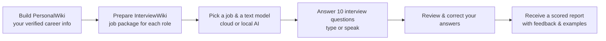

# InterviewSimulator

> **Read this guide in:** [日本語 (Japanese)](README_jp.md) · [繁體中文 (Traditional Chinese)](README_tc.md) · [简体中文 (Simplified Chinese)](README_cn.md)

---

## What is InterviewSimulator?

InterviewSimulator lets you **practise a real job interview** using your own verified career history. You answer ten questions, then receive a scored report with feedback and sample answers you can study.

> **How scoring works:** Your score reflects the evidence in *this practice run only*. It does not predict whether you will get the job.

---

## How It Works — Overview



There are **two knowledge bases** you maintain:

| Knowledge Base | What it stores |
|---|---|
| **PersonalWiki** | Your confirmed work history, skills, and achievements — reviewed and verified by you |
| **InterviewWiki** | A job-specific package: the job description, company research, your compatibility analysis, practice questions, and a tailored résumé |

---

## Choosing Your Setup

### Hardware recommendations

| Your device | Starting point |
|---|---|
| **Tested reference Mac** | 2018 Mac mini · Intel Core i5 3 GHz · 32 GB RAM · macOS Sequoia 15.7.9 |
| **Newer Mac** (Apple Silicon) | 16 GB RAM minimum; 32 GB for comfort when running multiple apps |
| **Windows / Linux PC** | 32 GB RAM recommended for running the local AI model |
| **Cloud AI only** | No local model needed — any modern computer works for the interview interface |
| **Disk space** | At least **10 GB** free (for the local AI model, speech tools, and history) |

Allow extra space for Python environments, download caches, backups, and source builds. Ten GB is not a safe total-installation allowance on Intel macOS; LLVM alone can use tens of GB. Prefer prebuilt tools where available.

### AI model options

The app can use a **local AI model** (runs on your computer, no internet needed for text) or a **cloud AI model** (OpenAI, Google, Anthropic, or Ollama cloud).

| Local model | Size | Speed |
|---|---|---|
| `Qwen3.5-9B Q4_K_M` | ~5.5 GB | Better quality; slower on Intel Mac (minutes per answer) |
| `Qwen3.5-4B Q4_K_M` | ~2.5 GB | Faster; slightly lower quality |

> **What is Q4_K_M?** It means the model is compressed to use about 4 bits per value — a space-saving format that still gives good results.

The 9B model is the quality-first recommendation, with 4B as the speed alternative; quality varies by task. Local operation needs no network after the required tools/models/voices are installed. Ollama supports a server on this computer or its official cloud; a purely local Ollama model does not require a cloud API key. Simplified Chinese is a documentation translation, not an additional interview/interface language.

### Installation profiles

Choose the profile that matches what you want to run locally:

| Profile name | Local AI text | Local microphone & transcription | Local question voice |
|---|---|---|---|
| `cloud-text` | ❌ Cloud only | ❌ Optional | ❌ Optional |
| `cloud-local-voice` | ❌ Cloud only | ✅ whisper.cpp + FFmpeg | ✅ OS voice / Piper / Open JTalk |
| `local-text` | ✅ Qwen + llama server | ❌ Optional | ❌ Optional |
| `local-voice` | ✅ Qwen + llama server | ✅ whisper.cpp + FFmpeg | ✅ OS voice / Piper / Open JTalk |

> **whisper.cpp** — a speech-recognition tool that turns your recorded voice into text, running entirely on your computer.
> **FFmpeg** — a free tool that handles audio recording and conversion.
> **llama server** — a local program that runs the Qwen AI model on your computer.

---

## Step-by-Step Setup

### Step 1 — Install the project

**Before you start**, install the following tools. Copy-paste the commands below for your platform:

#### Install Git

| Platform | Command |
|---|---|
| **macOS** | `xcode-select --install` *(skip if Apple command-line tools and Git already work)* |
| **Windows** | Download and run the installer from [git-scm.com/downloads](https://git-scm.com/downloads) |
| **Linux (Debian/Ubuntu)** | `sudo apt-get install git` |

#### Install Homebrew *(macOS only)*

Homebrew installs native tools like whisper.cpp, llama.cpp, and FFmpeg automatically. Paste this in your Terminal:

```sh
/bin/bash -c "$(curl -fsSL https://raw.githubusercontent.com/Homebrew/install/HEAD/install.sh)"
```

> After installation, follow any instructions printed by Homebrew to add it to your PATH.

#### Install uv (Python environment manager)

`uv` manages the Python version and packages the app needs.

**macOS / Linux:**
```sh
curl -LsSf https://astral.sh/uv/install.sh | sh
```

**Windows PowerShell:**
```powershell
powershell -ExecutionPolicy ByPass -c "irm https://astral.sh/uv/install.ps1 | iex"
```

> After installation, **close and reopen your terminal** so the `uv` command is recognized.

---

**Download the project:**

```sh
git clone https://github.com/NinjaRoboticsEducation/InterviewSimulator.git
cd InterviewSimulator
```

> **Note:** This downloads the app code only — not your personal files, API keys, or AI models.

---

#### Intel Mac — build prerequisites for the current lockfile

The current `uv.lock` selects `cryptography 50.0.1`, which has no Intel-macOS prebuilt wheel (ready-to-install Python package). A fresh Intel installation therefore needs Apple's command-line tools, Rust, and OpenSSL, even for cloud text. This does not mean all Intel Python packages always need compilation.

**Do not install or upgrade Rust through Homebrew just for this step.** It can pull in a large LLVM compiler build. First check existing tools; if Rust is missing, use the official `rustup` binary installer. Follow the [Intel Mac installation and Homebrew troubleshooting guide](doc/installation/INTEL_MAC_SETUP.md), including `OPENSSL_DIR`. Let an existing Homebrew operation finish or stop it with Ctrl+C before changing installation routes.

---

Preview requires an existing Python 3 interpreter; it does not download one. On a new computer, install Python 3.13 first with `uv python install 3.13`, then use `uv run --no-project --python 3.13 scripts/setup_environment.py --profile local-voice --model 9b --dry-run`. The preview itself makes no installation changes.

**Install your chosen profile (macOS / Linux):**

Preview first (no changes made):
```sh
sh scripts/setup.sh --profile local-voice --model 9b --dry-run
```

Then install:
```sh
sh scripts/setup.sh --profile local-voice --model 9b --install-native
```

For cloud AI only:
```sh
sh scripts/setup.sh --profile cloud-text
```

**Windows PowerShell:**

```powershell
powershell -ExecutionPolicy Bypass -File scripts/setup.ps1 -Profile local-voice -Model 9b -DryRun
powershell -ExecutionPolicy Bypass -File scripts/setup.ps1 -Profile local-voice -Model 9b -InstallNative
```

On Windows, install Git, CMake, the Visual Studio C++ build tools, and FFmpeg before using a voice profile. Linux and Windows voices need separate setup. The profile chooses requirements; it does not install every OS voice or voice model. See the [native tools and voice guide](doc/installation/LOCAL_VOICE_SETUP.md).

> **What the installer does:** Downloads Python 3.13, installs the app, downloads only the AI model you selected, verifies the download with a checksum (a file fingerprint to confirm nothing was corrupted), and creates a settings file (`.env`). Your existing settings are never overwritten.

---

### Step 2 — Build your PersonalWiki (your career profile)

Move into the PersonalWiki folder and initialize it:

```sh
cd InterviewWiki/PersonalWiki
uv run llmwiki init
uv run llmwiki doctor
```

**Add your files** (résumé, certificates, portfolio):

| Your file type | Folder to place it in |
|---|---|
| Résumé / CV | `raw/articles/` |
| Career notes | `raw/notes/` |
| Certificates | `raw/papers/` |
| Portfolio images | `raw/media/` |

Register each file you add (replace the example filename with yours):

```sh
uv run llmwiki source add raw/articles/MyResume.pdf
uv run llmwiki source list
```

> **Important:** Registering a file does not build your wiki automatically. You need to follow the full ingestion workflow described in [PersonalWiki/AGENTS.md](InterviewWiki/PersonalWiki/AGENTS.md).

**Suggested prompt for a coding assistant (like Antigravity):**

> Read PersonalWiki/AGENTS.md and its ingestion and review skills. Build source-linked wiki pages from my files, preserve the originals, check every career claim against its source, and show uncertainties for my review.

After reviewing the result, run a final quality check:

```sh
uv run llmwiki lint --strict
```

✅ Only facts confirmed against your source files are used in the interview. Do this once, then repeat whenever your career history changes.

---

### Step 3 — Prepare a job package (InterviewWiki)

Go back to the `InterviewWiki` folder. Create a folder for the company and role, then put the job description inside:

```
InterviewWiki/
└── JobDescriptions/
    └── example-company/
        └── python-engineer/
            └── sources/
                └── JobDescription.md   ← paste the job description here
```

Register the opportunity and prepare the package:

The commands below prepare workflow files; they do not generate the complete package by themselves. Use the linked agent workflow to fill the artifacts and review them before validation.

From the PersonalWiki directory used in Step 2, `cd ..` returns to InterviewWiki. After finalization, the next `cd ..` returns to the project root.

```sh
cd ..
uv run interviewwiki init
uv run interviewwiki candidate migrate
uv run interviewwiki opportunity register example-company/python-engineer
uv run interviewwiki task prepare example-company/python-engineer --kind full-package
```

The package must include: company research, your compatibility analysis, practice questions with answer plans, and a tailored résumé. Follow the workflows in [InterviewWiki/AGENTS.md](InterviewWiki/AGENTS.md) and [InterviewWiki/README.md](InterviewWiki/README.md).

When the package is ready, validate and finalize it:

```sh
uv run interviewwiki task validate example-company/python-engineer --kind full-package --strict
uv run interviewwiki task finalize example-company/python-engineer --kind full-package
```

> Fix every validation error before finalizing. Repeat for each job you apply to.

Check all ready jobs from the project root:

```sh
cd ..
uv run interview-simulator jobs
```

---

### Step 4 — Configure local AI and voices

Skip the Qwen model section if you are using cloud AI for all text tasks.

#### Download AI models manually

If you are **not** using the setup script, or want to download models yourself, use the commands below. Run them from the project root folder.

**Create the model folders first:**

For manual downloads only; the setup script already verifies the selected assets. Download only the text model you plan to use, and Whisper only for transcription.

```sh
mkdir -p models/primary models/fallback models/whisper
```

**Qwen3.5-9B Q4_K_M** — best quality (~5.5 GB):

```sh
curl -fL -o models/primary/Qwen3.5-9B-Q4_K_M.gguf \
  "https://huggingface.co/unsloth/Qwen3.5-9B-GGUF/resolve/99a1b2185534379e6e8b5ec869da25d3e7b3f73c/Qwen3.5-9B-Q4_K_M.gguf"
```

> SHA-256 checksum: `03b74727a860a56338e042c4420bb3f04b2fec5734175f4cb9fa853daf52b7e8`

**Qwen3.5-4B Q4_K_M** — faster, smaller (~2.5 GB):

```sh
curl -fL -o models/fallback/Qwen3.5-4B-Q4_K_M.gguf \
  "https://huggingface.co/unsloth/Qwen3.5-4B-GGUF/resolve/720bb031aae5488eae5d6a78768e6d826662b2ae/Qwen3.5-4B-Q4_K_M.gguf"
```

> SHA-256 checksum: `00fe7986ff5f6b463e62455821146049db6f9313603938a70800d1fb69ef11a4`

**Whisper multilingual small** — speech-to-text model (~488 MB):

```sh
curl -fL -o models/whisper/ggml-small.bin \
  "https://huggingface.co/ggerganov/whisper.cpp/resolve/80da2d8bfee42b0e836fc3a9890373e5defc00a6/ggml-small.bin"
```

> SHA-256 checksum: `1be3a9b2063867b937e64e2ec7483364a79917e157fa98c5d94b5c1fffea987b`

> **How to verify a checksum (required before use):**
> ```sh
> # macOS / Linux:
> shasum -a 256 models/primary/Qwen3.5-9B-Q4_K_M.gguf
> # The output should match the SHA-256 value listed above.
> ```
> A checksum mismatch means the file is corrupted — delete it and re-download.

> **Windows users:** Replace `curl -fL -o <filename> "<url>"` with:
> ```powershell
> Invoke-WebRequest -Uri "<url>" -OutFile "<filename>"
> ```

---

Compare every downloaded file with its listed SHA-256 before use. On macOS use `shasum -a 256 FILE`; on Linux use `sha256sum FILE`; in PowerShell use `Get-FileHash FILE -Algorithm SHA256`. Use a fresh destination or move aside an existing file before downloading.

In PowerShell create directories with `New-Item -ItemType Directory -Force models/primary,models/fallback,models/whisper`. Use `curl.exe -fL -o FILE URL` on one line or `Invoke-WebRequest`; backslash is not a PowerShell line continuation.

**Settings file (`.env`)** — the installer creates this for you. To set it manually, copy `.env.example` to `.env` and fill in the paths:

```dotenv
INTERVIEW_SIMULATOR_GGUF=models/primary/Qwen3.5-9B-Q4_K_M.gguf
INTERVIEW_SIMULATOR_WHISPER_MODEL=models/whisper/ggml-small.bin
INTERVIEW_SIMULATOR_TTS_BACKEND=auto
```

> - `INTERVIEW_SIMULATOR_GGUF` — path to your local Qwen AI model file
> - `INTERVIEW_SIMULATOR_WHISPER_MODEL` — path to the speech-recognition model (must be the **multilingual small** version, not the English-only `.en` version)
> - `INTERVIEW_SIMULATOR_TTS_BACKEND` — text-to-speech engine; `auto` picks the best available

**macOS voices:** Install English, Japanese, and Mandarin voices via **System Settings → Accessibility → Spoken Content**. The app prefers: `Samantha` (English), `Kyoko` (Japanese), `Meijia` (Mandarin).

**Windows voices:** Uses your installed System.Speech voices.

**Linux voices:** Piper (English/Mandarin) and Open JTalk (Japanese). See the [local voice setup guide](doc/installation/LOCAL_VOICE_SETUP.md).

**Start the local AI server** (in one terminal window, keep it running):

```sh
uv run interview-simulator local-server
```

This starts the local AI on `127.0.0.1:8081`. Leave this terminal open.

**In a second terminal**, check everything is working:

```sh
uv run interview-simulator doctor
uv run interview-simulator jobs
uv run interview-simulator voice-test interview-en.wav --locale en
uv run interview-simulator voice-test interview-ja.wav --locale ja
uv run interview-simulator voice-test interview-zh.wav --locale zh-Hant
```

Play the generated `.wav` file to verify the voice sounds correct. Repeat with `--locale ja` and `--locale zh-Hant`.

---

Choose a new output filename for each voice test: existing files are never overwritten. Run voice tests only if local speech is configured. Start the Qwen server only when a selected text task uses it.

### Step 5 — Practise in the browser

Start the interview interface:

```sh
uv run interview-simulator serve
```

Open **[http://127.0.0.1:8765](http://127.0.0.1:8765)** in Safari, Chrome, or Edge.

The app has **six pages** that guide you through the whole process:

```
① Get started
   ↓  Choose your display language and read the intro
② Select Model
   ↓  Pick local AI, or enter a cloud API key (Google / OpenAI / Anthropic / Ollama)
③ Select Job Interview
   ↓  Choose the job and interview language (EN / JA / ZH-Hant)
④ Start Interview
   ↓  Play each question → record or type your answer → confirm
⑤ Review your answers
   ↓  Correct any answers before generating the report
⑥ Interview report
      View scores, feedback, and sample answers — download as Markdown or HTML
```

Each answer is limited to **6,000 characters**. **Record answer** replaces the draft only after successful transcription; **Extend recording** appends another three-minute segment to your edited text. You may extend repeatedly within the answer limit. A countdown starts when recording actually begins. Saved interviews are on **Interview report**; cancelled interviews are hidden, not deleted.

**Interview tips:**
- You can type answers even if voice is not set up
- Use **Pause interview** to save and come back later
- Use **Review answers** to revisit any confirmed answer before the report is generated
- The report locks your answers — edits are only possible before the report starts

> **API key safety:** Enter keys directly into the password field on the Select Model page. Never paste them into the chat, a report file, or a Git commit. Select "Remember on this device" only if you trust the computer's secure vault.

---

### Step 6 — Optional: Practise via text chat (ADK Web)

This is an alternative typed interface — useful for development or if you prefer typing commands.

Stop the browser server first (`Ctrl+C`), then:

```sh
uv run interview-simulator serve-adk
```

Open [http://127.0.0.1:8765](http://127.0.0.1:8765), select `interview_practice`, and start with:

```
start example-company/python-engineer en
```

Known models may be saved directly; models requiring qualification must pass Test Model. A format check is not a quality guarantee. If a provider is unavailable or its quota is exhausted, switch to a local model or another provider; preserve and resume saved work.

Use `ja` or `zh-Hant` for other languages. Append `adaptive` for question bank selection.

For cloud text, first save your provider/model settings in the built-in interface. Stop it, then run `uv run interview-simulator serve-adk --allow-cloud-text`. This explicitly permits selected profile/job facts and answer text to reach the configured providers. The terminal loads a vault key or prompts for one privately. Audio stays local. A direct ADK start command also supports the `cloud-ok` consent suffix.

**Useful commands:**

| Command | What it does |
|---|---|
| `jobs` / `help` | List ready jobs and usage instructions |
| `resume RUN_ID` | Continue an unfinished interview session |
| `history RUN_ID` | View saved answers without resuming |
| `skip` | Record a deliberately skipped answer |
| `review` | Show all saved questions and answers |
| `edit 1 revised answer` | Change answer 1 before scoring |
| `pause` / `cancel` | Save and pause, or abandon the current run |
| `report` / `status` | Generate feedback or check progress |
| `stop-report` | Stop report generation; completed scores are saved |
| `restart` | Begin a new practice run for the same job |
| `allowance` | Add 12 more attempts if the report was interrupted |
| `revise-report cloud-ok` | Create a new scoring revision from saved answers |

> **Note:** The microphone and local speech controls are only in the browser interface. ADK Web is text-only.

---

### Step 7 — Review reports and manage your data

**Reports are saved here:**

```
InterviewWiki/Output/<company>/<role>/Simulations/<run-id>/report.md
```

Each report includes scores, strengths, feedback, and a sample answer built from your confirmed career facts. The coach checks claims against the supplied evidence.

Reports can also be named `report-r02.md`, `report-r03.md`, and so on; the first file may be an earlier draft. Open the latest version through **Interview report**. A new final report requires ten validated examples, including skipped questions. Missing examples keep the report labelled **Draft** and resumable. Examples can include suggested motivations or future approaches, not just historical facts. Evidence checks reduce unsupported claims but cannot guarantee that AI never makes a mistake: verify each example before using it.

**Verify a report:**

```sh
uv run interview-simulator verify-run RUN_ID
```

Stop both simulator interfaces before backup, restore, or clearing history. The ZIP contains simulator databases and simulation files, not the source PersonalWiki/job packages: copy those separately. To preserve practice history during a move, use backup/restore as well as copying wiki data and models; do not copy `.venv` or compiled `.native` tools. Restore before starting either interface in the new installation.

**Backup and restore your practice history:**

```sh
uv run interview-simulator backup /path/to/private-backup.zip
uv run interview-simulator restore /path/to/private-backup.zip
```

> The backup is an **unencrypted ZIP file** — store it somewhere secure. It does not contain API keys. Restore only into a clean installation with no existing practice data.

**Move to a new computer:** Copy your source files, wiki data, and models. Reinstall the app natively on the new machine — Python environments and compiled tools are not portable. Reconnect your cloud accounts after copying.

**Clear all practice history** (cannot be undone):

```sh
uv run interview-simulator clear-history --confirm
```

This removes all sessions, answers, reports, and question bank history. Your PersonalWiki, job packages, and models are kept.

---

## Troubleshooting

| Problem | What to try |
|---|---|
| **No ready jobs listed** | Run `jobs`. Complete PersonalWiki strict review, migrate candidate facts, then validate and finalize the InterviewWiki package. Registration alone is not enough. |
| **`uv` not found** | Install uv from its official site, close and reopen the terminal, then retry. |
| **Rust / OpenSSL error (Intel Mac)** | Use the [Intel Mac guide](doc/installation/INTEL_MAC_SETUP.md). Reuse working tools, prefer rustup when Rust is missing, and set `OPENSSL_DIR`; do not automatically run `brew install rust`. |
| **Setup exits with code 2** | Python installed but native tools are missing. Re-run with `--install-native` or follow the [voice guide](doc/installation/LOCAL_VOICE_SETUP.md). |
| **Download fails or checksum mismatch** | Retry the download. Move aside the broken file (do not bypass the checksum check). Check disk space and your internet connection to Hugging Face. |
| **`.env` still points to 9B after installing 4B** | The installer preserves existing settings. Edit `INTERVIEW_SIMULATOR_GGUF` manually, then restart the model server. |
| **Local AI server not responding** | Start `uv run interview-simulator local-server`. Check that port 8081 is free. |
| **Model in memory differs from `.env` setting** | Stop and restart the model server with the correct `.env` path. Start a new practice run after switching models. |
| **Voice buttons disabled or silent** | Run `doctor` and `voice-test`. Verify FFmpeg, whisper-cli, the multilingual small model, and your OS voices are installed. Restart the app after installing voices. Typed answers always work. |
| **Microphone permission stuck** | Allow microphone access for `127.0.0.1` in your browser and OS settings. Embedded browsers (e.g. VS Code) may not support the microphone. |
| **Speech recognition mistakes** | Correct the transcript before confirming. Speak in a quiet environment, check the interview language setting. Each recording is limited to 3 minutes / 20 MB. |
| **Cloud API key rejected** | Reconnect the provider and check your API billing and permissions. Chat subscription keys do not give API access. |
| **Unknown model cannot be saved** | Run the synthetic model test first. Choose "Provider default" for reasoning if unsure. |
| **Report is very slow** | Normal for Intel Mac — scoring can take many minutes per answer. Check saved progress and use **Resume unfinished report**. Validated scores are not recalculated. |
| **Model-call budget reached** | Stop the simulator, then run `uv run interview-simulator report-allowance RUN_ID --confirm`. |
| **HTTP 403 error after restart** | Reload the browser page. The security token changes each time the server restarts. |
| **Second interface won't start** | Stop the other server with `Ctrl+C`. Only one interface can run at a time. |

---

### Advanced report recovery

If report generation was interrupted, stop all simulator servers first, then:

```sh
# Add 12 more permitted task attempts (does not increase cloud quota):
uv run interview-simulator report-allowance RUN_ID --confirm

# Create a new scoring revision using the current saved model settings:
uv run interview-simulator report-revision RUN_ID --confirm

# If your saved model uses cloud AI:
uv run interview-simulator report-revision RUN_ID --confirm --allow-cloud-text
```

After running either command, restart the simulator and use **Resume unfinished report** on the Interview report page.

---

## Project Structure (for reference)

```
InterviewSimulator/
├── agents/interview_practice/      ADK Web chat interface
├── src/interview_simulator/
│   ├── engine.py                   Core interview and report workflow
│   ├── adk_runtime.py              AI agent coordination
│   ├── providers/                  Cloud / Ollama connections and key handling
│   ├── localization.py             Translations (EN / JA / ZH)
│   ├── storage.py                  Saves answers, scores, and history
│   ├── wiki.py                     Reads your prepared job packages
│   ├── speech.py / local_voices.py Microphone recording and question playback
│   ├── report.py / report_view.py  Generates and renders the scored report
│   └── static/                     Browser UI, theme, and translations
├── InterviewWiki/
│   ├── PersonalWiki/raw/           Your original résumé and portfolio files
│   ├── PersonalWiki/wiki/          Reviewed and verified career information
│   ├── JobDescriptions/            Registered job opportunities
│   └── Output/.../Simulations/     Saved reports for each practice run
├── .simulator/                     App databases and model settings (private)
├── models/                         Downloaded AI and speech models
├── config/download-manifest.json   Model download checksums and licences
├── scripts/                        Setup scripts and model benchmarks
├── tests/                          Automated tests
└── doc/                            Research, audits, and validation evidence
```
