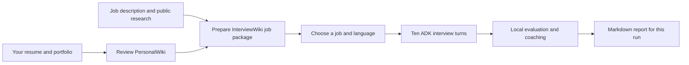
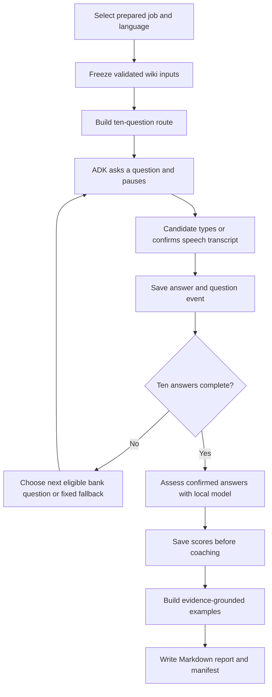

# InterviewSimulator

## 1. What this project does

InterviewSimulator is a private practice interviewer for a job you are considering. It asks ten questions about your experience, professional judgment, portfolio, the role, and the company. You can answer by typing, or speak one answer at a time in the built-in browser. After the interview, it writes a Markdown report with a score for each answer, specific feedback, and a practice answer assembled from facts you have confirmed about yourself. The score describes what you showed **in this practice session**; it does not predict a hiring decision.

The app uses **Google ADK (Agent Development Kit)** for the interview conversation and local assessment tasks. The language model runs on your own device through **llama.cpp**, a program that serves local AI models. English, Japanese, and Traditional Chinese are supported. Mandarin speech is converted to Traditional Chinese text for review.

Your career information and the job must be prepared first. **PersonalWiki** is your reviewed record of real experience. **InterviewWiki** prepares each job opportunity and its research. InterviewSimulator reads those results and focuses on practice. It does not create or rewrite either wiki. You can return to the same job for another run; each run gets its own report folder.



## 2. Quick start

### Hardware and software

| Device | Recommendation |
|---|---|
| Reference machine | **2018 Mac mini**, 3 GHz six-core Intel Core i5, 32 GB RAM, macOS Sequoia 15.7.9. The app and synthetic model/audio checks have run here. |
| Newer Mac | Apple Silicon with at least 16 GB RAM is a reasonable candidate, but its three-language voice setup still needs device testing. |
| Windows or Linux PC | At least 32 GB RAM is the conservative choice for the 9B model; configure Piper voices instead of macOS `say`. Full device qualification remains open. |
| Model | **Qwen3.5-9B Q4_K_M** first for quality. Use **Qwen3.5-4B Q4_K_M** if the 9B model is too slow. Q4_K_M is a compact, four-bit model format. |

On the reference Intel Mac, a fresh synthetic English assessment plus coaching took about **2 minutes 22 seconds with 9B** and **1 minute 33 seconds with 4B**. A complete ten-answer report can therefore take many minutes. The same short test found materially different scores across the three interview languages, so treat the score as practice feedback, not a hiring prediction or a cross-language ranking. See the [local model qualification](doc/LOCAL_MODEL_QUALIFICATION.md) for conditions, all timings, and limitations. Microphone quality, answer length, and a real job package may change the result.

Install [uv](https://docs.astral.sh/uv/) (Python environment manager), [llama.cpp](https://github.com/ggml-org/llama.cpp) (`llama-server`), [whisper.cpp](https://github.com/ggml-org/whisper.cpp) (`whisper-cli`), and [FFmpeg](https://ffmpeg.org/) for voice input. On macOS, the built-in `say` command can read questions aloud. On other systems, install [Piper](https://github.com/rhasspy/piper) and local voice files. The text interview works without microphone software.

### Step 1: Copy and install the project

Clone the project, or copy the whole `InterviewSimulator` folder, including its `InterviewWiki/PersonalWiki` source folder. A GitHub clone includes the wiki applications but **not** your private resumes, job descriptions, or interview reports. Open a terminal:

```sh
git clone https://github.com/NinjaRoboticsEducation/InterviewSimulator.git
cd InterviewSimulator
```

If you copied the folder instead, open a terminal in that copy. Then install the three Python projects:

```sh
uv python install 3.13
uv sync --locked --group dev
cd InterviewWiki
uv sync --locked
cd PersonalWiki
uv sync --locked
uv run llmwiki init
uv run llmwiki doctor
```

`uv` creates a new `.venv` for each project. When moving to another computer, copy the project and private data, then recreate the environments; `.venv` and native programs are device-specific. If `uv sync --locked` fails, check internet access and the local `InterviewWiki` folder before changing the lockfile.

### Step 2: Build PersonalWiki once

Place your real resume in `InterviewWiki/PersonalWiki/raw/articles/`. Put career notes under `raw/notes/`, certificates under `raw/papers/`, and portfolio images under `raw/media/`. Keep original files unchanged. From `InterviewWiki/PersonalWiki`, register a source and inspect it:

```sh
uv run llmwiki source add raw/articles/MyResume.pdf
uv run llmwiki source list
```

Replace `MyResume.pdf` with your actual filename. Use the PersonalWiki ingestion and review workflow to create source-linked pages in `wiki/`. For example, ask your coding assistant:

> Read `PersonalWiki/AGENTS.md` and its wiki-ingest and wiki-review skills. Build my PersonalWiki from the files in `raw/`, check every material career claim against its source, preserve my originals, and run strict lint. Show me uncertainties for review.

Then check the result from `InterviewWiki/PersonalWiki`:

```sh
uv run llmwiki lint --strict
```

A source registration alone does **not** build a complete wiki. Resolve strict-lint failures and review the candidate facts before continuing. Repeat this step when your career information changes.

### Step 3: Register and prepare a job in InterviewWiki

From the `InterviewWiki` folder, create a folder for the company and opportunity. Put the job description in `JobDescription.md`; the folder names become the job reference:

```text
InterviewWiki/JobDescriptions/example-company/product-designer/sources/JobDescription.md
```

Run the deterministic registration and preparation commands:

```sh
uv run interviewwiki init
uv run interviewwiki candidate migrate
uv run interviewwiki opportunity register example-company/product-designer
uv run interviewwiki task prepare example-company/product-designer --kind full-package
```

Registration also ingests supported files under the opportunity’s `sources/` folder. The full package also needs company research, candidate compatibility analysis, interview questions, and a tailored resume. Ask your coding assistant to follow `InterviewWiki/AGENTS.md` and its company-research and full-package skills, using public company sources and your reviewed PersonalWiki facts. The `task prepare` command creates a workspace; it does not write the complete AI-assisted package by itself. When the package is ready:

```sh
uv run interviewwiki task validate example-company/product-designer --kind full-package --strict
uv run interviewwiki task finalize example-company/product-designer --kind full-package
```

`finalize` seals the package. Resolve every strict validation error first. Repeat this job step for each opportunity. The [InterviewWiki guide](InterviewWiki/README.md) gives the fuller preparation workflow.

### Step 4: Start the local model

Return to `InterviewSimulator`. Download a trusted GGUF model and verify its published SHA-256 fingerprint (a file checksum). The recommended [9B Q4_K_M](https://huggingface.co/unsloth/Qwen3.5-9B-GGUF/blob/main/Qwen3.5-9B-Q4_K_M.gguf) hash is `03b74727a860a56338e042c4420bb3f04b2fec5734175f4cb9fa853daf52b7e8`; the [4B fallback](https://huggingface.co/unsloth/Qwen3.5-4B-GGUF/blob/main/Qwen3.5-4B-Q4_K_M.gguf) hash is `00fe7986ff5f6b463e62455821146049db6f9313603938a70800d1fb69ef11a4`. No model is bundled.

Use the same file path for the model server and InterviewSimulator. For example, on the reference Intel Mac:

```sh
export INTERVIEW_SIMULATOR_GGUF=models/primary/Qwen3.5-9B-Q4_K_M.gguf
llama-server -m "$INTERVIEW_SIMULATOR_GGUF" -c 4096 --host 127.0.0.1 --port 8081 -ngl 0 -t 6 --alias interview-local --api-key local-only --cors-origins http://127.0.0.1:8765
```

Leave that terminal running. In a second terminal, from `InterviewSimulator`, set the same `INTERVIEW_SIMULATOR_GGUF` variable and check the setup:

```sh
uv run interview-simulator doctor
uv run interview-simulator jobs
```

The app asks llama.cpp which model it loaded and compares the path with `INTERVIEW_SIMULATOR_GGUF` before scoring. Keep the same model loaded until a report finishes. Set `INTERVIEW_SIMULATOR_MODEL_API_KEY` if you change the server key.

### Step 5: Choose an interview interface

Use **one interface at a time**. Both use the same saved interview engine and question bank. The built-in browser supports typed and turn-by-turn spoken answers. ADK Web is a development chat interface for typed answers; use the built-in browser for microphone practice. ADK Web chat history is temporary and clears when its server stops; the interview answers and report remain saved by the shared engine.

**Built-in browser:**

```sh
uv run interview-simulator serve
```

Open <http://127.0.0.1:8765>. Choose a ready job, language, and either **Fixed practice** or **Adaptive question order**. Press Start. Listen to the greeting and questions if voice output is configured. Record one answer at a time, correct the recognized text, and confirm it. You can always type instead. The adaptive choice uses only bank questions linked to the same job evidence and keeps two questions in each topic; with no eligible variants, it explains that the run uses the fixed route.

**Google ADK Web:** stop the built-in server first, then run:

```sh
uv run interview-simulator serve-adk
```

Open <http://127.0.0.1:8765>, select `interview_practice`, and send `jobs`. Start a ready job with `start example-company/product-designer en` (or `ja` / `zh-Hant`). Add `adaptive` at the end to request the bank-based question order, for example `start example-company/product-designer ja adaptive`. Type each answer in chat. Other commands are `resume`, `skip`, `report`, and `status`. The report is saved as a Markdown file; ADK Web shows its path. ADK Web itself is intended by Google for [local development and debugging](https://adk.dev/runtime/web-interface/), so keep it on `127.0.0.1`.

### Step 6: Review the report and practise again

After ten answers or explicit skips, press **Generate report** in the built-in browser. In ADK Web, send `report`, then send `status` until the report path appears. The browser shows the report text. The file lives at:

```text
InterviewWiki/Output/<company>/<opportunity>/Simulations/<run-id>/report.md
```

Open it in any Markdown viewer. Run `uv run interview-simulator verify-run <run-id>` from `InterviewSimulator` to check the report manifest and file fingerprints. Read the quote from each confirmed answer, the score and feedback, and the example answer. Bracketed details are prompts for **you** to fill with verifiable facts; they are not claims the app has confirmed. The report includes the question flow and, for new model assessments, model and prompt provenance. If a step fails, retry report generation; saved scores are not recalculated. Once a run is finished, choose the job again to make a fresh report in a new run folder.

### Move, back up, or remove practice data

Stop either server before these commands. The backup is a **private, unencrypted ZIP** containing simulator databases and run folders; store it somewhere protected. Copy the project with its PersonalWiki and InterviewWiki source/package folders separately. Restore into a copied project with an **empty** simulator state and no existing `Simulations` run folders:

```sh
uv run interview-simulator backup /path/to/private-simulator-backup.zip
uv run interview-simulator restore /path/to/private-simulator-backup.zip
```

Restoring verifies checksums and SQLite integrity and refuses to overwrite existing run data. To deliberately discard one run, including its report and effect on practice history, stop the server and run `uv run interview-simulator delete-run <run-id>`. Keep a backup first if you may need it. The two interfaces cannot run against the state at the same time.

## 3. Key features and how the pieces fit

```text
InterviewSimulator/
├── agents/interview_practice/       ADK Web chat entry point
├── src/interview_simulator/         Shared interview engine, ADK flow, API, audio, scoring
│   └── static/app.js                Built-in browser behavior
├── InterviewWiki/
│   ├── PersonalWiki/raw/            Your original personal material
│   ├── PersonalWiki/wiki/           Reviewed, sourced personal pages
│   ├── JobDescriptions/            One folder per job opportunity
│   └── Output/.../Simulations/      Frozen inputs, reports, manifests per run
├── .simulator/                      Private SQLite databases and server lease
├── models/                          Optional local GGUF files; not shipped
├── tests/                           Regression tests
└── doc/                             Plan, status, and audit
```

| Part | Job |
|---|---|
| PersonalWiki | Holds your verified career facts. Only confirmed, non-sensitive facts can shape questions and model input. |
| InterviewWiki | Manually prepares and strictly validates job requirements, company research, and candidate matches. |
| Question bank | Records asked questions without counting repeats as new versions. A bounded adaptive selector can choose a current-evidence variant; every choice is saved for recovery. |
| ADK workflow | Asks and pauses for ten answers. ADK's saved session and the simulator database let an interrupted interview resume. |
| Local assessor | Uses the rubric (five scoring dimensions) and a local Qwen model through llama.cpp. It checks that quoted answer evidence really appears in your confirmed answer. |
| Career coach | Uses confirmed personal facts in an example answer and shows placeholders for unknown details. Free-form coaching claims are replaced with controlled guidance. |
| Voice tools | `whisper-cli` recognizes a complete answer; macOS `say` or Piper reads questions; FFmpeg converts audio. No spoken interruptions are needed. |
| Report and history | Produces one report per run, keeps per-answer scores stable, and shows topic progress across runs. |



Fixed practice follows the planned question order. Adaptive practice can reorder or replace a question only inside its topic slot, so the route still covers personal experience, professionalism, portfolio, role, and company twice each. The selection policy uses answer words as **data**, never as instructions. It records its policy version, eligible count, chosen question, and fixed fallback. The evidence snapshot, saved decisions, and ADK session allow the same turn to be replayed after a restart. Some topics may stay fixed until the bank contains a safe, current alternative.

The reference models are Qwen3.5-9B Q4_K_M (quality first) and Qwen3.5-4B Q4_K_M (speed fallback). A **GGUF** is the model file format used by llama.cpp. The app uses a local HTTP address on this computer; it has no cloud model fallback. Model-generated scoring can still be wrong. Use the report as practice feedback and compare important claims with your own source material.

## 4. Troubleshooting

| What you see | What to do |
|---|---|
| No jobs appear, or a job is marked “not ready” | Run `uv run interview-simulator jobs`. Finish PersonalWiki strict lint, rebuild candidate facts if needed, and strictly validate and finalize the InterviewWiki full package. Check the job reference spelling. |
| PersonalWiki strict lint fails | Review each cited career statement against the original source. Use the PersonalWiki review workflow; do not mark a review as human-verified unless a person actually checked it. |
| `doctor` says the model endpoint is unavailable | Start `llama-server` on `127.0.0.1:8081`, keep it running, and check its key and port. |
| The loaded model does not match `INTERVIEW_SIMULATOR_GGUF` | Start the server and the app from the same project folder with the same model path. Do not swap models midway through a report. |
| Scoring is very slow | Try the 4B Q4_K_M model, use a shorter answer, and check available memory. Existing saved scores stay tied to their original model; begin a new run when changing models. |
| Voice buttons fail | Check `ffmpeg`, `whisper-cli`, the local whisper model path, microphone permission, and your configured `say` or Piper voice. Type the answer if voice is unavailable. Audio is limited to 20 MB and three minutes. |
| The browser says to reload, or reports a 403 error | Reload the local page after restarting the server; its request token changes each time. Open `127.0.0.1`, not a remote address. |
| An interview seems stuck after a restart | Use `resume` in ADK Web or reload the built-in browser. A saved answer is replayed into the ADK session. If you intentionally want to abandon a run, stop the server and use `delete-run <run-id>`. |
| The report stops or is incomplete | Keep the model server running. Retry **Generate report** or `report`; completed scores are kept. Inspect the report for any answer marked unavailable. |
| A second server will not start | Close the other interface first. A file lease prevents both interfaces from writing the same practice state. |
| Restore refuses to run | Use a copied project with an empty `.simulator` state and no existing run folders. Keep the original backup intact and check that its matching InterviewWiki job folders exist. |

For development checks, run `uv run python -m pytest -q`, `uv run ruff check src agents tests`, `uv run ruff format --check src agents tests`, `uv run mypy src/interview_simulator`, `node --check src/interview_simulator/static/app.js`, and `node tests/browser_state.cjs`. The [implementation plan](doc/INTERVIEW_SIMULATOR_RESEARCH_AND_IMPLEMENTATION_PLAN.md) and [audit](doc/SECURITY_AND_CORRECTNESS_AUDIT.md) record design decisions and remaining acceptance work.
