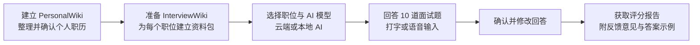

# InterviewSimulator

> **以其他语言阅读：** [English](README.md) · [日本語（日文）](README_jp.md) · [繁體中文（繁体中文）](README_tc.md)

---

## InterviewSimulator 是什么？

InterviewSimulator 让你能够**用自己真实的工作经历来练习求职面试**。你只需回答十道题目，便可获得一份含有评分、反馈意见与参考答案的报告。

> **关于评分：** 评分反映的是**本次练习**的回答表现，并不能预测实际录取结果。

---

## 运作方式概览



你需要维护**两个知识库**：

| 知识库 | 内容 |
|---|---|
| **PersonalWiki** | 你已确认并验证的工作经历、技能与成就 |
| **InterviewWiki** | 针对特定职位的资料包：职位描述、公司研究、适配分析、练习题目、定制简历 |

---

## 环境配置选择

### 推荐硬件配置

| 使用设备 | 建议配置 |
|---|---|
| **已验证 Mac** | Mac mini 2018 · Intel Core i5 3GHz · 32GB RAM · macOS Sequoia 15.7.9 |
| **较新的 Mac**（Apple Silicon） | 最低 16GB RAM；建议 32GB 以确保流畅运行 |
| **Windows / Linux PC** | 使用本地 AI 时建议 32GB RAM |
| **仅使用云端 AI** | 不需要本地模型，普通电脑即可使用界面 |
| **磁盘空间** | 至少 **10GB** 可用空间（供 AI 模型、语音工具与练习记录使用） |

Python环境、下载缓存、备份及源码编译另需空间。Intel Mac完整安装不能假设10GB就足够；LLVM本身可能需要数十GB。请优先使用可用的预编译工具。

### AI 模型选择

可选择**本地 AI 模型**（不需要网络即可执行文字任务）或**云端 AI 模型**（OpenAI、Google、Anthropic 或 Ollama）。

| 本地模型 | 大小 | 速度 |
|---|---|---|
| `Qwen3.5-9B Q4_K_M` | 约 5.5GB | 质量较好；Intel Mac 较慢（每个回答需数分钟） |
| `Qwen3.5-4B Q4_K_M` | 约 2.5GB | 速度较快；质量略低 |

> **什么是 Q4_K_M？** 这是一种将模型数据压缩至约 4 位的格式，在节省空间的同时仍能维持良好效果。

9B优先考虑质量，4B优先考虑速度；实际质量因任务而异。工具、模型及语音安装完成后可本机运行。Ollama支持同一电脑的服务器及官方云端，完全本机的模型不需要云端API密钥。简体中文仅为文档翻译，不是新增的界面或面试语言。

### 安装配置文件

请根据你想使用的功能选择安装配置文件：

| 配置文件名称 | 本地 AI 文字 | 麦克风与语音转文字 | 问题语音播放 |
|---|---|---|---|
| `cloud-text` | ❌ 仅限云端 | ❌ 可选 | ❌ 可选 |
| `cloud-local-voice` | ❌ 仅限云端 | ✅ whisper.cpp + FFmpeg | ✅ 系统语音 / Piper / Open JTalk |
| `local-text` | ✅ Qwen + llama 服务器 | ❌ 可选 | ❌ 可选 |
| `local-voice` | ✅ Qwen + llama 服务器 | ✅ whisper.cpp + FFmpeg | ✅ 系统语音 / Piper / Open JTalk |

> **whisper.cpp** — 将录音转换为文字的语音识别工具（完全在你的电脑上运行）
> **FFmpeg** — 处理音频录制与转换的免费工具
> **llama 服务器** — 在你的电脑上运行 Qwen AI 模型的程序

---

## 逐步安装说明

### 步骤 1 — 安装项目

**请先安装以下工具。** 请根据你的操作系统，复制并粘贴以下命令。

#### 安装 Git

| 操作系统 | 命令 |
|---|---|
| **macOS** | `xcode-select --install` *（已安装Apple命令行工具和Git则跳过）* |
| **Windows** | 从 [git-scm.com/downloads](https://git-scm.com/downloads) 下载并运行安装程序 |
| **Linux（Debian/Ubuntu）** | `sudo apt-get install git` |

#### 安装 Homebrew *（仅限 macOS）*

Homebrew 可自动安装 whisper.cpp、llama.cpp、FFmpeg 等原生工具。请在终端中粘贴以下命令并执行：

```sh
/bin/bash -c "$(curl -fsSL https://raw.githubusercontent.com/Homebrew/install/HEAD/install.sh)"
```

> 安装完成后，请按照终端显示的指示将 Homebrew 添加到 PATH。

#### 安装 uv（Python 环境管理工具）

`uv` 管理应用程序所需的 Python 版本和软件包。

**macOS / Linux：**
```sh
curl -LsSf https://astral.sh/uv/install.sh | sh
```

**Windows PowerShell：**
```powershell
powershell -ExecutionPolicy ByPass -c "irm https://astral.sh/uv/install.ps1 | iex"
```

> 安装完成后，请**关闭终端并重新打开**，这样 `uv` 命令才会被识别。

---

**下载项目：**

```sh
git clone https://github.com/NinjaRoboticsEducation/InterviewSimulator.git
cd InterviewSimulator
```

> **注意：** 下载的是应用代码，不包含你的个人文件、API 密钥或 AI 模型。

---

#### Intel Mac — 当前锁定软件包需要的编译环境

当前 `uv.lock` 指定 `cryptography 50.0.1`，此版本没有Intel macOS的wheel（预先编译的Python软件包）。因此全新安装需要Apple命令行工具、Rust及OpenSSL，即使仅使用云端文字处理也一样。这不代表所有Intel版Python软件包都需要编译。

**请勿只为此步骤而通过Homebrew安装或升级Rust。** 这可能触发庞大的LLVM编译器构建。先检查现有工具；若缺少Rust，使用官方 `rustup` 二进制安装程序。请按[Intel Mac安装与Homebrew故障排除指南（英文）](doc/installation/INTEL_MAC_SETUP.md)操作，包括设置 `OPENSSL_DIR`。更换安装方式前，请等待现有Homebrew任务完成，或用Ctrl+C停止。

---

预览需要已安装的Python 3，不会自动下载。新电脑可先运行 `uv python install 3.13`，再使用 `uv run --no-project --python 3.13 scripts/setup_environment.py --profile local-voice --model 9b --dry-run`。预览本身不会安装软件包。

**选择配置文件并安装（macOS / Linux）：**

先预览确认（不会进行任何更改）：
```sh
sh scripts/setup.sh --profile local-voice --model 9b --dry-run
```

正式安装：
```sh
sh scripts/setup.sh --profile local-voice --model 9b --install-native
```

仅使用云端 AI：
```sh
sh scripts/setup.sh --profile cloud-text
```

**Windows PowerShell：**

```powershell
powershell -ExecutionPolicy Bypass -File scripts/setup.ps1 -Profile local-voice -Model 9b -DryRun
powershell -ExecutionPolicy Bypass -File scripts/setup.ps1 -Profile local-voice -Model 9b -InstallNative
```

Windows语音配置需要先安装Git、CMake、Visual Studio C++构建工具及FFmpeg。Windows及Linux语音需单独设置。配置方案会选择所需组件，但不会自动安装所有系统语音或语音模型。请参阅[原生工具与语音指南](doc/installation/LOCAL_VOICE_SETUP.md)。

> **安装程序执行的工作：** 安装 Python 3.13、设置应用程序、下载你选择的 AI 模型、用校验码（文件指纹）验证下载完整性、创建设置文件（`.env`）。不会覆盖现有设置。

---

### 步骤 2 — 建立 PersonalWiki（个人职历档案）

进入 PersonalWiki 文件夹并初始化：

```sh
cd InterviewWiki/PersonalWiki
uv run llmwiki init
uv run llmwiki doctor
```

**添加你的文件：**

| 文件类型 | 存放文件夹 |
|---|---|
| 简历 / CV | `raw/articles/` |
| 职业笔记 | `raw/notes/` |
| 证书 / 资质 | `raw/papers/` |
| 作品集图片 | `raw/media/` |

添加文件后进行登记（请将示例文件名替换为你自己的文件名）：

```sh
uv run llmwiki source add raw/articles/MyResume.pdf
uv run llmwiki source list
```

> **重要：** 登记文件不会自动建立 Wiki。请按照 [PersonalWiki/AGENTS.md](InterviewWiki/PersonalWiki/AGENTS.md) 中的数据导入流程操作。

**给代码助手（如 Antigravity）的建议提示：**

> 请阅读 PersonalWiki/AGENTS.md 及其导入与审核技能。根据我的文件建立附有来源链接的 Wiki 页面，保留原始文件，对照来源核查每一项职历声明，并将不确定的内容显示出来供我审查。

审查结果后，执行最终质量检查：

```sh
uv run llmwiki lint --strict
```

✅ 只有经来源文件确认的事实才会用于面试练习。每当职历有所变化时，请重复此步骤。

---

### 步骤 3 — 准备职位资料包（InterviewWiki）

回到 `InterviewWiki` 文件夹，为公司和职位创建文件夹，并将职位描述放入其中：

```
InterviewWiki/
└── JobDescriptions/
    └── example-company/
        └── python-engineer/
            └── sources/
                └── JobDescription.md   ← 在此粘贴职位描述
```

登记职位并准备资料包：

以下命令只准备工作流程文件，不会自动生成完整资料包。请通过链接中的代理工作流程填写并审核成果，再执行验证。

从步骤2的PersonalWiki目录运行 `cd ..` 返回InterviewWiki。最终确认后，下一个 `cd ..` 会回到项目根目录。

```sh
cd ..
uv run interviewwiki init
uv run interviewwiki candidate migrate
uv run interviewwiki opportunity register example-company/python-engineer
uv run interviewwiki task prepare example-company/python-engineer --kind full-package
```

资料包必须包含：公司研究、适配分析、附回答计划的练习题目，以及定制简历。请按照 [InterviewWiki/AGENTS.md](InterviewWiki/AGENTS.md) 和 [InterviewWiki/README.md](InterviewWiki/README.md) 的流程操作。

准备好后，执行验证与最终确认：

```sh
uv run interviewwiki task validate example-company/python-engineer --kind full-package --strict
uv run interviewwiki task finalize example-company/python-engineer --kind full-package
```

> 在最终确认之前，请修正所有验证错误。每个应聘的职位都要重复此步骤。

从项目根目录查看所有已准备好的职位：

```sh
cd ..
uv run interview-simulator jobs
```

---

### 步骤 4 — 配置本地 AI 与语音

如果所有文字任务都使用云端 AI，可跳过 Qwen 模型配置。

#### 手动下载 AI 模型

如果你**不**使用安装脚本，或希望自己下载模型，请使用以下命令。在项目根目录中运行。

**先建立模型文件夹：**

仅供手动下载使用；安装脚本已会验证选定的文件。只需选择你要使用的文字模型，Whisper仅在需要转录时下载。

```sh
mkdir -p models/primary models/fallback models/whisper
```

**Qwen3.5-9B Q4_K_M** — 质量优先（约5.5GB）：

```sh
curl -fL -o models/primary/Qwen3.5-9B-Q4_K_M.gguf \
  "https://huggingface.co/unsloth/Qwen3.5-9B-GGUF/resolve/99a1b2185534379e6e8b5ec869da25d3e7b3f73c/Qwen3.5-9B-Q4_K_M.gguf"
```

> SHA-256 校验和：`03b74727a860a56338e042c4420bb3f04b2fec5734175f4cb9fa853daf52b7e8`

**Qwen3.5-4B Q4_K_M** — 速度优先（约2.5GB）：

```sh
curl -fL -o models/fallback/Qwen3.5-4B-Q4_K_M.gguf \
  "https://huggingface.co/unsloth/Qwen3.5-4B-GGUF/resolve/720bb031aae5488eae5d6a78768e6d826662b2ae/Qwen3.5-4B-Q4_K_M.gguf"
```

> SHA-256 校验和：`00fe7986ff5f6b463e62455821146049db6f9313603938a70800d1fb69ef11a4`

**Whisper 多语言 small** — 语音识别模型（约488MB）：

```sh
curl -fL -o models/whisper/ggml-small.bin \
  "https://huggingface.co/ggerganov/whisper.cpp/resolve/80da2d8bfee42b0e836fc3a9890373e5defc00a6/ggml-small.bin"
```

> SHA-256 校验和：`1be3a9b2063867b937e64e2ec7483364a79917e157fa98c5d94b5c1fffea987b`

> **如何验证校验和（使用前必须验证）：**
> ```sh
> # macOS / Linux：
> shasum -a 256 models/primary/Qwen3.5-9B-Q4_K_M.gguf
> # 输出应与上方的 SHA-256 相符。
> ```
> 校验和不符说明文件已损坏，请删除后重新下载。

> **Windows 用户：** 请将 `curl -fL -o <文件名> "<URL>"` 替换为：
> ```powershell
> Invoke-WebRequest -Uri "<URL>" -OutFile "<文件名>"
> ```

---

使用前请验证每个下载文件的SHA-256。macOS用 `shasum -a 256 FILE`，Linux用 `sha256sum FILE`，PowerShell用 `Get-FileHash FILE -Algorithm SHA256`。请下载到新文件，或先将现有文件移至别处。

PowerShell请用 `New-Item -ItemType Directory -Force models/primary,models/fallback,models/whisper` 创建文件夹。下载请使用单行 `curl.exe -fL -o FILE URL` 或 `Invoke-WebRequest`；反斜杠不是PowerShell的续行符。

**配置文件（`.env`）** — 安装程序会自动创建。如需手动配置，请将 `.env.example` 复制为 `.env` 并填入以下路径：

```dotenv
INTERVIEW_SIMULATOR_GGUF=models/primary/Qwen3.5-9B-Q4_K_M.gguf
INTERVIEW_SIMULATOR_WHISPER_MODEL=models/whisper/ggml-small.bin
INTERVIEW_SIMULATOR_TTS_BACKEND=auto
```

> - `INTERVIEW_SIMULATOR_GGUF` — 本地 Qwen AI 模型文件的路径
> - `INTERVIEW_SIMULATOR_WHISPER_MODEL` — 语音识别模型的路径（必须使用**多语言 small 版本**，不可使用英语专用的 `.en` 版本）
> - `INTERVIEW_SIMULATOR_TTS_BACKEND` — 语音合成引擎；`auto` 会自动选择最佳选项

**macOS 语音：** 通过**系统设置 → 辅助功能 → 朗读内容**安装英语、日语与普通话语音。推荐语音：`Samantha`（英语）、`Kyoko`（日语）、`Meijia`（普通话）

**Windows 语音：** 使用已安装的 System.Speech 语音。

**Linux 语音：** Piper（英语/普通话）和 Open JTalk（日语）。请参阅[本地语音设置指南](doc/installation/LOCAL_VOICE_SETUP.md)。

**启动本地 AI 服务器**（在第一个终端窗口中运行，保持开启）：

```sh
uv run interview-simulator local-server
```

本地 AI 将在 `127.0.0.1:8081` 启动，请保持此终端窗口开启。

**在第二个终端**中确认一切正常运行：

```sh
uv run interview-simulator doctor
uv run interview-simulator jobs
uv run interview-simulator voice-test interview-en.wav --locale en
uv run interview-simulator voice-test interview-ja.wav --locale ja
uv run interview-simulator voice-test interview-zh.wav --locale zh-Hant
```

播放生成的 `.wav` 文件确认语音是否正确。再以 `--locale ja` 和 `--locale zh-Hant` 重复测试。

---

每次语音测试请使用新文件名，现有文件不会被覆盖。仅在本机语音配置完成后测试；Qwen服务器只需在选定文字任务使用它时启动。

### 步骤 5 — 在浏览器中练习面试

启动面试界面：

```sh
uv run interview-simulator serve
```

使用 Safari、Chrome 或 Edge 打开 **[http://127.0.0.1:8765](http://127.0.0.1:8765)**。

应用程序共有**六个页面**，引导你完成整个流程：

```
① Get started（开始）
   ↓  选择界面语言并阅读说明
② Select Model（选择 AI 模型）
   ↓  选择本地 AI，或输入云端 API 密钥（Google / OpenAI / Anthropic / Ollama）
③ Select Job Interview（选择职位面试）
   ↓  选择职位与面试语言（英语 / 日语 / 繁体中文）
④ Start Interview（开始面试）
   ↓  播放问题 → 录音或打字回答 → 确认
⑤ Review your answers（确认回答）
   ↓  在生成报告前修改任何回答
⑥ Interview report（面试报告）
      查看评分、反馈意见与答案示例 — 可下载 Markdown 或 HTML 格式
```

每个回答上限为**6,000字符**。**Record answer（录制回答）**会在转录成功后替换草稿；**Extend recording（延长录音）**会将下一段最多3分钟的录音文字追加到已编辑的回答。字数限制内可重复追加。实际开始录音后会显示倒计时。已保存的面试位于**面试报告**页；已取消的面试只会隐藏，不会删除。

**面试小贴士：**
- 即使未配置语音，仍可以打字方式回答
- 使用 **Pause interview** 可保存进度，稍后继续
- 使用 **Review answers** 可在报告生成前重新审视任何回答
- 开始生成报告时，回答即被锁定，无需等到完成

> **API 密钥安全：** 请直接在 Select Model 页面的密码输入框中输入密钥。绝对不要粘贴在聊天消息、报告文件或 Git 提交中。仅在你信任的电脑上选择「在此设备上记住」。

---

### 步骤 6 — 可选：通过文字聊天练习（ADK Web）

这是另一种以打字命令操作的界面。

先停止浏览器服务器（`Ctrl+C`），然后：

```sh
uv run interview-simulator serve-adk
```

打开 [http://127.0.0.1:8765](http://127.0.0.1:8765)，选择 `interview_practice`，并以以下命令开始：

```
start example-company/python-engineer en
```

需要兼容性测试的模型必须通过Test Model后才能保存；格式测试不等于质量保证。服务商无法使用或配额耗尽时，请切换本机模型或其他服务商，保留并继续已保存的工作。

其他语言请使用 `ja`（日语）或 `zh-Hant`（繁体中文）。加上 `adaptive` 可从题库中选题。

使用云端文字处理前，先在内置网页保存服务商及模型设置。停止服务器后，运行 `uv run interview-simulator serve-adk --allow-cloud-text`，明确同意发送选定的个人／职位资料及回答文字。密钥会从系统凭据保管库读取，或由终端隐藏输入。音频保留在本机。ADK开始命令也支持同意用的 `cloud-ok` 后缀。

**常用命令：**

| 命令 | 功能 |
|---|---|
| `jobs` / `help` | 列出已准备的职位与使用说明 |
| `resume RUN_ID` | 继续未完成的面试 |
| `history RUN_ID` | 查看已保存的回答 |
| `skip` | 将此题记录为跳过 |
| `review` | 显示所有已保存的问题与回答 |
| `edit 1 修改后的回答` | 在评分前修改第 1 题的回答 |
| `pause` / `cancel` | 暂停保存，或放弃当前练习 |
| `report` / `status` | 生成反馈意见或确认进度 |
| `stop-report` | 中断报告生成；已完成的评分将保留 |
| `restart` | 为相同职位开始新的练习 |
| `allowance` | 报告中断时新增 12 次尝试机会 |
| `revise-report cloud-ok` | 从已保存的回答建立新的评分版本 |

> **注意：** 麦克风与本地语音功能仅在浏览器界面中提供。ADK Web 为纯文字模式。

---

### 步骤 7 — 查看报告与管理数据

**报告保存位置：**

```
InterviewWiki/Output/<公司名称>/<职位名称>/Simulations/<run-id>/report.md
```

每份报告包含评分、优点、反馈意见，以及根据你已确认职历建立的答案示例。教练会将陈述与提供的证据核对。

继续处理或重新评估后，也可能生成 `report-r02.md`、`report-r03.md` 等版本；第一个文件可能只是较早的草稿。请从**面试报告**打开最新版。新的最终报告必须含十个已验证回答示例，包括跳过的题目。缺少示例时保持**草稿**并可继续处理。示例可包含建议的动机或未来做法，不只是过去事实。证据验证可减少无依据陈述，但无法保证AI永远正确，使用前仍需核实。

**验证报告：**

```sh
uv run interview-simulator verify-run RUN_ID
```

备份、恢复或清除记录前，请停止两个模拟器界面的服务器。ZIP包含模拟器数据库及面试文件，不包含原始PersonalWiki及职位资料包，须单独复制。迁移保留记录时，请同时使用备份／恢复，不要复制 `.venv` 或已编译的 `.native`。在新环境首次启动界面前先恢复。

**备份与恢复练习记录：**

```sh
uv run interview-simulator backup /path/to/private-backup.zip
uv run interview-simulator restore /path/to/private-backup.zip
```

> 备份为**未加密的 ZIP 文件**，请存放在安全的地方。不包含 API 密钥。恢复只能在没有现有练习数据的全新安装环境中进行。

**迁移至新电脑：** 复制源文件、Wiki 数据和模型。在新电脑上重新原生安装应用程序，Python 环境和编译工具无法直接迁移。复制后请重新连接云端账号。

**清除所有练习记录**（无法恢复）：

```sh
uv run interview-simulator clear-history --confirm
```

这将删除所有练习会话、回答、报告与题库记录。PersonalWiki、职位资料包和模型将保留。

---

## 故障排除

| 问题 | 解决方法 |
|---|---|
| **没有显示已准备好的职位** | 运行 `jobs`。完成 PersonalWiki 严格审查，迁移候选人数据，然后验证并最终确认 InterviewWiki 资料包。仅登记职位是不够的。 |
| **找不到 `uv`** | 从官方网站安装 uv，关闭并重新打开终端，再重试命令。 |
| **Rust / OpenSSL 错误（Intel Mac）** | 按[Intel Mac指南](doc/installation/INTEL_MAC_SETUP.md)检查现有工具；缺少Rust时优先使用rustup，并设置 `OPENSSL_DIR`。不要直接重跑 `brew install rust`。 |
| **安装程序以代码 2 退出** | Python 已安装但缺少原生工具。使用 `--install-native` 选项重新运行，或参考[语音设置指南](doc/installation/LOCAL_VOICE_SETUP.md)。 |
| **下载失败或校验码不匹配** | 重试下载。将损坏的文件移至别处（请勿跳过校验码验证），检查磁盘空间和连至 Hugging Face 的网络连接。 |
| **安装 4B 后 `.env` 仍指向 9B** | 安装程序会保留现有设置。请手动编辑 `INTERVIEW_SIMULATOR_GGUF`，然后重启模型服务器。 |
| **本地 AI 服务器没有响应** | 启动 `uv run interview-simulator local-server`，确认端口 8081 未被占用。 |
| **语音按钮无法使用或没有声音** | 运行 `doctor` 和 `voice-test`。确认 FFmpeg、whisper-cli、多语言 small 模型和操作系统语音已安装。安装语音后请重启应用程序。文字输入始终可用。 |
| **麦克风权限无法获取** | 在浏览器和操作系统设置中允许 `127.0.0.1` 访问麦克风。嵌入式浏览器（如 VS Code）可能不支持麦克风。 |
| **语音识别错误** | 确认前请先修正文字稿。在安静的环境中说话，确认面试语言设置是否正确。每次录音限制为 3 分钟 / 20MB。 |
| **云端 API 密钥被拒绝** | 重新连接服务商，并检查 API 账单与权限设置。聊天订阅的密钥可能无法用于 API 访问。 |
| **报告速度非常慢** | Intel Mac 的正常现象，每个回答的评分可能需要数分钟。查看已保存的进度并使用 **Resume unfinished report**（继续未完成的报告）。 |
| **达到模型调用上限** | 停止模拟器后运行 `uv run interview-simulator report-allowance RUN_ID --confirm`。 |
| **重启后出现 HTTP 403 错误** | 刷新浏览器页面。安全令牌在服务器每次重启时都会更改。 |
| **第二个界面无法启动** | 使用 `Ctrl+C` 停止另一个服务器。同一时间只能运行一个界面。 |

---

### 高级报告恢复

如果报告生成过程中断，请先停止所有模拟器服务器，然后运行：

```sh
# 新增 12 次允许的任务尝试次数（不会增加云端配额）：
uv run interview-simulator report-allowance RUN_ID --confirm

# 使用当前保存的模型设置创建新的评分版本：
uv run interview-simulator report-revision RUN_ID --confirm

# 如果保存的模型设置使用云端 AI：
uv run interview-simulator report-revision RUN_ID --confirm --allow-cloud-text
```

执行命令后，重新启动模拟器，然后在面试报告页面选择 **Resume unfinished report**（继续未完成的报告）。

---

## 项目结构（供参考）

```
InterviewSimulator/
├── agents/interview_practice/      ADK Web 聊天界面
├── src/interview_simulator/
│   ├── engine.py                   面试与报告的核心工作流程
│   ├── adk_runtime.py              AI 代理协调
│   ├── providers/                  云端 / Ollama 连接与密钥管理
│   ├── localization.py             翻译（英语 / 日语 / 中文）
│   ├── storage.py                  保存回答、评分与记录
│   ├── wiki.py                     读取已准备的职位资料包
│   ├── speech.py / local_voices.py 麦克风录音与问题播放
│   ├── report.py / report_view.py  生成并显示评分报告
│   └── static/                     浏览器 UI、主题与翻译
├── InterviewWiki/
│   ├── PersonalWiki/raw/           原始简历与作品集文件
│   ├── PersonalWiki/wiki/          已审查验证的职历信息
│   ├── JobDescriptions/            已登记的职位
│   └── Output/.../Simulations/     每次练习的保存报告
├── .simulator/                     应用数据库与模型设置（私密）
├── models/                         已下载的 AI 与语音模型
├── config/download-manifest.json   模型下载校验码与许可证
├── scripts/                        安装脚本与模型基准测试
├── tests/                          自动化测试
└── doc/                            研究、审查与验证文档
```
