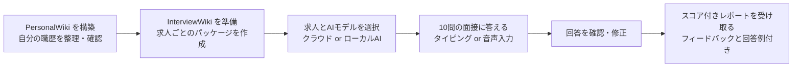

# InterviewSimulator

> **他の言語で読む：** [English](README.md) · [繁體中文（繁体字中国語）](README_tc.md) · [简体中文（簡体字中国語）](README_cn.md)

---

## InterviewSimulator とは？

InterviewSimulator は、**あなた自身の職歴を使って就職面接の練習**ができるツールです。10問の質問に答えると、スコア付きのレポートとフィードバック、参考回答が届きます。

> **スコアについて：** スコアはこの練習セッションの回答内容を評価したものです。実際の合否を予測するものではありません。

---

## 仕組みの概要



**2つの知識ベース**を管理します：

| 知識ベース | 内容 |
|---|---|
| **PersonalWiki** | あなたが確認・検証した職歴、スキル、実績 |
| **InterviewWiki** | 求人ごとのパッケージ：求人票、企業研究、適性分析、練習問題、カスタマイズされた履歴書 |

---

## セットアップの選択

### 推奨ハードウェア

| 使用端末 | 目安 |
|---|---|
| **検証済みMac** | Mac mini 2018 · Intel Core i5 3GHz · RAM 32GB · macOS Sequoia 15.7.9 |
| **新しいMac**（Apple Silicon） | 最低16GB RAM、快適に使うなら32GB推奨 |
| **Windows / Linux PC** | ローカルAI使用時はRAM 32GB推奨 |
| **クラウドAIのみ** | ローカルモデル不要 — 普通のパソコンで動作します |
| **ディスク容量** | 空き **10GB以上**（AIモデル・音声ツール・履歴用） |

Python環境、キャッシュ、バックアップ、ソースビルドには追加容量が必要です。Intel Macの新規導入で10GBあれば十分とは限りません。LLVMだけで数十GB使う場合があるため、利用できるビルド済みツールを優先してください。

### AIモデルの選択肢

**ローカルAIモデル**（インターネット不要）または**クラウドAIモデル**（OpenAI・Google・Anthropic・Ollama）を選べます。

| ローカルモデル | サイズ | 速度 |
|---|---|---|
| `Qwen3.5-9B Q4_K_M` | 約5.5GB | 品質優先；Intel Macでは遅め（数分/回答） |
| `Qwen3.5-4B Q4_K_M` | 約2.5GB | 速度優先；品質はやや落ちる |

> **Q4_K_M とは？** モデルのデータを約4ビットに圧縮した形式です。容量を節約しつつ、十分な品質を維持できます。

9Bは品質優先、4Bは速度優先の推奨構成ですが、品質はタスクによって変わります。必要なツール・モデル・音声の導入後はローカルで動作します。Ollamaは同じ端末のサーバーまたは公式クラウドに対応し、完全ローカルのモデルにはクラウドAPIキーは不要です。簡体字中国語は説明書の翻訳であり、追加の画面・面接言語ではありません。

### インストールプロファイル

使いたい機能に合わせてプロファイルを選んでください：

| プロファイル名 | ローカルAIテキスト | マイク・文字起こし | 質問の読み上げ |
|---|---|---|---|
| `cloud-text` | ❌ クラウドのみ | ❌ 任意 | ❌ 任意 |
| `cloud-local-voice` | ❌ クラウドのみ | ✅ whisper.cpp + FFmpeg | ✅ OS音声 / Piper / Open JTalk |
| `local-text` | ✅ Qwen + llamaサーバー | ❌ 任意 | ❌ 任意 |
| `local-voice` | ✅ Qwen + llamaサーバー | ✅ whisper.cpp + FFmpeg | ✅ OS音声 / Piper / Open JTalk |

> **whisper.cpp** — 録音した音声をテキストに変換するツール（完全ローカル動作）
> **FFmpeg** — 音声の録音・変換を行う無料ツール
> **llamaサーバー** — QwenのAIモデルをあなたのパソコン上で動かすプログラム

---

## ステップごとのセットアップ

### ステップ 1 — プロジェクトをインストールする

**事前に以下をインストールしてください。** お使いのプラットフォームに合わせてコマンドをコピー＆ペーストしてください。

#### Git をインストールする

| プラットフォーム | コマンド |
|---|---|
| **macOS** | `xcode-select --install` *（AppleコマンドラインツールとGitが導入済みなら不要）* |
| **Windows** | [git-scm.com/downloads](https://git-scm.com/downloads) からインストーラーをダウンロードして実行 |
| **Linux（Debian/Ubuntu）** | `sudo apt-get install git` |

#### Homebrew をインストールする *（macOS のみ）*

Homebrew は whisper.cpp・llama.cpp・FFmpeg などのネイティブツールを自動でインストールします。ターミナルに以下を貼り付けて実行してください：

```sh
/bin/bash -c "$(curl -fsSL https://raw.githubusercontent.com/Homebrew/install/HEAD/install.sh)"
```

> インストール後、ターミナルに表示される指示に従って Homebrew を PATH に追加してください。

#### uv をインストールする（Python 環境管理ツール）

`uv` はアプリに必要な Python のバージョンとパッケージを管理するツールです。

**macOS / Linux：**
```sh
curl -LsSf https://astral.sh/uv/install.sh | sh
```

**Windows PowerShell：**
```powershell
powershell -ExecutionPolicy ByPass -c "irm https://astral.sh/uv/install.ps1 | iex"
```

> インストール後、**ターミナルを閉じて再度開いてください**。これにより `uv` コマンドが認識されます。

---

**プロジェクトをダウンロード：**

```sh
git clone https://github.com/NinjaRoboticsEducation/InterviewSimulator.git
cd InterviewSimulator
```

> **注：** ダウンロードされるのはアプリのコードのみです。個人ファイル、APIキー、AIモデルは含まれません。

---

#### Intel Mac — 現在の固定依存関係に必要なビルド環境

現在の `uv.lock` は `cryptography 50.0.1` を指定しています。この版にはIntel macOS向けwheel（ビルド済みPythonパッケージ）がないため、新規インストールではクラウド文字処理だけの場合もAppleのコマンドラインツール、Rust、OpenSSLが必要です。すべてのIntel用Pythonパッケージが常にコンパイルを必要とするわけではありません。

**この手順のためだけにHomebrewでRustをインストール・更新しないでください。** 大規模なLLVMコンパイラーのビルドが始まる場合があります。既存ツールを確認し、Rustがなければ公式の `rustup` バイナリーインストーラーを使用してください。`OPENSSL_DIR` の設定を含む[Intel Mac導入・Homebrew対処ガイド（英語）](doc/installation/INTEL_MAC_SETUP.md)に従ってください。導入方法を変更する前に、実行中のHomebrew処理を完了させるか、Ctrl+Cで停止してください。

---

プレビューには既存のPython 3が必要で、自動ダウンロードは行いません。新しい端末では先に `uv python install 3.13` を実行し、`uv run --no-project --python 3.13 scripts/setup_environment.py --profile local-voice --model 9b --dry-run` で確認できます。プレビュー自体はインストールしません。

**プロファイルを選んでインストール（macOS / Linux）：**

まずプレビューで確認（変更は行われません）：
```sh
sh scripts/setup.sh --profile local-voice --model 9b --dry-run
```

実際にインストール：
```sh
sh scripts/setup.sh --profile local-voice --model 9b --install-native
```

クラウドAIのみの場合：
```sh
sh scripts/setup.sh --profile cloud-text
```

**Windows PowerShell：**

```powershell
powershell -ExecutionPolicy Bypass -File scripts/setup.ps1 -Profile local-voice -Model 9b -DryRun
powershell -ExecutionPolicy Bypass -File scripts/setup.ps1 -Profile local-voice -Model 9b -InstallNative
```

Windowsの音声プロファイルにはGit、CMake、Visual StudioのC++ビルドツール、FFmpegを先に用意してください。WindowsとLinuxの音声は別途設定が必要です。プロファイルは必要な構成を選びますが、すべてのOS音声や音声モデルを自動導入するものではありません。[導入ガイド](doc/installation/LOCAL_VOICE_SETUP.md)を参照してください。

> **インストーラーが行うこと：** Python 3.13のインストール、アプリのセットアップ、選択したAIモデルのダウンロード、チェックサム（ファイルの整合性確認）による検証、設定ファイル（`.env`）の作成。既存の設定は上書きされません。

---

### ステップ 2 — PersonalWiki（職歴プロフィール）を作成する

PersonalWikiのフォルダに移動して初期化：

```sh
cd InterviewWiki/PersonalWiki
uv run llmwiki init
uv run llmwiki doctor
```

**ファイルを追加する：**

| ファイルの種類 | 保存先フォルダ |
|---|---|
| 履歴書 / CV | `raw/articles/` |
| 職務経歴メモ | `raw/notes/` |
| 資格・証明書 | `raw/papers/` |
| ポートフォリオ画像 | `raw/media/` |

ファイルを追加したら登録します（ファイル名はご自身のものに変更してください）：

```sh
uv run llmwiki source add raw/articles/MyResume.pdf
uv run llmwiki source list
```

> **重要：** ファイルを登録しただけではWikiは自動作成されません。[PersonalWiki/AGENTS.md](InterviewWiki/PersonalWiki/AGENTS.md) の取り込みワークフローに従ってください。

**コーディングアシスタントへの指示例：**

> PersonalWiki/AGENTS.md とその取り込み・レビューのスキルを読み、私のファイルからソース連携されたWikiページを作成し、元のファイルを保持しながら、すべての職歴情報をソースと照合し、不確かな点をレビューのために表示してください。

レビュー後、最終チェックを実行：

```sh
uv run llmwiki lint --strict
```

✅ ソースファイルで確認された事実のみが面接練習で使用されます。職歴に変化があった際はこの手順を繰り返してください。

---

### ステップ 3 — 求人パッケージ（InterviewWiki）を準備する

`InterviewWiki` フォルダに戻り、会社名と求人名のフォルダを作成して求人票を配置します：

```
InterviewWiki/
└── JobDescriptions/
    └── example-company/
        └── python-engineer/
            └── sources/
                └── JobDescription.md   ← ここに求人票を貼り付ける
```

求人を登録してパッケージを準備：

以下はワークフロー用ファイルを準備する指令で、完全なパッケージを自動生成するものではありません。リンク先のエージェント手順で成果物を作成・確認してから検証してください。

ステップ2のPersonalWiki内から `cd ..` でInterviewWikiへ戻ります。最終確認後、次の `cd ..` でプロジェクトのルートへ戻ります。

```sh
cd ..
uv run interviewwiki init
uv run interviewwiki candidate migrate
uv run interviewwiki opportunity register example-company/python-engineer
uv run interviewwiki task prepare example-company/python-engineer --kind full-package
```

パッケージには、企業研究・適性分析・回答プラン付き練習問題・カスタマイズされた履歴書が必要です。[InterviewWiki/AGENTS.md](InterviewWiki/AGENTS.md) と [InterviewWiki/README.md](InterviewWiki/README.md) のワークフローに従ってください。

準備ができたらバリデーションとファイナライズを行います：

```sh
uv run interviewwiki task validate example-company/python-engineer --kind full-package --strict
uv run interviewwiki task finalize example-company/python-engineer --kind full-package
```

> バリデーションエラーをすべて修正してからファイナライズしてください。応募する求人ごとにこの手順を繰り返します。

プロジェクトのルートから準備済みの求人を確認：

```sh
cd ..
uv run interview-simulator jobs
```

---

### ステップ 4 — ローカルAIと音声を設定する

テキストタスクをすべてクラウドAIで行う場合、Qwenモデルの設定は不要です。

#### AIモデルを手動でダウンロードする

設定スクリプトを使用しない場合、または自分でモデルをダウンロードしたい場合は、以下のコマンドを使用してください。プロジェクトのルートフォルダで実行してください。

**まずモデルフォルダを作成：**

手動ダウンロード用です。セットアップスクリプトは選択したファイルを検証します。使用する文字モデルだけを選び、Whisperは文字起こしに必要な場合のみ取得してください。

```sh
mkdir -p models/primary models/fallback models/whisper
```

**Qwen3.5-9B Q4_K_M** — 品質優先（約5.5GB）：

```sh
curl -fL -o models/primary/Qwen3.5-9B-Q4_K_M.gguf \
  "https://huggingface.co/unsloth/Qwen3.5-9B-GGUF/resolve/99a1b2185534379e6e8b5ec869da25d3e7b3f73c/Qwen3.5-9B-Q4_K_M.gguf"
```

> SHA-256チェックサム：`03b74727a860a56338e042c4420bb3f04b2fec5734175f4cb9fa853daf52b7e8`

**Qwen3.5-4B Q4_K_M** — 速度優先（約2.5GB）：

```sh
curl -fL -o models/fallback/Qwen3.5-4B-Q4_K_M.gguf \
  "https://huggingface.co/unsloth/Qwen3.5-4B-GGUF/resolve/720bb031aae5488eae5d6a78768e6d826662b2ae/Qwen3.5-4B-Q4_K_M.gguf"
```

> SHA-256チェックサム：`00fe7986ff5f6b463e62455821146049db6f9313603938a70800d1fb69ef11a4`

**Whisper 多言語対応 small** — 音声認識モデル（約488MB）：

```sh
curl -fL -o models/whisper/ggml-small.bin \
  "https://huggingface.co/ggerganov/whisper.cpp/resolve/80da2d8bfee42b0e836fc3a9890373e5defc00a6/ggml-small.bin"
```

> SHA-256チェックサム：`1be3a9b2063867b937e64e2ec7483364a79917e157fa98c5d94b5c1fffea987b`

> **チェックサムの確認方法（使用前に必ず確認）：**
> ```sh
> # macOS / Linux：
> shasum -a 256 models/primary/Qwen3.5-9B-Q4_K_M.gguf
> # 出力が上記のSHA-256と一致することを確認してください。
> ```
> チェックサムが一致しない場合、ファイルが破損しています。削除して再ダウンロードしてください。

> **Windowsをお使いの場合：** `curl -fL -o <ファイル名> "<URL>"` を以下に置き換えてください：
> ```powershell
> Invoke-WebRequest -Uri "<URL>" -OutFile "<ファイル名>"
> ```

---

使用前に各ファイルのSHA-256を照合してください。macOSは `shasum -a 256 FILE`、Linuxは `sha256sum FILE`、PowerShellは `Get-FileHash FILE -Algorithm SHA256` を使います。ダウンロード先は新規ファイルにするか、既存ファイルを先に別の場所へ移してください。

PowerShellでは `New-Item -ItemType Directory -Force models/primary,models/fallback,models/whisper` でフォルダーを作成します。`curl.exe -fL -o FILE URL` を1行で実行するか `Invoke-WebRequest` を使用してください。バックスラッシュはPowerShellの行継続記号ではありません。

**設定ファイル（`.env`）** — インストーラーが自動作成します。手動で設定する場合は `.env.example` を `.env` にコピーして以下を入力してください：

```dotenv
INTERVIEW_SIMULATOR_GGUF=models/primary/Qwen3.5-9B-Q4_K_M.gguf
INTERVIEW_SIMULATOR_WHISPER_MODEL=models/whisper/ggml-small.bin
INTERVIEW_SIMULATOR_TTS_BACKEND=auto
```

> - `INTERVIEW_SIMULATOR_GGUF` — ローカルQwenモデルファイルのパス
> - `INTERVIEW_SIMULATOR_WHISPER_MODEL` — 音声認識モデルのパス（**多言語対応のsmall版**を使用。英語専用の`.en`版は不可）
> - `INTERVIEW_SIMULATOR_TTS_BACKEND` — 音声読み上げエンジン；`auto`で最適なものを自動選択

**macOSの音声：** **システム設定 → アクセシビリティ → 読み上げコンテンツ** で英語・日本語・中国語（北京語）の音声をインストールします。推奨音声：`Samantha`（英語）、`Kyoko`（日本語）、`Meijia`（北京語）

**Windowsの音声：** インストール済みのSystem.Speech音声を使用します。

**Linuxの音声：** Piper（英語/北京語）とOpen JTalk（日本語）。[ローカル音声設定ガイド](doc/installation/LOCAL_VOICE_SETUP.md)を参照。

**ローカルAIサーバーを起動**（1つ目のターミナルで実行、起動したままにしておく）：

```sh
uv run interview-simulator local-server
```

`127.0.0.1:8081` でローカルAIが起動します。このターミナルは閉じないでください。

**2つ目のターミナル**で動作確認：

```sh
uv run interview-simulator doctor
uv run interview-simulator jobs
uv run interview-simulator voice-test interview-en.wav --locale en
uv run interview-simulator voice-test interview-ja.wav --locale ja
uv run interview-simulator voice-test interview-zh.wav --locale zh-Hant
```

生成された`.wav`ファイルを再生して音声を確認してください。`--locale ja` と `--locale zh-Hant` でも繰り返します。

---

音声テストごとに新しいファイル名を使ってください。既存ファイルは上書きされません。音声設定済みの場合のみ実行し、Qwenサーバーは選択した文字タスクで使用する場合のみ起動します。

### ステップ 5 — ブラウザで面接練習する

面接インターフェースを起動：

```sh
uv run interview-simulator serve
```

Safari、Chrome、または Edge で **[http://127.0.0.1:8765](http://127.0.0.1:8765)** を開きます。

アプリは**6つのページ**で構成されています：

```
① Get started（スタート）
   ↓  表示言語を選んで説明を読む
② Select Model（AIモデル選択）
   ↓  ローカルAI、またはクラウドAPIキーを入力
③ Select Job Interview（求人選択）
   ↓  求人と面接言語（英語 / 日本語 / 繁体字中国語）を選ぶ
④ Start Interview（面接開始）
   ↓  質問を再生 → 録音またはタイピングで回答 → 確認
⑤ Review your answers（回答確認）
   ↓  レポート生成前に回答を修正
⑥ Interview report（面接レポート）
      スコア・フィードバック・回答例を確認 — Markdown / HTMLでダウンロード可能
```

各回答は**6,000文字まで**です。**Record answer（回答を録音）**は文字起こしに成功した後で下書きを置き換えます。**Extend recording（録音を追加）**は編集済みの回答に次の3分間の録音内容を追加します。文字数の範囲内で繰り返せます。実際に録音が始まると残り時間が表示されます。保存済み面接は**面接レポート**にあり、中止済み面接は削除せず非表示にします。

**面接のコツ：**
- 音声が設定されていなくてもタイピングで回答できます
- **Pause interview** で途中保存して後から再開できます
- **Review answers** でレポート生成前に回答を見直せます
- レポート生成を開始した時点で回答はロックされます（完了を待ちません）

> **APIキーの安全な取り扱い：** キーはSelect Modelページのパスワードフィールドに直接入力してください。チャット、レポートファイル、Gitコミットには絶対に貼り付けないでください。「このデバイスで記憶する」はそのコンピューターを信頼できる場合のみ選択してください。

---

### ステップ 6 — オプション：テキストチャットで練習する（ADK Web）

これはタイピングで操作する代替インターフェースです。

まずブラウザサーバーを停止（`Ctrl+C`）してから：

```sh
uv run interview-simulator serve-adk
```

[http://127.0.0.1:8765](http://127.0.0.1:8765) を開いて `interview_practice` を選択し、以下で開始します：

```
start example-company/python-engineer en
```

確認テストが必要なモデルはTest Modelに合格してから保存します。形式確認は品質保証ではありません。接続先が利用不可、または利用枠切れの場合はローカルモデルか別の接続先へ変更し、保存済みの作業を再開してください。

他の言語は `ja`（日本語）または `zh-Hant`（繁体字中国語）を使用。`adaptive` を追加すると問題バンクから出題されます。

クラウド文字処理では、まず標準ブラウザ画面で接続先とモデルを保存し、サーバーを停止してから `uv run interview-simulator serve-adk --allow-cloud-text` を実行します。選択した個人・求人情報と回答文の外部送信への同意です。キーはOSの資格情報保管庫から読み込むか、非表示の端末入力で指定します。音声はローカルのままです。ADKの開始指令には同意用の `cloud-ok` 接尾辞もあります。

**よく使うコマンド：**

| コマンド | 内容 |
|---|---|
| `jobs` / `help` | 準備済みの求人一覧と使い方を表示 |
| `resume RUN_ID` | 未完了の面接を再開する |
| `history RUN_ID` | 保存された回答を表示する |
| `skip` | 回答をスキップとして記録する |
| `review` | 保存された質問と回答を確認する |
| `edit 1 修正した回答` | スコアリング前に回答1を変更する |
| `pause` / `cancel` | 途中保存、または現在のセッションを中止する |
| `report` / `status` | フィードバックを生成、または進捗を確認する |
| `stop-report` | レポート生成を中断；完了済みのスコアは保存される |
| `restart` | 同じ求人で新しい練習を開始する |
| `allowance` | レポートが中断された場合に12回の試行を追加する |
| `revise-report cloud-ok` | 保存済み回答から新しいスコアリング版を作成する |

> **注：** マイクとローカル音声はブラウザインターフェースのみ対応しています。ADK Webはテキスト専用です。

---

### ステップ 7 — レポートの確認とデータ管理

**レポートの保存場所：**

```
InterviewWiki/Output/<会社名>/<求人名>/Simulations/<run-id>/report.md
```

レポートには、スコア・強み・フィードバック・確認済み職歴に基づく回答例が含まれます。回答例の主張は提供された根拠と照合します。

再開・再評価により `report-r02.md`、`report-r03.md` なども作成され、最初のファイルが古い下書きの場合があります。**面接レポート**から最新版を開いてください。新しい最終レポートには、スキップした質問も含め10件の検証済み回答例が必要です。不足があれば**下書き**として再開できます。回答例には過去の事実だけでなく、動機や今後の取り組みの提案も含まれます。根拠確認は誤りを減らしますが、AIの無誤謬を保証しません。使用前に内容を確認してください。

**レポートの検証：**

```sh
uv run interview-simulator verify-run RUN_ID
```

バックアップ・復元・履歴削除の前に両方のシミュレーター画面のサーバーを停止してください。ZIPにはデータベースと面接ファイルが含まれますが、元のPersonalWikiや求人パッケージは別途コピーします。端末移行では履歴のバックアップ・復元も行い、`.venv` やコンパイル済み `.native` はコピーしないでください。新しい環境で画面を起動する前に復元します。

**練習履歴のバックアップと復元：**

```sh
uv run interview-simulator backup /path/to/private-backup.zip
uv run interview-simulator restore /path/to/private-backup.zip
```

> バックアップは**暗号化されていないZIPファイル**です。安全な場所に保管してください。APIキーは含まれません。復元は練習データが存在しないクリーンな環境にのみ行えます。

**別のパソコンへの移行：** ソースファイル、Wikiデータ、モデルをコピーして、新しいパソコンでアプリをネイティブインストールしてください。Python環境とコンパイル済みツールはポータブルではありません。コピー後にクラウドアカウントを再接続してください。

**練習履歴をすべて削除**（元に戻せません）：

```sh
uv run interview-simulator clear-history --confirm
```

セッション・回答・レポート・問題バンク履歴がすべて削除されます。PersonalWiki、求人パッケージ、モデルは保持されます。

---

## トラブルシューティング

| 問題 | 対処方法 |
|---|---|
| **準備済み求人が表示されない** | `jobs` を実行。PersonalWiki の厳格なレビューを完了し、候補者情報を移行してから、InterviewWiki パッケージをバリデーション・ファイナライズしてください。登録だけでは不十分です。 |
| **`uv` が見つからない** | 公式サイトから uv をインストールし、ターミナルを閉じて再度開き、コマンドを再実行してください。 |
| **Rust / OpenSSL エラー（Intel Mac）** | [Intel Macガイド](doc/installation/INTEL_MAC_SETUP.md)を参照。既存ツールを再利用し、Rustがなければrustupを使用して `OPENSSL_DIR` を設定してください。機械的に `brew install rust` を実行しないでください。 |
| **セットアップが終了コード2で終わる** | Python はインストールされましたがネイティブツールが不足しています。`--install-native` オプションで再実行するか、[音声設定ガイド](doc/installation/LOCAL_VOICE_SETUP.md)を参照してください。 |
| **ダウンロード失敗またはチェックサム不一致** | ダウンロードを再試行してください。壊れたファイルを別の場所に移動させ（チェックサム検証はスキップしないでください）、ディスク空き容量とHugging Faceへのネットワーク接続を確認してください。 |
| **`.env` が4Bインストール後も9Bを指している** | インストーラーは既存の設定を保持します。`INTERVIEW_SIMULATOR_GGUF` を手動で編集してから、モデルサーバーを再起動してください。 |
| **ローカルAIサーバーが応答しない** | `uv run interview-simulator local-server` を起動してください。ポート8081が使用可能か確認してください。 |
| **音声ボタンが無効または無音** | `doctor` と `voice-test` を実行してください。FFmpeg、whisper-cli、多言語対応smallモデル、OSの音声がインストールされているか確認してください。音声インストール後はアプリを再起動してください。テキスト入力は常に利用可能です。 |
| **マイクの権限が取得できない** | ブラウザとOSの設定で `127.0.0.1` のマイクアクセスを許可してください。埋め込みブラウザ（VS Codeなど）はマイクに対応していない場合があります。 |
| **音声認識のミス** | 確認前にテキストを修正してください。静かな環境で話し、面接言語の設定を確認してください。各録音は3分/20MBまでです。 |
| **クラウドAPIキーが拒否される** | プロバイダーを再接続し、API の請求設定と権限を確認してください。チャットサブスクリプションのキーはAPIアクセスに使用できない場合があります。 |
| **レポートが非常に遅い** | Intel Macでは通常の動作です（1回答あたり数分かかる場合があります）。保存された進捗を確認し、**Resume unfinished report**（未完了レポートを再開）を使用してください。 |
| **モデル呼び出しの上限に達した** | シミュレーターを停止してから `uv run interview-simulator report-allowance RUN_ID --confirm` を実行してください。 |
| **再起動後にHTTP 403エラー** | ブラウザページを再読み込みしてください。セキュリティトークンはサーバーの再起動ごとに変わります。 |
| **2番目のインターフェースが起動しない** | `Ctrl+C` でもう一方のサーバーを停止してください。同時に起動できるのは1つだけです。 |

---

### 高度なレポート復旧

レポートの生成が中断された場合は、すべてのシミュレーターサーバーを停止してから実行してください：

```sh
# 許可されたタスク試行回数を12回追加（クラウドのクォータは増えません）：
uv run interview-simulator report-allowance RUN_ID --confirm

# 現在の保存済みモデル設定で新しいスコアリング版を作成：
uv run interview-simulator report-revision RUN_ID --confirm

# 保存済みモデルがクラウドAIを使用している場合：
uv run interview-simulator report-revision RUN_ID --confirm --allow-cloud-text
```

コマンドを実行後、シミュレーターを再起動し、Interview reportページで **Resume unfinished report**（未完了レポートを再開）を選択してください。

---

## プロジェクト構造（参考）

```
InterviewSimulator/
├── agents/interview_practice/      ADK Webチャットインターフェース
├── src/interview_simulator/
│   ├── engine.py                   面接・レポートの中心的なワークフロー
│   ├── adk_runtime.py              AIエージェントの連携
│   ├── providers/                  クラウド / Ollama接続とキー管理
│   ├── localization.py             翻訳（英語 / 日本語 / 中国語）
│   ├── storage.py                  回答・スコア・履歴の保存
│   ├── wiki.py                     準備済み求人パッケージの読み込み
│   ├── speech.py / local_voices.py マイク録音と質問の読み上げ
│   ├── report.py / report_view.py  スコアレポートの生成と表示
│   └── static/                     ブラウザUI・テーマ・翻訳
├── InterviewWiki/
│   ├── PersonalWiki/raw/           元の履歴書とポートフォリオファイル
│   ├── PersonalWiki/wiki/          確認・検証済みの職歴情報
│   ├── JobDescriptions/            登録済みの求人
│   └── Output/.../Simulations/     各練習セッションの保存レポート
├── .simulator/                     アプリのデータベースとモデル設定（非公開）
├── models/                         ダウンロード済みのAI・音声モデル
├── config/download-manifest.json   モデルダウンロードのチェックサムとライセンス
├── scripts/                        セットアップスクリプトとモデルベンチマーク
├── tests/                          自動テスト
└── doc/                            研究・監査・検証エビデンス
```
