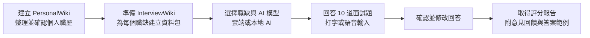

# InterviewSimulator

> **以其他語言閱讀：** [English](README.md) · [日本語（日文）](README_jp.md) · [简体中文（簡體中文）](README_cn.md)

---

## InterviewSimulator 是什麼？

InterviewSimulator 讓你能夠**用自己真實的工作經歷來練習求職面試**。你只需回答十個問題，便可獲得一份含有評分、意見回饋與參考答案的報告。

> **關於評分：** 評分反映的是**本次練習**的回答表現，並不能預測實際錄取結果。

---

## 運作方式概覽



你需要維護**兩個知識庫**：

| 知識庫 | 內容 |
|---|---|
| **PersonalWiki** | 你已確認並驗證的工作經歷、技能與成就 |
| **InterviewWiki** | 針對特定職缺的資料包：職位描述、公司研究、適性分析、練習題目、客製化履歷 |

---

## 環境設定選擇

### 推薦硬體配置

| 使用裝置 | 建議配置 |
|---|---|
| **已驗證 Mac** | Mac mini 2018 · Intel Core i5 3GHz · 32GB RAM · macOS Sequoia 15.7.9 |
| **較新的 Mac**（Apple Silicon） | 最低 16GB RAM；建議 32GB 以確保順暢運行 |
| **Windows / Linux PC** | 使用本地 AI 時建議 32GB RAM |
| **僅使用雲端 AI** | 不需本地模型，一般電腦即可使用介面 |
| **磁碟空間** | 至少 **10GB** 可用空間（供 AI 模型、語音工具與練習紀錄使用） |

Python環境、下載快取、備份及原始碼編譯另需空間。Intel Mac完整安裝不能假設10GB就足夠；LLVM本身可能需要數十GB。請優先使用可取得的預先編譯工具。

### AI 模型選擇

可選擇**本地 AI 模型**（不需網路即可執行文字任務）或**雲端 AI 模型**（OpenAI、Google、Anthropic 或 Ollama）。

| 本地模型 | 大小 | 速度 |
|---|---|---|
| `Qwen3.5-9B Q4_K_M` | 約 5.5GB | 品質較佳；Intel Mac 較慢（每個回答需數分鐘） |
| `Qwen3.5-4B Q4_K_M` | 約 2.5GB | 速度較快；品質略低 |

> **什麼是 Q4_K_M？** 這是一種將模型資料壓縮至約 4 位元的格式，在節省空間的同時仍能維持良好效果。

9B優先考量品質，4B優先考量速度；實際品質因任務而異。工具、模型及語音安裝完成後可本機執行。Ollama支援同一電腦的伺服器及官方雲端，完全本機的模型不需要雲端API金鑰。簡體中文僅為文件翻譯，不是新增的介面或面試語言。

### 安裝設定檔

請依照你想使用的功能選擇安裝設定檔：

| 設定檔名稱 | 本地 AI 文字 | 麥克風與語音轉文字 | 問題語音播放 |
|---|---|---|---|
| `cloud-text` | ❌ 僅限雲端 | ❌ 選用 | ❌ 選用 |
| `cloud-local-voice` | ❌ 僅限雲端 | ✅ whisper.cpp + FFmpeg | ✅ 系統語音 / Piper / Open JTalk |
| `local-text` | ✅ Qwen + llama 伺服器 | ❌ 選用 | ❌ 選用 |
| `local-voice` | ✅ Qwen + llama 伺服器 | ✅ whisper.cpp + FFmpeg | ✅ 系統語音 / Piper / Open JTalk |

> **whisper.cpp** — 將錄音轉換為文字的語音辨識工具（完全在你的電腦上執行）
> **FFmpeg** — 處理音訊錄製與轉換的免費工具
> **llama 伺服器** — 在你的電腦上執行 Qwen AI 模型的程式

---

## 逐步安裝說明

### 步驟 1 — 安裝專案

**請先安裝以下工具。** 請依照你的使用平台，直接複製貼上以下指令。

#### 安裝 Git

| 使用平台 | 指令 |
|---|---|
| **macOS** | `xcode-select --install` *（已安裝Apple命令列工具和Git則略過）* |
| **Windows** | 從 [git-scm.com/downloads](https://git-scm.com/downloads) 下載安裝程式並執行 |
| **Linux（Debian/Ubuntu）** | `sudo apt-get install git` |

#### 安裝 Homebrew *（僅限 macOS）*

Homebrew 可自動安裝 whisper.cpp、llama.cpp、FFmpeg 等原生工具。請在終端機中貼上以下指令並執行：

```sh
/bin/bash -c "$(curl -fsSL https://raw.githubusercontent.com/Homebrew/install/HEAD/install.sh)"
```

> 安裝完成後，請依照終端機顯示的指示，將 Homebrew 加入 PATH。

#### 安裝 uv（Python 環境管理工具）

`uv` 管理應用程式所需的 Python 版本與套件。

**macOS / Linux：**
```sh
curl -LsSf https://astral.sh/uv/install.sh | sh
```

**Windows PowerShell：**
```powershell
powershell -ExecutionPolicy ByPass -c "irm https://astral.sh/uv/install.ps1 | iex"
```

> 安裝完成後，請**關閉終端機並重新開啟**，讓 `uv` 指令生效。

---

**下載專案：**

```sh
git clone https://github.com/NinjaRoboticsEducation/InterviewSimulator.git
cd InterviewSimulator
```

> **注意：** 下載的是應用程式碼，不包含你的個人檔案、API 金鑰或 AI 模型。

---

#### Intel Mac — 目前鎖定套件需要的編譯環境

目前 `uv.lock` 指定 `cryptography 50.0.1`，此版本沒有Intel macOS的wheel（預先編譯的Python套件）。因此全新安裝需要Apple命令列工具、Rust及OpenSSL，即使僅使用雲端文字處理也一樣。這不代表所有Intel用Python套件都需要編譯。

**請勿只為此步驟而透過Homebrew安裝或升級Rust。** 這可能觸發龐大的LLVM編譯器建構。先檢查現有工具；若缺少Rust，使用官方 `rustup` 二進位安裝程式。請依[Intel Mac安裝與Homebrew疑難排解指南（英文）](doc/installation/INTEL_MAC_SETUP.md)操作，包括設定 `OPENSSL_DIR`。更換安裝方式前，請等待現有Homebrew工作完成，或以Ctrl+C停止。

---

預覽需要已安裝的Python 3，不會自動下載。新電腦可先執行 `uv python install 3.13`，再使用 `uv run --no-project --python 3.13 scripts/setup_environment.py --profile local-voice --model 9b --dry-run`。預覽本身不會安裝套件。

**選擇設定檔並安裝（macOS / Linux）：**

先預覽確認（不會進行任何變更）：
```sh
sh scripts/setup.sh --profile local-voice --model 9b --dry-run
```

正式安裝：
```sh
sh scripts/setup.sh --profile local-voice --model 9b --install-native
```

僅使用雲端 AI：
```sh
sh scripts/setup.sh --profile cloud-text
```

**Windows PowerShell：**

```powershell
powershell -ExecutionPolicy Bypass -File scripts/setup.ps1 -Profile local-voice -Model 9b -DryRun
powershell -ExecutionPolicy Bypass -File scripts/setup.ps1 -Profile local-voice -Model 9b -InstallNative
```

Windows語音設定檔需要先安裝Git、CMake、Visual Studio C++建置工具及FFmpeg。Windows及Linux語音需另行設定。設定檔會選擇所需元件，但不會自動安裝所有系統語音或語音模型。請參閱[原生工具與語音指南](doc/installation/LOCAL_VOICE_SETUP.md)。

> **安裝程式執行的工作：** 安裝 Python 3.13、設置應用程式、下載你選取的 AI 模型、以校驗碼（檔案指紋）驗證下載完整性、建立設定檔（`.env`）。不會覆蓋現有設定。

---

### 步驟 2 — 建立 PersonalWiki（個人職歷檔案）

進入 PersonalWiki 資料夾並初始化：

```sh
cd InterviewWiki/PersonalWiki
uv run llmwiki init
uv run llmwiki doctor
```

**新增你的檔案：**

| 檔案類型 | 存放資料夾 |
|---|---|
| 履歷 / CV | `raw/articles/` |
| 職涯筆記 | `raw/notes/` |
| 證照 / 證書 | `raw/papers/` |
| 作品集圖片 | `raw/media/` |

新增檔案後進行登錄（請將範例檔名替換為你自己的檔名）：

```sh
uv run llmwiki source add raw/articles/MyResume.pdf
uv run llmwiki source list
```

> **重要：** 登錄檔案不會自動建立 Wiki。請依照 [PersonalWiki/AGENTS.md](InterviewWiki/PersonalWiki/AGENTS.md) 中的資料匯入流程操作。

**給程式碼助理（如 Antigravity）的建議提示：**

> 請閱讀 PersonalWiki/AGENTS.md 及其匯入與審核技能。根據我的檔案建立附有來源連結的 Wiki 頁面，保留原始檔案，對照來源核查每一項職歷聲明，並將不確定的內容顯示出來供我審查。

審查結果後，執行最終品質檢查：

```sh
uv run llmwiki lint --strict
```

✅ 只有經來源檔案確認的事實才會用於面試練習。每當職歷有所變動時，請重複此步驟。

---

### 步驟 3 — 準備職缺資料包（InterviewWiki）

回到 `InterviewWiki` 資料夾，為公司和職位建立資料夾，並將職位描述放入其中：

```
InterviewWiki/
└── JobDescriptions/
    └── example-company/
        └── python-engineer/
            └── sources/
                └── JobDescription.md   ← 在此貼上職位描述
```

登錄職缺並準備資料包：

以下指令只準備工作流程檔案，不會自動生成完整資料包。請透過連結中的代理工作流程填寫並審查成果，再執行驗證。

從步驟2的PersonalWiki目錄執行 `cd ..` 返回InterviewWiki。最終確認後，下一個 `cd ..` 會回到專案根目錄。

```sh
cd ..
uv run interviewwiki init
uv run interviewwiki candidate migrate
uv run interviewwiki opportunity register example-company/python-engineer
uv run interviewwiki task prepare example-company/python-engineer --kind full-package
```

資料包必須包含：公司研究、適性分析、附回答計畫的練習題目，以及客製化履歷。請依照 [InterviewWiki/AGENTS.md](InterviewWiki/AGENTS.md) 和 [InterviewWiki/README.md](InterviewWiki/README.md) 的流程操作。

準備好後，執行驗證與最終確認：

```sh
uv run interviewwiki task validate example-company/python-engineer --kind full-package --strict
uv run interviewwiki task finalize example-company/python-engineer --kind full-package
```

> 在最終確認之前，請修正所有驗證錯誤。每個應徵的職缺都要重複此步驟。

從專案根目錄查看所有已準備好的職缺：

```sh
cd ..
uv run interview-simulator jobs
```

---

### 步驟 4 — 設定本地 AI 與語音

如果所有文字任務都使用雲端 AI，可略過 Qwen 模型設定。

#### 手動下載 AI 模型

如果你**不**使用安裝腳本，或希望自己下載模型，請使用以下指令。在專案根目錄執行。

**先建立模型資料夾：**

僅供手動下載使用；安裝腳本已會驗證選定的檔案。只需選擇你要使用的文字模型，Whisper僅在需要轉錄時下載。

```sh
mkdir -p models/primary models/fallback models/whisper
```

**Qwen3.5-9B Q4_K_M** — 品質優先（約5.5GB）：

```sh
curl -fL -o models/primary/Qwen3.5-9B-Q4_K_M.gguf \
  "https://huggingface.co/unsloth/Qwen3.5-9B-GGUF/resolve/99a1b2185534379e6e8b5ec869da25d3e7b3f73c/Qwen3.5-9B-Q4_K_M.gguf"
```

> SHA-256 校驗碼：`03b74727a860a56338e042c4420bb3f04b2fec5734175f4cb9fa853daf52b7e8`

**Qwen3.5-4B Q4_K_M** — 速度優先（約2.5GB）：

```sh
curl -fL -o models/fallback/Qwen3.5-4B-Q4_K_M.gguf \
  "https://huggingface.co/unsloth/Qwen3.5-4B-GGUF/resolve/720bb031aae5488eae5d6a78768e6d826662b2ae/Qwen3.5-4B-Q4_K_M.gguf"
```

> SHA-256 校驗碼：`00fe7986ff5f6b463e62455821146049db6f9313603938a70800d1fb69ef11a4`

**Whisper 多語言 small** — 語音轉文字模型（約488MB）：

```sh
curl -fL -o models/whisper/ggml-small.bin \
  "https://huggingface.co/ggerganov/whisper.cpp/resolve/80da2d8bfee42b0e836fc3a9890373e5defc00a6/ggml-small.bin"
```

> SHA-256 校驗碼：`1be3a9b2063867b937e64e2ec7483364a79917e157fa98c5d94b5c1fffea987b`

> **如何驗證校驗碼（使用前請務必驗證）：**
> ```sh
> # macOS / Linux：
> shasum -a 256 models/primary/Qwen3.5-9B-Q4_K_M.gguf
> # 輸出結果應與上方的 SHA-256 相符。
> ```
> 校驗碼不符表示檔案已損壞，請刪除後重新下載。

> **Windows 使用者：** 請將 `curl -fL -o <檔名> "<URL>"` 替換為：
> ```powershell
> Invoke-WebRequest -Uri "<URL>" -OutFile "<檔名>"
> ```

---

使用前請驗證每個下載檔案的SHA-256。macOS用 `shasum -a 256 FILE`，Linux用 `sha256sum FILE`，PowerShell用 `Get-FileHash FILE -Algorithm SHA256`。請下載到新檔案，或先將現有檔案移至別處。

PowerShell請用 `New-Item -ItemType Directory -Force models/primary,models/fallback,models/whisper` 建立資料夾。下載請使用單行 `curl.exe -fL -o FILE URL` 或 `Invoke-WebRequest`；反斜線不是PowerShell的換行接續符號。

**設定檔（`.env`）** — 安裝程式會自動建立。如需手動設定，請將 `.env.example` 複製為 `.env` 並填入以下路徑：

```dotenv
INTERVIEW_SIMULATOR_GGUF=models/primary/Qwen3.5-9B-Q4_K_M.gguf
INTERVIEW_SIMULATOR_WHISPER_MODEL=models/whisper/ggml-small.bin
INTERVIEW_SIMULATOR_TTS_BACKEND=auto
```

> - `INTERVIEW_SIMULATOR_GGUF` — 本地 Qwen AI 模型檔案的路徑
> - `INTERVIEW_SIMULATOR_WHISPER_MODEL` — 語音辨識模型的路徑（必須使用**多語言 small 版本**，不可使用英語專用的 `.en` 版本）
> - `INTERVIEW_SIMULATOR_TTS_BACKEND` — 語音合成引擎；`auto` 會自動選擇最佳選項

**macOS 語音：** 透過**系統設定 → 輔助使用 → 語音內容**安裝英文、日文與國語語音。建議語音：`Samantha`（英文）、`Kyoko`（日文）、`Meijia`（國語）

**Windows 語音：** 使用已安裝的 System.Speech 語音。

**Linux 語音：** Piper（英文/國語）和 Open JTalk（日文）。請參閱[本地語音設定指南](doc/installation/LOCAL_VOICE_SETUP.md)。

**啟動本地 AI 伺服器**（在第一個終端機視窗中執行，保持開啟）：

```sh
uv run interview-simulator local-server
```

本地 AI 將在 `127.0.0.1:8081` 啟動，請保持此終端機開啟。

**在第二個終端機**中確認一切正常運作：

```sh
uv run interview-simulator doctor
uv run interview-simulator jobs
uv run interview-simulator voice-test interview-en.wav --locale en
uv run interview-simulator voice-test interview-ja.wav --locale ja
uv run interview-simulator voice-test interview-zh.wav --locale zh-Hant
```

播放產生的 `.wav` 檔案確認語音是否正確。再以 `--locale ja` 和 `--locale zh-Hant` 重複測試。

---

每次語音測試請使用新檔名，既有檔案不會被覆寫。僅在本機語音設定完成後測試；Qwen伺服器只需在選定文字任務使用它時啟動。

### 步驟 5 — 在瀏覽器中練習面試

啟動面試介面：

```sh
uv run interview-simulator serve
```

以 Safari、Chrome 或 Edge 開啟 **[http://127.0.0.1:8765](http://127.0.0.1:8765)**。

應用程式共有**六個頁面**，引導你完成整個流程：

```
① Get started（開始）
   ↓  選擇介面語言並閱讀說明
② Select Model（選擇 AI 模型）
   ↓  選擇本地 AI，或輸入雲端 API 金鑰（Google / OpenAI / Anthropic / Ollama）
③ Select Job Interview（選擇職缺面試）
   ↓  選擇職缺與面試語言（英文 / 日文 / 繁體中文）
④ Start Interview（開始面試）
   ↓  播放問題 → 錄音或打字回答 → 確認
⑤ Review your answers（確認回答）
   ↓  在產生報告前修改任何回答
⑥ Interview report（面試報告）
      查看評分、意見回饋與答案範例 — 可下載 Markdown 或 HTML 格式
```

每個回答上限為**6,000字元**。**Record answer（錄製回答）**會在轉錄成功後取代草稿；**Extend recording（延長錄音）**會將下一段最多3分鐘的錄音文字附加到你已編輯的回答。字數限制內可重複追加。實際開始錄音後會顯示倒數計時。已儲存的面試位於**面試報告**頁；已取消的面試只會隱藏，不會刪除。

**面試小提示：**
- 即使未設定語音，仍可以打字方式回答
- 使用 **Pause interview** 可儲存進度，稍後繼續
- 使用 **Review answers** 可在報告產生前重新審視任何回答
- 開始產生報告時，回答即被鎖定，無需等到完成

> **API 金鑰安全：** 請直接在 Select Model 頁面的密碼欄位中輸入金鑰。絕對不要貼在聊天訊息、報告檔案或 Git 提交中。僅在你信任的電腦上選擇「在此裝置上記住」。

---

### 步驟 6 — 選用：透過文字聊天練習（ADK Web）

這是另一種以打字指令操作的介面。

先停止瀏覽器伺服器（`Ctrl+C`），然後：

```sh
uv run interview-simulator serve-adk
```

開啟 [http://127.0.0.1:8765](http://127.0.0.1:8765)，選擇 `interview_practice`，並以以下指令開始：

```
start example-company/python-engineer en
```

需要相容性測試的模型必須通過Test Model後才能儲存；格式測試不等於品質保證。供應商無法使用或配額耗盡時，請切換本機模型或其他供應商，保留並繼續已儲存的工作。

其他語言請使用 `ja`（日文）或 `zh-Hant`（繁體中文）。加上 `adaptive` 可從題庫中選題。

使用雲端文字處理前，先在內建網頁儲存供應商及模型設定。停止伺服器後，執行 `uv run interview-simulator serve-adk --allow-cloud-text`，明確同意傳送選定的個人／職缺資料及回答文字。金鑰會從系統憑證保管庫讀取，或由終端機隱藏輸入。音訊保留在本機。ADK開始指令也支援同意用的 `cloud-ok` 後綴。

**常用指令：**

| 指令 | 功能 |
|---|---|
| `jobs` / `help` | 列出已準備的職缺與使用說明 |
| `resume RUN_ID` | 繼續未完成的面試 |
| `history RUN_ID` | 檢視已儲存的回答 |
| `skip` | 將此題記錄為略過 |
| `review` | 顯示所有已儲存的問題與回答 |
| `edit 1 修改後的回答` | 在評分前修改第 1 題的回答 |
| `pause` / `cancel` | 暫停儲存，或放棄目前練習 |
| `report` / `status` | 產生意見回饋或確認進度 |
| `stop-report` | 中斷報告產生；已完成的評分將保留 |
| `restart` | 為相同職缺開始新的練習 |
| `allowance` | 報告中斷時新增 12 次嘗試機會 |
| `revise-report cloud-ok` | 從已儲存的回答建立新的評分版本 |

> **注意：** 麥克風與本地語音功能僅在瀏覽器介面中提供。ADK Web 為純文字模式。

---

### 步驟 7 — 查看報告與管理資料

**報告儲存位置：**

```
InterviewWiki/Output/<公司名稱>/<職位名稱>/Simulations/<run-id>/report.md
```

每份報告包含評分、優點、意見回饋，以及根據你已確認職歷建立的答案範例。教練會將聲明與提供的證據核對。

重新繼續或評估後，也可能產生 `report-r02.md`、`report-r03.md` 等版本；第一個檔案可能只是較早的草稿。請從**面試報告**開啟最新版。新的最終報告必須含十個已驗證回答範例，包括略過的題目。缺少範例時維持**草稿**並可繼續處理。範例可包含建議的動機或未來做法，不只是過去事實。證據驗證可減少無根據聲明，但無法保證AI永遠正確，使用前仍需確認。

**驗證報告：**

```sh
uv run interview-simulator verify-run RUN_ID
```

備份、還原或清除紀錄前，請停止兩個模擬器介面的伺服器。ZIP包含模擬器資料庫及面試檔案，不包含原始PersonalWiki及職缺資料包，須另行複製。移機保留紀錄時，請同時使用備份／還原，不要複製 `.venv` 或已編譯的 `.native`。在新環境首次啟動介面前先還原。

**備份與還原練習紀錄：**

```sh
uv run interview-simulator backup /path/to/private-backup.zip
uv run interview-simulator restore /path/to/private-backup.zip
```

> 備份為**未加密的 ZIP 檔**，請存放在安全的地方。不包含 API 金鑰。還原只能在沒有現有練習資料的全新安裝環境中進行。

**移機至新電腦：** 複製來源檔案、Wiki 資料和模型。在新電腦上重新原生安裝應用程式，Python 環境和編譯工具無法直接移植。複製後請重新連接雲端帳號。

**清除所有練習紀錄**（無法復原）：

```sh
uv run interview-simulator clear-history --confirm
```

這將刪除所有練習階段、回答、報告與題庫紀錄。PersonalWiki、職缺資料包和模型將保留。

---

## 疑難排解

| 問題 | 解決方法 |
|---|---|
| **沒有顯示已準備好的職缺** | 執行 `jobs`。完成 PersonalWiki 嚴格審查，遷移候選人資料，然後驗證並最終確認 InterviewWiki 資料包。僅登錄職缺是不夠的。 |
| **找不到 `uv`** | 從官方網站安裝 uv，關閉並重新開啟終端機，再重試指令。 |
| **Rust / OpenSSL 錯誤（Intel Mac）** | 依[Intel Mac指南](doc/installation/INTEL_MAC_SETUP.md)檢查現有工具；缺少Rust時優先使用rustup，並設定 `OPENSSL_DIR`。不要直接重跑 `brew install rust`。 |
| **安裝程式以代碼 2 結束** | Python 已安裝但缺少原生工具。以 `--install-native` 選項重新執行，或參考[語音設定指南](doc/installation/LOCAL_VOICE_SETUP.md)。 |
| **下載失敗或校驗碼不符** | 重試下載。將損壞的檔案移至別處（請勿略過校驗碼驗證），檢查磁碟空間和連至 Hugging Face 的網路連線。 |
| **安裝 4B 後 `.env` 仍指向 9B** | 安裝程式會保留現有設定。請手動編輯 `INTERVIEW_SIMULATOR_GGUF`，然後重新啟動模型伺服器。 |
| **本地 AI 伺服器沒有回應** | 啟動 `uv run interview-simulator local-server`，確認連接埠 8081 未被占用。 |
| **語音按鈕無法使用或沒有聲音** | 執行 `doctor` 和 `voice-test`。確認 FFmpeg、whisper-cli、多語言 small 模型和作業系統語音已安裝。安裝語音後請重新啟動應用程式。文字輸入始終可用。 |
| **麥克風權限無法取得** | 在瀏覽器和作業系統設定中允許 `127.0.0.1` 存取麥克風。嵌入式瀏覽器（如 VS Code）可能不支援麥克風。 |
| **語音辨識錯誤** | 確認前請先修正文字稿。在安靜的環境中說話，確認面試語言設定是否正確。每次錄音限制為 3 分鐘 / 20MB。 |
| **雲端 API 金鑰被拒絕** | 重新連接服務商，並檢查 API 帳單與權限設定。聊天訂閱的金鑰可能無法用於 API 存取。 |
| **報告速度非常慢** | Intel Mac 的正常現象，每個回答的評分可能需要數分鐘。查看已儲存的進度並使用 **Resume unfinished report**（繼續未完成的報告）。 |
| **達到模型呼叫上限** | 停止模擬器後執行 `uv run interview-simulator report-allowance RUN_ID --confirm`。 |
| **重新啟動後出現 HTTP 403 錯誤** | 重新整理瀏覽器頁面。安全權杖在伺服器每次重新啟動時都會變更。 |
| **第二個介面無法啟動** | 以 `Ctrl+C` 停止另一個伺服器。同一時間只能執行一個介面。 |

---

### 進階報告復原

如果報告產生過程中斷，請先停止所有模擬器伺服器，然後執行：

```sh
# 新增 12 次允許的任務嘗試次數（不會增加雲端配額）：
uv run interview-simulator report-allowance RUN_ID --confirm

# 使用當前儲存的模型設定建立新的評分版本：
uv run interview-simulator report-revision RUN_ID --confirm

# 如果儲存的模型設定使用雲端 AI：
uv run interview-simulator report-revision RUN_ID --confirm --allow-cloud-text
```

執行指令後，重新啟動模擬器，然後在面試報告頁面選擇 **Resume unfinished report**（繼續未完成的報告）。

---

## 專案結構（供參考）

```
InterviewSimulator/
├── agents/interview_practice/      ADK Web 聊天介面
├── src/interview_simulator/
│   ├── engine.py                   面試與報告的核心工作流程
│   ├── adk_runtime.py              AI 代理協調
│   ├── providers/                  雲端 / Ollama 連線與金鑰管理
│   ├── localization.py             翻譯（英文 / 日文 / 中文）
│   ├── storage.py                  儲存回答、評分與紀錄
│   ├── wiki.py                     讀取已準備的職缺資料包
│   ├── speech.py / local_voices.py 麥克風錄音與問題播放
│   ├── report.py / report_view.py  產生並顯示評分報告
│   └── static/                     瀏覽器 UI、主題與翻譯
├── InterviewWiki/
│   ├── PersonalWiki/raw/           原始履歷與作品集檔案
│   ├── PersonalWiki/wiki/          已審查驗證的職歷資訊
│   ├── JobDescriptions/            已登錄的職缺
│   └── Output/.../Simulations/     每次練習的儲存報告
├── .simulator/                     應用程式資料庫與模型設定（私人）
├── models/                         已下載的 AI 與語音模型
├── config/download-manifest.json   模型下載校驗碼與授權
├── scripts/                        安裝腳本與模型基準測試
├── tests/                          自動化測試
└── doc/                            研究、審查與驗證文件
```
