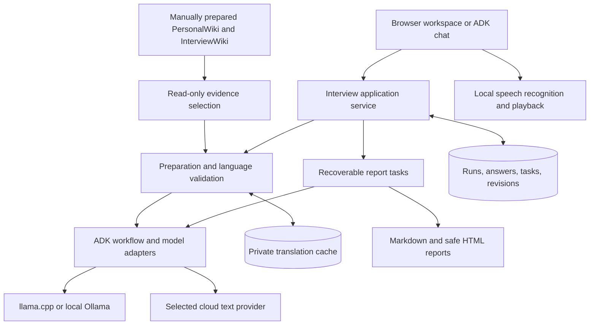

# InterviewSimulator: reliability, language quality, and Ollama refinement plan

**Research date:** 1 October 2026  
**Status:** Implemented in both application copies; see [implementation and validation](DURABILITY_IMPLEMENTATION_AND_VALIDATION.md).  
**Scope:** Both application copies, the built-in browser interface, the ADK chat interface, and a clean public release.

## 1. What the investigation found

The reported problems have several distinct causes. Clearing the browser cache or increasing every model limit would leave important problems unresolved.

1. **Local question preparation exceeds the configured context.** It sends all approved profile facts even when only a small selection is needed. The application's own budget check rejects that request before generation.
2. **The saved Gemini report failed mainly because of provider quota or rate limits.** Valid answers and some completed assessments are still saved. The application keeps attempting subsequent questions and displays an unhelpfully generic report message.
3. **English evidence is inserted directly into Japanese and Chinese templates.** There is no complete translation pipeline. Coaching examples also deliberately contain fill-in prompts, which do not meet the newly requested finished-answer standard.
4. **Cancelled runs are restored by browser startup logic.** The database retains their correct cancelled status, but the interface automatically opens them again.
5. **Interface language and interview language share one setting.** Opening an old run changes the application's interface language.
6. **Ollama requires capability-aware integration.** A request sent to a local Ollama daemon can still use a cloud model. Its cloud service currently lacks enforced structured output, which this application's assessment tasks depend on.

The recommendation is an incremental repair of the existing ADK architecture. Keep the saved interview data, introduce reliable task recovery, separate translated display text from source evidence, and add Ollama through the existing model adapter boundary.

### Decisions confirmed during this review

| Decision | Agreed behavior |
|---|---|
| Ollama connection scope | The user's own computer and Ollama's official cloud. Private-network and arbitrary remote servers are outside this version. |
| Reload and server restart | Open a clean landing page. Resume an unfinished interview only after the user chooses it. |
| Public tests | Keep automated tests and small fictional fixtures. Exclude personal data, generated test interviews, benchmark output, and debugging artifacts. |

Existing requirements remain: current ADK 2.x; Qwen3.5-9B Q4_K_M preferred, with 4B Q4_K_M as an explicit speed alternative; ten scored questions plus greeting and closing; English, Japanese, and Traditional Chinese; local Mandarin speech for Traditional Chinese; local microphone processing; optional cloud text processing; optional operating-system credential storage; manual wiki preparation; and edits only before scoring, without changing later question order.

## 2. Evidence and limits of the original planning review

The following investigation record describes the pre-implementation state. Current results are in the linked validation report.

The investigation used Serena's code-navigation tools, Context7 documentation lookup, current primary-source documentation, direct code inspection, and read-only inspection of the private SQLite databases and generated reports. SQLite is the application's local database format. No provider key was read from the credential vault, no candidate information was sent to an external service, and no saved interview was modified.

The live local tokenizer was used for two non-generating requests. A tokenizer measures how much text fits in a model's working context. Existing application and model servers were left running.

Evidence inspected:

- Fourteen saved runs: six with completed answer sequences and eight cancelled records. Some records predate the latest refinement, so older output does not prove that every current code path produced it.
- Saved report errors, model-call records, and ADK events. The ADK database contains 144 sessions and 415 events, including previous diagnostics; these are not 144 interviews.
- Both application trees: **74 corresponding application, test, configuration, script, and documentation files were byte-identical** at inspection. This comparison excludes private runtime data and does not establish that every nested wiki file is identical.
- The public Git index: no tracked job output, runtime database, model files, or environment file in the inspected categories. Tracked PersonalWiki data-directory entries were empty `.gitkeep` placeholders. This is a narrow check, not a completed secret scan of all content and Git history.

This was a diagnosis and planning pass. It did not re-run the full regression suite, make new billable model calls, benchmark translation systems, or certify cross-platform operation. Earlier passing tests remain useful evidence, but they do not establish that these newly reported scenarios work.

### Findings mapped to implementation

Paths below are relative to the project root; line numbers refer to the inspected version.

| ID | Priority and finding | Evidence | Required response |
|---|---|---|---|
| R1 | High: oversized local preparation | `adk_runtime.py:338` sends every confirmed fact; `:91` applies the budget check; `cli.py:69` starts with 4,096 context tokens | Build compact task-specific inputs and preflight them before creating an active interview |
| R2 | High: preparation failure becomes cancellation | `engine.py:83–92` cancels the newly created run on any preparation exception | Separate preparation failure from user cancellation; offer retry or a validated baseline deck |
| R3 | High: report quota failures cascade | `providers/service.py:48–124` retries once after at most five seconds; `engine.py:278–327` continues through remaining answers | Pause affected work, honor provider delay, preserve checkpoints, and expose a useful recovery action |
| R4 | High: failure records lose their cause | `adk_runtime.py:220–222` records all failures as `interrupted` with empty metadata | Persist safe typed errors, task IDs, retry timing, and dispatch status |
| R5 | High: unfinished multilingual output | `questions.py:49–70` interpolates untranslated evidence; `evaluation.py:118–202` builds examples from original facts and placeholders | Introduce grounded localization and finished coaching examples |
| R6 | High: cancelled run is reopened | `static/app.js:187–191`, `:231–242`; `storage.py:222–234` | Remove automatic latest-run selection; separate history viewing from practice resumption |
| R7 | Medium: language settings are coupled | `static/app.js:8`, `:59`, `:194`; dynamic strings in `static/setup.js` | Separate interface preference from immutable run language and localize dynamic messages |
| R8 | High: local evaluation has avoidable quote failures | `evaluation.py:29–30`; saved assessment errors and ADK outputs | Select exact answer spans by ID; never manufacture or translate an evidence quote |
| R9 | Medium: recovery controls cannot adjust a frozen task plan | `engine.py:272–277`, `storage.py:504–513`, frozen `ModelPlan` | Introduce explicit report revisions and bounded recovery budgets using the saved answers |
| R10 | Medium: development artifacts need release review | Public documentation includes local skill paths and raw benchmark links; many refinement files remain uncommitted | Build a reviewed release manifest, sanitize documentation, and validate a clean installation |

### 2.1 Local context failure: reproduced

The saved Japanese preparation request was reconstructed without printing its private contents. Measurements from the running llama.cpp tokenizer were:

| Input construction | Facts included | Input tokens | App reserve | Configured context | Remaining output capacity |
|---|---:|---:|---:|---:|---:|
| Existing request | 66 | 3,601 | 512 | 4,096 | **−17** |
| Diagnostic: only facts already referenced by the deck | 2 | 1,114 | 512 | 4,096 | **2,470** |

These figures reproduce the current application's arithmetic, including its approximate wrapper reserve. They are not an exact measurement of the fully rendered ADK chat prompt. The smaller request proves that targeted evidence selection can remove the immediate overflow; it does not prove that choosing only two facts gives the best interview coverage.

The message asking the user to shorten an answer is misleading here: no answer was being assessed. The failed task was preparation. The model designer receives a fresh ADK session and a new task payload, so accumulating prior interviews in a single model conversation is **not the cause of this reproduced failure**.

The current guard also accepts as little as 256 output tokens, regardless of task. That can turn an input that barely fits into incomplete JSON output. JSON is the structured text format used to return assessments. Increasing a model's advertised context is insufficient when its running server is still configured for 4,096 tokens.

### 2.2 Gemini report: confirmed quota/rate-limit failure

The saved English Gemini 3.8 Flash run contains:

- Two valid assessments, one with completed coaching.
- Eight unavailable assessments whose saved reason is `Provider quota or rate limit reached. Wait and check your account.`
- One missing coaching result with that same reason.
- Twenty-two logical task attempts across generation and retry: three succeeded and nineteen were recorded as interrupted. Successful receipts also show that some transport requests were retried.

That error text is produced by the HTTP 429 handling branch. The records do **not** preserve enough upstream detail to determine whether the exhausted limit was requests per minute, daily quota, tokens, or another account limit. The report should communicate this uncertainty rather than prescribe buying credits or repeatedly retrying.

Google documents multiple quota dimensions and applies limits per project, not simply per API key. The app should direct users to their actual account limits instead of hard-coding a public quota table. [Google rate-limit documentation](https://ai.google.dev/gemini-api/docs/rate-limits)

Separately, two saved question-designer ADK events record an unusable/incomplete answer and an HTTP 503. The exact finish reason of the unusable answer was discarded. It could include output exhaustion or another provider finish condition; the evidence does not establish which one. Google distinguishes `MAX_TOKENS`, safety filtering, malformed output, and other finish reasons. Those distinctions need to survive the adapter. [Google finish-reason reference](https://ai.google.dev/api/generate-content#FinishReason)

The 1,024-token assessment default and 2,048-token coaching default also need model-specific validation, especially when thinking is enabled. These are additional risks, **not the demonstrated cause of the saved quota failures**. Google currently lists thinking controls for Gemini 3.8 Flash; do not assume that an unset option disables thinking or that every Gemini version accepts identical options. [Google thinking documentation](https://ai.google.dev/gemini-api/docs/thinking)

### 2.3 Language quality and quoting

The Japanese passage in the request matches the **legacy personal-category coaching template** in `evaluation.py:130`. That template appears in the saved Japanese report. It is not the English question passed through a translation service. The question templates separately insert English facts unchanged, so both reported quality concerns are valid.

In the completed Japanese and Traditional Chinese runs inspected, five questions in each deck contained long English passages. All six available Japanese coaching examples and all nine available Traditional Chinese coaching examples contained fill-in placeholders. Newer four-slot coaching still inserts original source-language facts and placeholders for missing slots.

Current language checks establish only that feedback contains Japanese kana or Chinese characters. OpenCC converts Chinese writing forms; it does not translate English, verify meaning, or establish native fluency. Source-ID validation proves that an identifier exists, not that generated prose accurately uses that source.

Across 66 saved assessor outputs that could be paired with their input, 49 had exact quotes, eight differed only in whitespace, eight had other mismatches, and one was empty. These records include earlier diagnostics. The strict quote safeguard should stay, but the model should select an existing span rather than retype it.

### 2.4 State durability

The main database correctly marks cancelled interviews as cancelled. Startup then chooses an active run, a browser `interviewRun` value, or the most recent database run. The final choice has no status filter. Cancelling also calls `show()`, which writes that cancelled ID back into browser storage.

Three related problems make this confusing:

- `show()` always navigates to the interview screen, even for cancelled history.
- The engine returns a greeting whenever no answers exist, including a cancelled preparation record; the greeting can take precedence over the cancelled message.
- Restart and practice-again handlers reset only part of the browser state. Report content, drafts, transcript state, and outstanding callbacks need a single reset lifecycle.

The browser key is shared by every project served on the same browser origin. An origin is the combination of protocol, hostname, and port. Switching project copies on the same address can therefore reuse a stale pointer. This does not prove cross-project database contamination, but it creates misleading restoration and error behavior.

ADK interview sessions are already keyed by run ID, and assessment calls normally use fresh session IDs. Retaining those records is not itself an error. The application must decide explicitly which session can be resumed. ADK chat should not silently attach an unbound chat to whichever interview is globally active.

Existing browser-state tests remove the call to `initialize()` before executing the script. They therefore cannot catch the full cancelled → reload → automatic restore sequence. Speech temporary directories are normally cleaned through context managers; crash cleanup needs coverage, but there is no evidence that temporary audio caused this restoration bug.

## 3. Proposed architecture

Keep Google ADK responsible for agent execution and the ten-turn interview workflow. Retain SQLite as the durable application record. Add small, explicit services around the existing engine rather than another agent framework.



**Design pattern:** a deterministic coordinator with bounded model tasks. This means ordinary code controls state changes and safety checks; models handle language and judgment within explicit inputs and output contracts. A recoverable task records its progress before the next task starts.

ADK supports custom model adapters through `BaseLlm`. Extend the existing adapter for Ollama while preserving ADK execution, events, and session isolation. Keep the currently installed `google-adk==2.10.0` lock while implementing; review any later 2.x update separately against contract tests. [ADK model documentation](https://adk.dev/agents/models/), [ADK custom-model implementation guide](https://github.com/google/adk-python/blob/main/docs/guides/models/llm_registry/index.md)

Suggested responsibilities, introduced only as phases need them:

```text
src/interview_simulator/
  engine.py                    # Public application operations shared by both interfaces
  storage.py                   # Transactions, migrations, run and answer history
  preparation.py               # Evidence selection, deck preparation, safe fallback
  context_budget.py            # Provider-aware input and output planning
  tasks.py                     # Durable task checkpoints and retry policy
  errors.py                    # Safe error codes and recovery descriptions
  localization/
    service.py                 # Grounded question and report localization
    glossary.py                # Approved terminology and protected names
    validation.py              # Meaning-related checks and artifact rejection
    cache.py                   # Private, versioned translation reuse
  providers/
    base.py                    # Bindings, capabilities, locality and model identity
    service.py                 # Provider coordination
    ollama.py                  # Native Ollama API transport
    adk_model.py               # ADK BaseLlm integration
    credentials.py             # Memory and optional operating-system vault
  static/
    session.js                 # Browser lifecycle and stale-response protection
    i18n.js                    # Interface message IDs and translations
    locales/                   # English, Japanese and Traditional Chinese UI messages
    app.js / setup.js           # Interview and connection screens
tests/
  ...                          # Existing regressions plus realistic fictional scenarios
```

This is a proposed division of responsibilities, not a requirement to split every existing function immediately.

## 4. Context planning and recoverable preparation

### 4.1 Prepare the smallest sufficient input

Use a shared task-input builder with a declared budget for instructions, evidence, schema, and output. A token is a unit of text processed by the model; Japanese and Chinese must be measured rather than estimated from English word counts.

| Task | Include | Exclude |
|---|---|---|
| Question design | Category and difficulty targets, compact baseline intents, ranked facts linked to job requirements, selected company evidence | Entire profile, irrelevant source text, previous interviews, runtime metadata |
| Localization | One complete question or a small batch, referenced source statements, applicable glossary | Entire interview package or conversation history |
| Assessment | Current confirmed answer, actual asked question, relevant evidence, rubric | Other answers, old assessments, coaching prose |
| Coaching | Current answer, compact validated assessment, relevant source facts | Transport receipts, hashes, repeated rubric text |
| Summary | Validated assessment summaries and coverage | Full transcripts and full coaching responses |

For preparation, rank facts deterministically by requirement relevance and category coverage. Select a bounded set, then measure. If necessary, process categories in small batches and merge by fixed ordinal. Preserve two questions per category and the self-introduction first. Do not drop necessary question references merely to reach a size target.

For llama.cpp, count the actual rendered message template where supported, including the final instruction and any schema injected into text. `/apply-template` and `/tokenize` provide the building blocks. Retain a tested conservative allowance if an installed server lacks the required interface. [llama.cpp server reference](https://github.com/ggml-org/llama.cpp/tree/master/tools/server#api-endpoints)

Reserve enough output for the specific task, then fit evidence into the remaining space. Do not accept a ten-item deck simply because 256 tokens remain. Initial targets for qualification are roughly 1,000–1,500 output tokens for compact assessment and 1,500–2,500 for coaching; use smaller per-question preparation calls when needed. These are test targets, not universal limits or an automatic increase in cloud spending.

A confirmed answer is never silently shortened. If it cannot fit, preserve it and offer a compatible context setting, a capable selected provider, or an explicitly approved revised scoring job. Chunking an answer and combining scores changes assessment semantics; it requires separate qualification and is not the default fix.

### 4.2 Make preparation a real lifecycle

Introduce `preparing`, `ready`, and `preparation_failed` states. Save the preparation task and error separately from cancellation. Activate the interview only after its complete, validated deck is ready and the ADK flow has started successfully.

If optional model design fails, offer:

- Retry the failed preparation step after resolving its connection or budget problem.
- Use a complete, validated fixed deck. If personalized localization is unavailable, a vetted native-language baseline can omit the untranslated evidence excerpt. Explain the reduced personalization before starting.
- Cancel preparation deliberately.

Do not show a greeting, record a question-bank presentation, or label the failure as user cancellation before preparation succeeds. A browser timeout must not create a second run when the user retries: use a client-generated preparation request ID and return the existing job for duplicate requests.

Keep the default 4,096-token local profile for initial regression tests. Add a documented, explicit larger-context option only after measuring memory and latency on the reference Intel Mac. Do not silently restart a user-managed model server or assume that its theoretical model context is its active context.

## 5. Report recovery and useful errors

### 5.1 Save enough information to recover safely

Represent each preparation, assessment, coaching, localization, and summary operation as a task. Store a stable task ID, run ID, report revision, ordinal, input hash, provider/model identity, status, attempt count, and next permitted retry time. A hash identifies input changes without storing another copy of the text.

Possible task states: `pending`, `running`, `succeeded`, `retry_wait`, `failed`, `interrupted`, and `outcome_unknown`. A timeout after dispatch may have been billed even if no response arrived. Never label it a confirmed rejection or retry it indefinitely.

An illustrative error contract:

```python
from dataclasses import dataclass
from typing import Literal

@dataclass(frozen=True)
class TaskFailure:
    code: str                      # e.g. RATE_LIMITED, INPUT_TOO_LARGE
    task_id: str
    retryable: bool
    retry_after_seconds: float | None
    dispatch_state: Literal["not_sent", "sent", "unknown"]
    message_key: str                # Interface translates this stable identifier
```

Store only approved diagnostics: HTTP status, provider error category, finish reason, bounded retry delay, safe request ID, input/output token counts, model identity, and validation outcome. Never persist authentication headers, raw error bodies, private prompts in general logs, or internal reasoning text. Keep the existing private run snapshots under their access restrictions.

### 5.2 Retry the cause, not the whole interview

| Failure | Application behavior | User-facing recovery |
|---|---|---|
| Input too large | Stop before dispatch; identify task and measured shortage | Rebuild compact preparation or select a compatible scoring configuration using saved answers |
| Temporary HTTP 429 | Pause affected provider work; honor `Retry-After` or safe provider retry metadata | Show a countdown or Resume action; retain completed scores |
| Quota exhausted or unknown quota category | Avoid cycling through the remaining questions | Show provider/account guidance and retain the partial report |
| HTTP 503 or transient connection failure | Bounded backoff with jitter; stop after the configured attempt/deadline limit | Resume missing tasks later |
| Authentication denied | Stop calls using that credential | Reconnect the selected provider; do not paste keys into chat |
| Output limit reached | Record finish reason and usage; retain answers | Explicitly allow a larger output allowance within a recorded retry policy |
| Invalid structured output | One bounded schema-repair attempt with concise diagnostics | Keep unavailable feedback if repair fails; never assign a fabricated score |
| Provider safety refusal | Preserve the refusal category without exposing private response details | Explain that this task was not assessed; do not repeatedly rephrase to bypass it |
| User stop or server shutdown | Cancel/await workers and mark unfinished tasks interrupted | Resume explicitly from saved checkpoints |

Replace the current five-second ceiling on provider-directed waiting with a validated delay that can exceed the foreground request lifetime. Persist long waits instead of occupying an HTTP request. Use a shared provider/model cooldown so other tasks do not immediately repeat the same failure. If the delay or quota category is unavailable, say so and require explicit retry after a bounded attempt.

The current run-wide call budget counts even local preflight failures and eventually prevents useful recovery. Separate non-dispatched validation from provider dispatches. Track transport retries, repair calls, and unknown outcomes consistently. Keep a finite approved budget; offer an explicit additional bounded retry allocation rather than silently resetting the counter.

### 5.3 Preserve fairness when settings change

- A simple retry uses the same frozen answers, rubric, model, and already valid scores. Regenerate only missing tasks.
- Operational adjustments, such as a larger output allowance, need a recorded retry-policy revision and must not overwrite completed results.
- Changing the assessor model, rubric, or scoring prompt creates a **new assessment revision** over all ten saved answers. Keep the old report and assess the full revision consistently; never silently mix scores from two models.
- Updating wording or coaching alone can create a presentation/coaching revision without changing valid scores. Preserve the original question as actually asked.
- When a provider model alias resolves to a different version during recovery, record the change and offer a coherent new revision. Do not silently weaken the existing model-identity guard.

An incomplete report should say, for example: “2 of 10 answers assessed. The provider returned a rate-limit error. Your answers and completed feedback are saved.” Show the specific affected questions and a Resume missing feedback action. Partial scores stay clearly provisional.

For old records, reconstruct pending work from saved answers and existing evaluations. Do not overwrite valid assessments. Where old attempt records lack detail, mark the cause unknown rather than inventing a migration history.

## 6. Natural, evidence-grounded multilingual content

### 6.1 Recommended approach: a hybrid language pipeline

Use the selected text model to localize complete interview questions and compose coaching, combined with application-owned evidence selection, a small terminology glossary, private translation caching, and validation. “Hybrid” here means model language ability plus deterministic controls; it does not require a second remote service.

Default to the provider already chosen for the relevant text task. Add a separate localization binding only as an advanced option, inheriting that choice initially. Include it in the data disclosure and task budget. Local-only mode must remain local. Never silently send profile content to an unselected translation provider or a free public mirror.

The pipeline should work as follows:

1. **Keep a canonical question intent.** Record its category, subject, evidence IDs, difficulty, and requested answer type. A question requesting personal actions and outcomes must still request those two things after translation.
2. **Keep source facts immutable.** Store original text and source hash alongside translated display text. Translation is a representation of evidence, not a new verified profile fact.
3. **Translate the whole question in context.** Include only the referenced facts, the intended question, and applicable terminology. Tell the task to return a question, not a candidate answer or career advice.
4. **Protect precise details.** Preserve names, numbers, dates, negation, uncertainty, and the distinction between individual and team contribution. Use approved bilingual forms for terms such as GTM, ROI, and APAC when relevant.
5. **Validate before presenting.** Reject empty output, unresolved placeholders, internal schema names, instructions, missing required intent, unsupported evidence references, or excessive untranslated English outside protected terms. Punctuation alone is not proof that a sentence is a question.
6. **Repair once, then use a clear fallback.** Use an approved cached translation or native baseline question if available. Never display an unfinished generation as a completed question.
7. **Freeze displayed wording.** Store exactly what was asked and spoken. Further answer edits or language-cache updates must not rewrite interview history.

Cache keys must include source and target locale, source-content hash, provider/model identity, prompt version, glossary version, content type, and validation version. Keep caches in private runtime storage, separate per installation. An invalid or interrupted result never becomes a reusable cache entry.

Apply localization to fixed practice and adaptive practice, including when optional model-designed questions are turned off. Store a language-validation version on question-bank entries. Existing entries with untranslated passages or placeholders remain readable in history but are excluded from new adaptive selection until revalidated or replaced with a validated variant. Keep a canonical intent/evidence identity separate from localized wording so a translation change does not count as learning a completely new question. Preserve the existing rule that only actually displayed questions enter the practice bank.

Native-language review remains necessary: source-ID and character checks cannot prove semantic fidelity. Back-translation can help investigate difficult cases, but using another model call for every sentence would add cost and latency without proving correctness.

### 6.2 Finished coaching examples without invented experience

Keep these distinct report fields:

| Field | Purpose |
|---|---|
| Original confirmed answer | Exactly what the candidate approved |
| Evaluation | Strengths, improvements, and fair scoring |
| Suggested answer | Natural prose using supported profile facts and accurately attributed statements from the candidate's answer |
| Evidence and limits | Which details are verified, which are candidate-reported, and what is missing |
| Practice action | One practical next step |

Allow a confirmed answer to contribute detail, but label it as candidate-reported rather than silently promoting it to verified PersonalWiki evidence. A rewrite must not invent a metric, employer, accomplishment, or ownership claim. Missing evidence belongs in a separate coach note such as “Add a result you can verify before using a result-focused example.” Do not insert bracketed editing instructions into the spoken example.

Where only partial evidence exists, write a shorter supported example or state that a complete evidence-grounded example is unavailable. Preserve honest uncertainty. Proposed approaches to hypothetical situations must be clearly prospective, not presented as past achievements.

Use clause-level source references and checks for unsupported names/numbers, plus a bounded grounding review for generated prose. These checks reduce risk but do not constitute automatic factual verification. A failed grounding check must withhold the example while preserving the score.

For assessment quotes, split the confirmed answer into stable spans before the model call. The assessor selects `quote_span_id`; the application retrieves the original exact text. This avoids whitespace retyping failures and blocks invented quotations. A translated explanation can sit alongside the original quote, but it must not replace it.

Apply the same language checks to all report fields, including summaries, headings, example answers, fallback notices, and downloaded Markdown/HTML. Scores, evidence IDs, names, and exact original quotes are protected from translation. Opening an old report must not silently regenerate it.

### 6.3 Translation tools and MCP research

MCP means Model Context Protocol: a standard way for an agent to call a tool. An MCP wrapper connects a translator; it does not improve the translator's language quality by itself.

| Option | Verified capabilities | Fit for this application |
|---|---|---|
| Selected Qwen or cloud model plus glossary/cache | Reuses the existing text-provider integration; application controls intent and evidence | **Recommended default.** No extra service or model load; requires multilingual quality qualification |
| Argos Translate directly in Python | Offline translation library, installable language packages, MIT/CC0 library licensing | Worth a small optional benchmark as a lightweight local translation backend; assess package licenses and platform wheels separately. [Project](https://github.com/argosopentech/argos-translate) |
| Self-hosted LibreTranslate | Argos-based translation API, AGPL-3.0 server | Optional local service if it wins quality/latency tests; adds deployment and maintenance. [Project](https://github.com/LibreTranslate/LibreTranslate) |
| Official LibreTranslate MCP | `@libretranslate/mcp`; detect, translate, languages; configurable service URL; AGPLv3 wrapper | A genuine free/open-source MCP option. Useful if tool interoperability is required, but adds Node and a service to a Python app. Hosted service access is not automatically free. [Official MCP guide](https://docs.libretranslate.com/guides/mcp_server/), [source and license](https://github.com/LibreTranslate/LibreTranslate-MCP) |
| `translate-mcp` community project | Advertises multiple backends, glossary/cache, translation memory, and fallback chains; MIT repository | A research candidate, not an audited dependency. Its extra routing and fallback controls require security review and must not send data to an unapproved provider. [Maintainer repository](https://github.com/mohammadraufzahed/translate-mcp) |
| TranslateGemma 4B | Dedicated open-weight translator, 55-language family, specific translation template, 2K input context in its model card; Gemma terms | Optional specialist benchmark. Translate individual questions/sections, not the whole report. Adds model loading and memory pressure; open weights are not the same as an unrestricted software license. [Google model card](https://huggingface.co/google/translategemma-4b-it) |

LibreTranslate's language table includes English ↔ Japanese and English ↔ Traditional Chinese, using `zt` for Traditional Chinese. Map application `zh-Hant` explicitly and inspect installed `/languages` support. Japanese ↔ Traditional Chinese may pivot through English when a direct pair is unavailable; test meaning preservation. [Supported language packages](https://docs.libretranslate.com/guides/supported_languages/)

**Recommendation:** do not make an MCP translator a required dependency in this release. Define a translation backend interface now; benchmark the default selected model against Argos/LibreTranslate and TranslateGemma using fictional interview cases. Add a specialist backend only if it materially improves measured quality or latency. Keep optional services separate, version-pinned, and disabled by default. Do not launch unpinned `npx -y` packages or arbitrary MCP commands from an interview request.

## 7. Independent interface and interview languages

Add a persistent **Interface language** dropdown on the landing page and keep it accessible throughout the workspace. Keep **Interview language** on the job/practice setup screen.

| Setting | Stored in | Controls |
|---|---|---|
| `ui_locale` | Browser preference scoped to installation; explicit default English | Navigation, button labels, connection settings, errors, progress, dates |
| `interview_locale` | Frozen run snapshot; existing `locale` migrated compatibly | Questions, greeting/closing, speech recognition/playback locale, assessment, coaching, exported report |

Opening a Japanese run must not change an English interface. Changing the interface language must not alter a question, speech voice, report, model request, or stored answer.

Replace text-node matching with stable message identifiers and interpolation. Cover dynamic setup controls, progress messages, confirmation dialogs, validation errors, model capability notes, and history labels. Return error codes and safe parameters from Python rather than English strings as the only error contract.

Use `lang` attributes on interview content and report containers independently of the page language. Keep screen-reader labels and keyboard operation translated. Test all nine interface/interview language combinations.

The application can localize its own ADK chat responses and accept an explicit UI-language preference. It cannot promise to translate Google's surrounding ADK developer-console interface; that chrome belongs to ADK. Both interfaces must use the same run language and recovery rules.

## 8. Session lifecycle and durable recovery

### 8.1 Separate interview state from report state

| Interview state | Meaning | On reload/restart |
|---|---|---|
| Preparing | A deck is being built; no question has been presented | Show preparation status, or interrupted preparation after restart; no auto-start |
| Preparation failed | Preparation stopped with saved context and error | Offer retry or baseline explicitly |
| Ready | Valid deck exists | Offer Start explicitly |
| Active / paused | Confirmed answers are saved | Offer Resume on landing page; remain there until chosen |
| Answered | All ten questions answered or skipped | Offer Review answers or Generate/resume report |
| Cancelled | User ended the interview | History only; never resume as active |
| Archived | Hidden from everyday history | Available through explicit history management |

Report states are separate: not started, queued, running, waiting for retry, interrupted, incomplete, and complete. An available partial report does not mean the report job completed successfully. Return both artifact availability and job status to the interface.

### 8.2 One source of truth and explicit binding

- The application database owns run state, confirmed answers, question sequence, revisions, and task checkpoints.
- ADK sessions record workflow progress and model events. Reconcile a selected run idempotently; replaying an acknowledged answer must not advance twice.
- Browser storage contains preferences and a non-authoritative last-view hint, never the authority to reactivate a run.
- Give each installation an opaque namespace. Namespace browser preferences and caches; copied projects must establish a separate namespace without changing their preserved run IDs or automatically reconnecting copied credentials.
- Bind each ADK chat explicitly to a run. New chats start unbound; history/resume selection establishes the binding. Clear active binding on cancellation while retaining an explicit history selection.
- Keep a clear one-interview-at-a-time rule for this single-user application. If an unfinished run exists, offer Resume, Keep paused and start another, or Cancel. Starting another after keeping paused must be an explicit transaction, not a silent takeover.

Use revision checks for all mutations and idempotency keys for preparation, answer submission, report start, and retry. A late result from an older run or browser screen generation must not update the new screen. Invalid transitions return a conflict message and fresh state.

Create one browser reset operation that stops recording/playback, aborts pending fetches, clears timers, revokes audio URLs, clears run-specific drafts/transcript/submission state, removes report content, and releases busy flags. Preserve interface language and connection preferences. Use both `run_id` and a monotonically increasing view generation to discard stale callbacks.

History views must be read-only. They must not acknowledge presentations, select adaptive questions, replay ADK answers, or return a cancelled run's greeting. Cancelled runs may retain legitimately presented questions for history; only validated, actually displayed questions remain eligible for the learning bank.

### 8.3 Migration, cleanup, and restart

Create a versioned database migration under the existing exclusive server lease and migration lock. Back up SQLite through a consistent backup procedure; include a schema version and migration receipt. Add tables/columns without rewriting original answers or reports. Validate migration on copies and test rollback by restoring the matching database backup and prior application version.

On startup, mark orphaned in-flight tasks interrupted or outcome-unknown. Do not launch billable or CPU-heavy work until the user resumes it. Keep valid history. Cancelled records remain cancelled.

Publish report files through a recoverable export step: write the immutable revision's Markdown, structured export, and checksums first, then atomically update its manifest pointer. Mark export completion separately from assessment completion. On restart, reconcile a saved export task against the manifest rather than claiming a report exists because every model task finished. A failure between database and filesystem writes must be repairable without new model calls.

Old automatically cancelled preparation records cannot always be distinguished from user cancellation. Do not infer permission to revive them. An explicit Retry preparation action can create a new linked attempt from the preserved snapshot.

Automatically remove only disposable files owned by the app, such as abandoned audio and atomic-write temporary files, when ownership, age, and lack of active lease are established. Do not use broad folder deletion or follow symlinks. Retain unfinished interviews and diagnostic task history until explicit archive/delete or a user-selected retention rule. Translation-cache eviction must not delete frozen question/report text.

Review the ADK database service lifecycle in `InterviewFlow`: several methods create services without the assessor's explicit `finally` disposal. Use the pinned SDK's supported cleanup pattern and exercise repeated starts/stops. This is a resource-management concern found in code; no database-lock failure was demonstrated in this investigation.

## 9. Ollama provider integration

### 9.1 Supported connection modes

| Mode | Connection and authentication | Data locality |
|---|---|---|
| Local model | Default `http://127.0.0.1:11434`; API key optional | Inference stays on this computer when the selected model is verified local |
| Cloud model through local Ollama | Same local daemon; user signs into Ollama externally | Text leaves the computer through Ollama; disclose and require cloud-text consent |
| Official cloud directly | Fixed `https://ollama.com`; bearer API key required | Cloud text processing; no local Ollama installation required |

Local API access does not require authentication by default. Ollama sign-in can authorize cloud models through the local daemon; direct cloud access uses an API key. Cloud model names used by the direct API can differ from local cloud aliases. Preserve names returned by each discovery endpoint. [Ollama authentication](https://docs.ollama.com/api/authentication), [Ollama cloud guide](https://docs.ollama.com/cloud)

The UI may describe the key field as optional for local connections, but it must explain when direct cloud access requires one. Keep keys in server memory by default and offer the existing operating-system vault. Bind a credential reference to the connection profile and destination; never forward an official cloud key to an arbitrary local endpoint or save it in browser storage, run snapshots, logs, or source control.

### 9.2 Native API adapter

Use `httpx` with Ollama's native API behind the existing ADK `BaseLlm` adapter. This reuses current timeout, cancellation, redaction, and validation infrastructure and avoids adding LiteLLM routing behavior to the new provider path. OpenAI-compatible endpoints remain a possible future alternative, not a second first-release implementation.

| Operation | API and application policy |
|---|---|
| Detect local service | Probe only the configured loopback address; use `/api/version` with a short timeout. Do not scan the network or auto-launch an executable from a request. |
| Discover models | `GET /api/tags`; show installed/available models for that connection, cache briefly, and provide Refresh |
| Inspect selected local model | `POST /api/show`; examine completion capability, model metadata, quantization, and supported thinking values |
| Inspect loaded local configuration | `GET /api/ps` where supported; distinguish the model's theoretical context from the loaded context |
| Generate | `POST /api/chat`, `stream: false`, minimal system/user messages, bounded output, no tools or images |
| Validate connection/model | Synthetic non-private probe with the actual task schema/settings; identify optional billable cloud probes before dispatch |

Ollama documents model discovery, `/api/show` capability/thinking metadata, and chat response fields including stop reason and timing/token statistics. Use capability data rather than applying one reasoning setting to every model. [Model list](https://docs.ollama.com/api/tags), [model details](https://docs.ollama.com/api-reference/show-model-details), [chat API](https://docs.ollama.com/api/chat), [running models](https://docs.ollama.com/api/ps)

Some remote-model metadata is exposed as `remote_model` and `remote_host` in Ollama's API types. Combine this with the connection mode and cloud catalog; a loopback URL or missing `:cloud` suffix is not proof of local processing. Block ambiguous locality until it can be resolved. Do not follow a model-supplied remote host as a new trusted destination. [Ollama API types](https://github.com/ollama/ollama/blob/main/api/types.go)

Use `provider="ollama"` with an immutable connection-profile ID and an explicit locality value, such as `local` or `cloud`. Update consent checks, CPU scheduling, costs, credential lookup, provenance, model discovery, and settings validation. The current assumption that every provider except `local` is cloud must be removed centrally, including both JavaScript setup and Python model plans.

### 9.3 Structured output is a release condition

Local Ollama supports a JSON schema in the `format` field. Its documentation currently states that **Ollama Cloud does not support structured outputs**. Do not claim that a successful free-form request means a model can safely assess interviews. [Ollama structured-output documentation](https://docs.ollama.com/capabilities/structured-outputs)

Proposed policy:

- For a capable local model, send a schema and still validate the response locally.
- For cloud, use explicit JSON instructions without relying on unavailable schema enforcement, followed by strict validation and at most one repair. Mark the connection's capability accurately as application-validated JSON.
- Enable a cloud model for assessment only after it passes the representative schema and multilingual qualification suite. A one-field connection probe alone is insufficient.
- If a model fails qualification, keep it visible with a clear compatibility reason and block the unsupported task. Do not ship it as an unfinished experimental assessment option.
- If no cloud model passes the release gate, document that limitation and keep official-cloud discovery/configuration available without claiming full report support. No silent switch to another provider.

For malformed or truncated output, never “repair” scores with guessed defaults. Preserve validated task results and classify the missing work. Check error objects and finish status even when HTTP transport succeeds. [Ollama error handling](https://docs.ollama.com/api/errors)

### 9.4 URL security, resource use, and portability

Accept only normalized loopback addresses for the local mode and the fixed official HTTPS destination for direct cloud. Permit an explicit local port; reject credentials embedded in URLs, query strings, redirects, unsupported paths/schemes, private-network addresses, and arbitrary hosts. Normalize `localhost` to verified loopback resolution. Disable environment proxies. Retain the existing browser origin checks and request token.

A connection should save only nonsecret metadata: profile ID, mode, normalized endpoint, model selection, capabilities, and credential reference. Credential-vault failure must never fall back to a plaintext file. Changing destination disconnects the old credential binding and invalidates prior capability checks and cloud consent as appropriate.

Ollama currently supports macOS Sonoma or newer and x86 CPU execution; therefore the reference Intel Mac meets the documented OS/platform requirement. This does not establish acceptable generation speed. Benchmark it alongside llama.cpp before promising performance. [Ollama macOS requirements](https://docs.ollama.com/macos)

Retain Qwen3.5-9B Q4_K_M as the preference and offer 4B Q4_K_M explicitly. Ollama's model catalog lists quantized Qwen3.5 variants; verify the discovered quantization and digest instead of treating `latest` as a stable model identity. Keep llama.cpp usable independently. [Qwen3.5 model tags](https://ollama.com/library/qwen3.5/tags)

Start with one local inference operation at a time and a measured context setting. Do not run 9B, a second translation model, and speech recognition concurrently on the reference Mac. Reuse cached translations and schedule model work around voice operations. Higher context consumes more resources; cloud and local configuration differ. [Ollama context-length guidance](https://docs.ollama.com/context-length)

Native Ollama has no assumed llama.cpp-compatible tokenizer endpoint. Use a verified tokenizer for qualified local models when available; otherwise use conservative bounded inputs and an explicit capability limit, never the English characters-divided-by-four shortcut for CJK. Detect/reject input loss during qualification; do not depend on server-side truncation of confirmed answers.

Installation documentation must cover macOS, Windows, and Linux connection setup, loopback addressing, optional daemon sign-in, direct-cloud keys, and model availability. Models and vault entries are device-local resources; copying the project is followed by setup and rediscovery, not a promise to copy a working Ollama installation.

## 10. Synchronization and a clean public release

The inspected application copies already match in the 74 compared files. The next synchronization should carry **reviewed refinements**, not copy the personal folder wholesale.

1. Record checksums and private backups before migrations. Preserve existing uncommitted work.
2. Implement and test common code in the public/source project using fictional inputs and isolated runtime directories.
3. Transfer only an explicit code/configuration/documentation manifest to the personal copy. Preserve its wiki contents, job folders, `.env`, models, credentials, databases, reports, and local dependencies.
4. Apply schema migrations under a maintenance lease after a consistent backup. Verify run counts, answer hashes, report hashes, and cancellation states.
5. Compare common-file checksums again. Do not copy either Git directory or the personal repository's index; the personal copy has unrelated legacy staged changes.
6. Build a clean release staging directory from a reviewed allowlist. Verify a fresh installation there before preparing a Git commit or release.

| Include in the public source | Exclude from the public release |
|---|---|
| Application code, UI assets, pinned dependency lock, setup scripts | `.env`, credential metadata/vault material, runtime databases, ADK chat data |
| Required InterviewWiki and PersonalWiki code, schemas, templates, workflow instructions, licenses | Resumes, candidate facts, company/job registrations, reports, private wiki content |
| Automated tests and explicitly fictional minimal fixtures | Generated interview runs, raw benchmarks, audio, debug logs, caches, environment backups |
| README, setup/recovery documentation, sanitized design decisions | Personal paths, workstation-specific skill links, ad hoc prompts, unfinished feature scaffolding |
| Empty required directory placeholders | Models, native build trees, virtual environments, nested Git metadata |

An ignore file is not a publication guarantee: already tracked files and Git history need separate inspection. Run secret and private-data checks on the staged content and the history that would be published. Inspect filenames and document links as well as file bodies. Preserve required license notices. A new scan finding in existing public history needs a separate remediation decision; do not silently rewrite history.

Keep benchmark evidence privately and publish only a sanitized, reproducible summary where useful. Replace raw benchmark links before excluding their files. Rewrite README examples with portable paths and fictional data. Verify that the complete required wiki code is included, rather than depending on the personal copy or an uninitialized repository link.

Public cleanup must not delete the user's local history or model downloads. It changes the publication manifest. The current review creates no commit, push, or release.

## 11. Phased implementation and acceptance gates

| Phase | Work | Exit condition |
|---|---|---|
| 0. Reproduction and fixtures | Add fictional large-profile, mixed-language, quota, cancellation, and truncated-output cases; preserve diagnostic evidence privately | Each identified failure has a reproducer; private data never enters test fixtures |
| 1. Context and failure handling | Compact task inputs, complete budget calculation, preparation lifecycle, typed errors, provider cooldown, safe diagnostics | Large preparation fits or fails before activation with recovery; quota failure does not cascade through all questions |
| 2. Durable state and report revisions | Add task/revision migrations, explicit resume/history, browser reset, ADK binding, interrupted-job recovery | Cancel/reload/restart/new-run sequence passes in both interfaces; failed reports resume without answer repetition |
| 3. Language architecture | Independent UI language, message catalog, localization pipeline/cache, quote spans, grounded coaching | All nine language combinations work; native-language quality gate passes without unfinished output |
| 4. Ollama | Profiles, discovery, capabilities/locality, optional credentials, native adapter, local/cloud qualification | Supported modes pass contract/security tests; incompatible models are honestly blocked |
| 5. End-to-end qualification | Real local 9B/4B, selected cloud, voice, restart/failure injection, migration/rollback, fresh setup | Functional and language targets below met; measured limitations documented |
| 6. Synchronize and release preparation | Allowlisted transfer, private-data invariants, README updates, release manifest/scan | Both copies agree on common code; clean installation succeeds; no private/generated artifacts in staged release |

Phases 1 and 2 address the most disruptive failures first. Do not wait for Ollama or a specialist translator to fix saving, cancellation, and report recovery.

### Functional acceptance tests

| Scenario | Required result |
|---|---|
| Fictional profile at least as large as the failing 66-fact case, all three languages | Preparation handles it with measured compact inputs; no misleading instruction to shorten an absent answer |
| Local → cloud → local across separate runs | New run uses the selected plan; no previous question, report, transcript, or provider state is adopted |
| Cloud 429 before Q3 assessment | Q1/Q2 results survive; remaining tasks pause; resume completes missing work without rescoring valid answers |
| 429 with long retry delay, HTTP-date delay, or no retry hint | Safe bounded scheduling and clear uncertainty; no repeated immediate calls |
| Truncated JSON, safety finish, empty output, timeout, HTTP 503 | Distinct safe error categories; no fabricated score or lost answer |
| Recovery budget exhausted | Saved report stays accessible; additional calls require an explicit bounded allocation |
| Cancel → reload → server restart | Landing page stays clean; cancelled run is history only and has no greeting/answer controls |
| New practice while old history is displayed | Clean new run; no stale drafts, report, recorder, busy indicator, or late callback |
| Two browser tabs submit/edit/cancel concurrently | One accepted transition; stale revision rejected without double advancement |
| Server stops during preparation, assessment, coaching, or report export | Recoverable task state; valid prior artifacts retained; no automatic provider call on restart |
| Two ADK chats and built-in UI | Explicit run binding; review does not advance questions; cancelled/paused states are described correctly |
| All nine UI/interview locale combinations | UI changes independently; content, speech locale, and report retain the run language |
| Exact quote spans with multiline/CJK answers | Rendered quote is an exact source substring; translated or invented quote cannot be accepted |
| Ollama local model, local cloud alias, direct cloud | Correct locality disclosure, auth behavior, schema policy, and model identity |
| Malicious endpoint/redirect or missing vault | Request blocked or safe failure; no credential leakage or plaintext fallback |
| Copy to a new project path/device | New installation namespace, valid preserved history, rediscovered providers, no stale browser adoption |

Browser acceptance must execute the real initialization path in a real browser against an isolated test server. Keep unit tests for fast checks, but do not replace initialization with a no-op in the reload/restart tests. Include keyboard navigation, visible error placement, responsive layout, and local microphone/playback permissions.

### Language and model quality gate

Create a fictional evaluation set covering at least 30 distinct question intents across all five categories, all three languages, and examples of professional terminology, uncertainty, negation, dates, numbers, team ownership, and missing evidence. Include English sources localized into Japanese and Traditional Chinese, plus cross-language sources.

Require:

- Zero unresolved placeholders, schema instructions, or truncated fragments in displayed questions or suggested answers.
- Zero changed protected numbers, names, dates, negations, or invented achievements in the acceptance set.
- Ten distinct questions with preserved coverage and natural progression.
- Native-language review averaging at least 4/5 for meaning and naturalness, with no critical meaning error. If a native reviewer is unavailable, label quality qualification incomplete; an LLM judge alone is insufficient.
- Every accepted structured response passes the schema and evidence checks. Report the number of repaired and rejected outputs rather than hiding them.
- Long-profile and short-answer cases, not only a tiny success example.

Run a full ten-question report for each shipping locale on the primary local profile, the fallback local profile, and the selected supported cloud path. Measure preparation, speech, per-answer assessment, coaching, complete-report latency, memory, and cold/warm behavior. Sample repeated runs for timing and score variability. Separate saved translation-cache speed from first-run speed.

On the reference Intel Mac, benchmark 9B before proposing 4B as the user's default. Do not equate passing schema checks with fair scoring or promise instant local reports. Publish measured performance with model digest, quantization, context, runtime version, thread settings, and workload description, but no machine-specific paths.

### Linting, validation, and release checks

Use the project's own environment and pinned dependencies. Baseline commands from the project root:

```bash
uv sync --locked --group dev
uv run ruff check src agents scripts tests
uv run ruff format --check src agents scripts tests
uv run mypy src/interview_simulator
uv run python -m pytest
node --check src/interview_simulator/static/app.js
node --check src/interview_simulator/static/setup.js
node --check src/interview_simulator/static/i18n.js
node tests/browser_state.cjs
node tests/browser_voice.cjs
```

Extend JavaScript syntax checks to new modules, and add the real-browser lifecycle suite to continuous integration. Run migration/rollback and source/private-copy invariants separately against disposable database copies. Test the clean release install, not only an existing developer environment. Cover macOS Intel, macOS Apple silicon, Windows, and Linux where runners/hardware are available; label untested platforms accurately.

New regression fixtures should include a secret canary and private-data canary so release/export tests prove they are excluded. A canary is a recognizable fictional string used to detect leakage; never substitute a real key or resume.

## 12. Original review outcome and implementation boundary

This section preserves the approved planning outcome. Implementation has since proceeded; current changes and incomplete quality/device qualification are recorded in [implementation and validation](DURABILITY_IMPLEMENTATION_AND_VALIDATION.md).

The plan is complete for review with the three requested decisions incorporated. The proposed default is the existing selected model plus a grounded localization pipeline; specialist translation and MCP integration remain optional, evidence-based additions. Ollama support targets the user's computer and official cloud, with task compatibility explicitly qualified.

Implementation should begin with context budgeting and report/state recovery, then language quality and Ollama, followed by careful synchronization and release validation. Success means a candidate can recover a failed report from saved answers, start a clean new interview, and receive natural, supported feedback in the chosen interview language.

This document does not claim the problems are fixed. The application code, saved interviews, and provider configuration remain unchanged by this planning pass.
