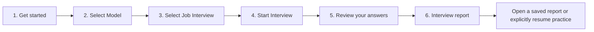

# Workspace, recording, and mandatory answer examples — implementation plan

Status: ready for user review. Recording extension policy confirmed; application implementation has not started.

This plan covers the nine requested refinements in both InterviewSimulator and PersonalInterviewSimulator. Existing test reports will not be repaired or regenerated. Candidate data, Wiki inputs, provider settings, and previous report revisions will be preserved. The current Modern Minimalist appearance will remain.

## 1. Confirmed decisions and scope

**Recording extensions — confirmed by the user:** allow repeated three-minute segments within the existing 6,000-character confirmed-answer limit. There is no fixed total-minute allowance. Each segment has its own three-minute timer; each successful extension appends text. When the answer reaches the text limit, disable Extend until the user shortens the draft. If a new segment takes the draft over the limit, retain its text visibly and require editing before confirmation or another extension.

Other interpretations used in this plan:

- “Remove cancelled interviews” means hide them in the browser's Saved interviews list, not delete their stored data.
- “Command line” means actual terminal commands, in addition to preserving the existing ADK chat commands.
- “Mandatory example” means every question needs a validated, personalized example before a new report can be called final. A provider outage may leave a clearly marked draft; an empty section or generic placeholder does not count as an example.
- Existing model-provider permissions remain: only selected text can leave the device; microphone audio, transcription, and spoken playback remain local.

## 2. New page flow and wording

| Step | English | Japanese | Traditional Chinese |
| --- | --- | --- | --- |
| 1 | Get started | はじめに | 開始使用 |
| 2 | Select Model | モデルを選択 | 選擇模型 |
| 3 | Select Job Interview | 応募先を選択 | 選擇面試職位 |
| 4 | Start Interview | 面接を開始 | 開始面試 |
| 5 | Review your answers | 回答を確認 | 檢查你的答案 |
| 6 | Interview report | 面接レポート | 面試報告 |

The navigation will display these labels with their numbers. Page headings, Back/Continue buttons, empty states, error messages, accessibility labels, and README references will use consistent wording.



The application continues to open on Get started after launch or reload. It will never silently resume an old interview.

### Get started

This page contains the introduction, interface-language selector, and one Continue button. No provider connection request is required just to leave this page. Background initialization must not trigger authentication prompts or billable model checks.

Proposed English introduction:

> InterviewSimulator helps you practise for a real job interview using your reviewed PersonalWiki and a prepared InterviewWiki job package. Choose an AI model and job opportunity, then answer ten interview questions by speaking or typing. Review your answers and receive a report with scores, practical feedback, and example answers grounded in your confirmed experience.
>
> Prepare your PersonalWiki and register the job in InterviewWiki before you begin. Recordings and speech stay on this device. If you choose cloud AI, selected text is sent only with your consent.

Equivalent Japanese and Traditional Chinese copy will be reviewed for natural wording, not literal word-for-word translation. Interface language remains selectable only here and stays fixed during an interview.

### Select Model

Move these existing controls together onto this page:

1. Provider: local llama.cpp, Ollama, Google, OpenAI, or Anthropic.
2. Connection settings appropriate to that provider, including credentials, optional credential-vault storage, Ollama connection mode, and local setup guidance.
3. One main model selector populated from that connection.
4. Refresh, Test model, test progress, and Stop model test.
5. Optional advanced settings for individual text tasks.
6. Save and continue to Select Job Interview.

**Keep the actual model selector.** A provider such as Ollama or Google can offer many models; selecting the provider alone cannot choose the intended model. Reuse the current main-model control in the combined panel rather than introducing a duplicate. Advanced per-task selectors stay available only in their expandable section.

Reset incompatible reasoning/model choices when provider, model, or Ollama connection changes. Preserve supported saved settings on reload. Connection success must not be mistaken for successful model qualification. Do not silently fall back to another model.

Setup navigation stays locked during an active or paused interview, preparation, or model test. Explicit cancellation unlocks setup. Moving controls must not weaken these guards.

### Select Job Interview

Keep the prepared job selector, interview language, fixed/adaptive flow, readiness information, and cloud-text consent. Remove the Saved interviews list and redundant resume control from this page. A small previous-practice count may remain; cancelled runs should not inflate the user-facing count.

### Interview report

Use two clear areas: **Saved interviews** and **Selected interview report**. Place the existing saved list here, ordered newest first, with job, interview language, date, and status.

- Completed: View report.
- Draft/interrupted report: View draft / Resume report.
- Unfinished interview: Resume interview, explicitly chosen by the user.
- Cancelled: omitted from the browser list.
- Empty list: “Your interview reports will appear here after you practise.”

Users may access their saved reports from this page before starting a new interview. Viewing a report must not submit a scoring request. During an unfinished interview, opening a different saved interview/report must be blocked until the current interview is cancelled or completed; merely relocating the list must not let a user abandon active work through its buttons. Report history should remain readable while provider services are offline.

Filtering is a presentation choice. Keep stored cancelled runs available to existing administrative/terminal workflows. Do not delete reports or database rows.

## 3. Remove the two recovery buttons; retain terminal access

Remove “Allow 12 more attempts” and “New assessment with current model settings” from the built-in browser, including obsolete event handlers, control-state references, and help text. Keep Generate report, Stop report work, and Resume unfinished report.

The current `allowance` and `revise-report` commands exist in the ADK agent's chat interface. Preserve them and add explicit terminal entry points. Proposed syntax:

```sh
uv run interview-simulator report-allowance RUN_ID --confirm
uv run interview-simulator report-revision RUN_ID --confirm
# When the saved configuration includes cloud text:
uv run interview-simulator report-revision RUN_ID --confirm --allow-cloud-text
```

These names are proposed additions, not commands that exist today.

Terminal behavior:

- Operate on the explicitly named run, never an inferred “current” run.
- Require simulator servers to be stopped and acquire the installation's existing server lease (exclusive access lock).
- Reuse the existing engine/storage functions and their revision checks and bounded allowance. Do not create a second scoring implementation.
- Allowance adds twelve task attempts; it does not increase the provider's account quota or automatically run a report.
- Revision uses the saved model plan, preserves earlier scores/report versions, and requires explicit cloud-text consent when applicable.
- Reuse safe credential loading from the operating-system vault or a hidden terminal prompt. Never put keys in arguments, output, or Git files.
- Print the result and instructions to restart the simulator and resume report work.
- Preserve the existing authenticated backend endpoints for compatibility, but do not expose replacement browser buttons.

When the application task allowance is exhausted, the browser explains that advanced recovery is available through the documented terminal command. It must not grant more attempts automatically. Provider quota limits must remain distinguishable from this application limit.

## 4. Recording: replace, extend, and countdown

### User-visible behavior

| Control | Behavior |
| --- | --- |
| Record answer | Starts a new segment of up to three minutes. After successful transcription, replaces the answer with the new transcript. |
| Extend recording | Starts another segment of up to three minutes. After successful transcription, appends it to the current edited answer with a paragraph break. |
| Stop recording | Ends the segment early and starts local transcription. |
| Countdown | Shows time remaining for the current segment; resets for each new recording or extension. |

Extend is enabled only when an editable answer has non-whitespace text and the current draft is below the answer-length limit. It can append to typed text as well as a voice transcript. Both actions stay disabled during recording, transcription, pending submission, or locked scoring.

Keep the existing answer intact while requesting microphone permission, recording, and transcribing. Replace/append only after success. Denied permission, empty transcription, cancellation, timeout, or server failure must leave the prior answer untouched. The user still reviews and explicitly confirms the combined answer; reaching zero never submits an answer automatically.

At the start of every segment, show `03:00 remaining`. During microphone permission, show “Waiting for microphone permission”; do not consume answer time before the recorder actually starts. This prevents users losing time to browser permission dialogs. Start the countdown as part of the Record/Extend action when capture begins.

At 30 seconds, show a restrained visual warning and one accessible announcement. At zero, stop capture, release the microphone, and show “Transcribing…”; stop the countdown. Do not announce every second to screen-reader users. The timer is separate from interview progress and transcription timeout.

### Correct timing and text safety

- Use a monotonic deadline, such as `performance.now()`, instead of decrementing a counter. Recalculate remaining time after tab visibility changes so delayed browser timers do not add time.
- Preserve a hard server-side three-minute audio limit and the existing 20 MB segment limit. Align the browser's current 179-second safety stop, displayed duration, and server duration handling rather than showing a misleading extra second.
- Specify how capture handles delayed browser callbacks: return at most the first 180 seconds with an explicit limit-reached indication, without accepting unbounded audio or silently treating an overlong clip as a full recording. Keep bounded decoding and upload limits.
- Bind every segment result to its run ID, question ID, answer revision, and media-operation ID. Ignore stale or cancelled results.
- Retain the user's edits in the base answer when appending. Retry must not append the same segment twice.
- Preserve transcript provenance: distinguish raw recognized segments from the user's corrected/typed text. Do not label typed base text as microphone output. Add backward-compatible optional segment metadata only if needed by the existing answer/history format.
- Keep the 6,000-character confirmed-answer limit for now. Show a character count. If a combined answer exceeds it, preserve the full draft and explain that it must be shortened before confirmation; do not silently truncate it or discard the new segment. Allow for the combined raw-transcript size when validating requests so valid extensions are not rejected by a hidden field limit.
- Clean up timers, streams, pending transcription, and segment state on cancellation, restart, question change, and page close. Reset segment provenance after a successful replacement recording; retain appropriate metadata when revisiting a saved answer. There is no extension-count cap; current draft length determines whether another segment can start.

## 5. Mandatory personalized examples

### Root cause addressed

The inspected test report had ten scores but only seven accepted examples. Saved ADK events show that the model generated candidates, but the two-category validator rejected natural intention/interest wording. Questions 8–10 failed both generation attempts. The engine saved the scores and exported an incomplete report. Separately, skipped answers bypass coaching entirely.

Do not solve this by allowing unsupported career claims or by endlessly retrying the same prompt.

### Evidence and sentence categories

Build a bounded evidence packet for each question from its frozen interview snapshot:

- Relevant confirmed, non-sensitive PersonalWiki facts.
- The question's job requirements and relevant company research, with source IDs.
- The exact question, interview language, confirmed answer or explicit skipped status, and existing feedback.

Use question-linked evidence first and a transparent relevance rule for additional facts. Avoid simply selecting the first few profile facts. Untrusted source text stays data, never instructions. Company facts cannot establish candidate achievements; candidate answers do not automatically become verified profile facts.

Revise the generated sentence structure and validators to distinguish:

| Sentence kind | Required treatment |
| --- | --- |
| Candidate experience | Cites confirmed candidate facts; preserves ownership, dates, quantities, uncertainty, and negation. |
| Company/job information | Cites appropriate company or requirement sources; never presented as candidate experience. |
| Proposed approach | Explicitly hypothetical/future; may describe a proposed schedule, clearly separated from achieved metrics. |
| Suggested motivation | Framed as an answer the candidate should adapt; does not invent long-standing personal values, passions, or experience. |
| Question for the interviewer | May ask about unknown conditions; must not assume unverified company practices. |
| Connecting language | Adds natural structure without introducing factual claims. |

Update both the ADK coaching schema and provider qualification checks together. Version the qualification contract so a cached pass for the older schema cannot silently certify the new clause format; preserve old stored report readability.

Replace brittle keyword-only intention checks with category-aware validation and an evidence review. Preserve deterministic citation/numeric checks and semantic review for unsupported claims. A missing keyword alone must not reject natural phrases such as “I am interested in learning…”. Explicitly stated future targets are not past results; numbers need contextual validation rather than a blanket ban.

The output remains a complete first-person example in the interview language, not an outline disguised as an answer. For sparse evidence, give a candid limitation and a proposed approach. Never invent a project just to fill a section. Include evidence references, why the answer works, and one next practice action.

### Generation and report lifecycle

1. Save a valid score independently so coaching retries cannot rescore the answer.
2. Generate coaching for every question, including skipped answers. The skipped score remains zero; coaching is a separate learning aid.
3. Validate structure, language, citations, and factual support. Semantic review should return bounded reason codes and failing clause indices, not just a yes/no result.
4. On failure, repair the offending clauses while retaining valid material. Start with the existing bounded initial attempt plus one repair; do not automatically raise the overall call allowance.
5. Check the final repaired answer as a whole. Persist successful coaching so future resume operations only process missing work.
6. Expose separate counts: `10/10 scored · 7/10 examples ready`. Keep partial work as a draft with clearly identified missing examples.
7. Mark a new report final only when all ten scores and all ten valid, non-empty examples exist, and any enabled required summary is complete. Validate the stored example contract, not merely the presence of a `coaching` key.
8. If the provider, budget, or validation prevents completion, retain the draft and offer existing explicit resume behavior. Do not silently switch providers or count a generic placeholder as a completed example.

Budget preparation must account for the expected scoring, coaching, evidence-review, translation, and optional summary calls. Warn before starting a configuration whose allowance cannot cover the normal required work. Retries remain bounded and accounted for; the removed web buttons must not be replaced with unlimited automatic retries.

Markdown, browser HTML, print output, downloadable files, status endpoints, and ADK chat must agree on draft/final status. A draft may be viewed or explicitly downloaded as a **draft**, but cannot be labelled a completed report. Stop equating “background task finished” with “report complete.”

Existing reports are test data: preserve them as they are, do not launch recovery calls or rewrite their immutable exports. Use the stricter completion contract for new assessments and add a version marker so old exports remain readable.

## 6. Implementation phases and touched areas

| Phase | Work | Main files/areas | Exit condition |
| --- | --- | --- | --- |
| 1. Baseline and contracts | Apply the confirmed repeated-extension policy; check source/private differences; define recording states and final-report contract. | Static app, speech API, coaching schema, report status | Review decisions recorded; no lost private changes. |
| 2. Navigation and content | Move provider setup and saved history; rename steps; add introduction; hide cancelled entries; remove recovery buttons. | `static/index.html`, `app.js`, `setup.js`, `i18n.js`, `style.css` | Three languages work, no missing-element errors, active-run guards still apply. |
| 3. Terminal recovery | Add actual terminal commands, retain ADK commands, reuse safe storage/engine functions. | `cli.py`, `agents/interview_practice/agent.py`, recovery APIs | Correct run, consent, lease, and no automatic model calls. |
| 4. Recording | Shared replace/append recording function; countdown; length feedback; failure/stale-response handling. | `app.js`, speech response/request models, optional answer metadata | Original text never lost on failure; extension and replacement behave distinctly. |
| 5. Mandatory examples | Evidence packet, new clause types, targeted repairs, skipped coaching, strict completion. | `adk_runtime.py`, `evaluation.py`, `engine.py`, `report.py`, `report_view.py`, `webapp.py`, provider qualification fixtures | Ten valid examples required for final output across both interfaces. |
| 6. Validation and documentation | Regression tests, browser acceptance, README/ADK help, clean-install smoke check. | Tests, docs, setup/release allowlist | Required checks pass; limitations documented accurately. |
| 7. Synchronize | Deploy validated application files to PersonalInterviewSimulator, preserve personal content/settings, verify hashes. | Allowlisted release files | Both copies match; existing reports unchanged; owned test servers stopped. |

Do not change Wiki ingestion or job registration workflows, default Qwen model preference, score weights, existing report scores, or cloud consent policy as part of these refinements.

## 7. Validation checklist

| Area | Required tests |
| --- | --- |
| Navigation | All six labels in three languages; Get started has no provider controls; Select Model has one main model selector; locked navigation cannot escape through the relocated history list. |
| Saved interviews | Cancelled excluded; completed/draft/unfinished visible with correct actions; opening saved reports works without a model server; no auto-resume after reload. |
| Removed controls | Both buttons absent; JavaScript initializes without their elements; terminal and ADK recovery still work. |
| Terminal recovery | Missing/wrong run, active-server lease, stale revision, repeated request safety, cloud-consent refusal, credentials redaction, unchanged answers and older reports. |
| Recording | Replacement success; extension preserves edited base; repeated extensions and length-based availability; typed base; whitespace-only base; permission denial; timeout; empty result; duplicate completion; question switch; Stop; reset; page close. |
| Timer | Does not run during permission wait; correct reset and countdown; 30-second warning; auto-stop; background-tab delay; stops during transcription; accessible status announcements. |
| Length and provenance | Three-minute per-segment enforcement; upload size; near-limit combined text; no silent truncation; raw voice segments remain distinguishable from edits and typed text. |
| Examples | All ten questions, including skipped, receive examples; realistic intention wording passes; unknown fact/source IDs, fabricated results, ownership changes, invented preferences, and misleading company assumptions fail. |
| Languages | English, Japanese, Traditional Chinese; preserve facts and quantities through translation; no untranslated paragraphs or schema text in answers. |
| Recovery and completion | Only missing coaching retried; scores unchanged; provider outage/budget exhaustion leaves a draft; empty/malformed coaching never counts as complete; old report exports remain untouched. |
| Security and rendering | Treat source/model text as untrusted; HTML/Markdown escaping; no secret or raw private-response logging; bounded uploads/calls/cancellation retained. |

Run the project's configured checks, including the stricter CI type-check options:

```sh
uv run --locked ruff check src agents tests scripts
uv run --locked ruff format --check src agents tests scripts
uv run --locked mypy src/interview_simulator --follow-imports=silent --check-untyped-defs
uv run --locked pytest
node tests/browser_state.cjs
node tests/browser_voice.cjs
node --check src/interview_simulator/static/app.js
node --check src/interview_simulator/static/setup.js
node --check src/interview_simulator/static/i18n.js
git diff --check
```

Use automated fictional transcripts and simulated provider responses for the full test matrix. Run a browser walkthrough covering the relocated controls, report history, recording extension, and timer. Any physical microphone or live-provider check must be reported separately from simulated tests; use fictional text for provider qualification. Do not send the user's existing test interviews to a cloud provider for validation.

## 8. Delivery and acceptance

Deliver updated code and README, focused regression tests, a concise validation report, and synchronized source/personal installations. Document terminal recovery and draft-report behavior clearly. No Git push is part of this implementation unless separately requested.

Acceptance requires all nine requested refinements, ten validated examples in every newly finalized report, safe recording replacement/extension with visible time remaining, and preservation of existing private data. The repeated-extension policy is confirmed. Implementation begins only after the user approves this plan.
